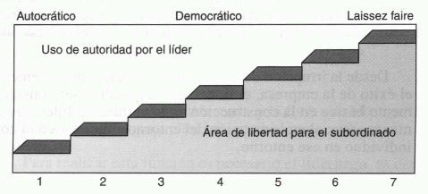
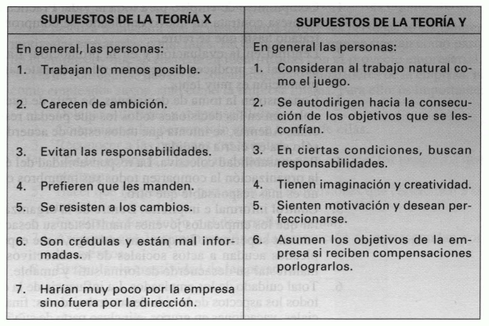

Tema 2: Proceso de dirección de la empresa
==========================================

Concepto de dirección y niveles directivos
------------------------------------------

***Trabajo del directivo***. Combinar eficientemente **recursos humanos y técnicos** para lograr los objetivos de la empresa. 
Es un factor crítico que requiere una respuesta sistemática a los cambios del entorno, implicando procesos para la toma de decisiones en un entorno cambiante, siempre orientados a la consecución de **objetivos**. Estos principios directivos son de **aplicación general** en todo tipo de organizaciones.

---

### Niveles Directivos

Los directivos se organizan en una estructura piramidal con tres niveles:

* **Alta dirección**: Es el nivel más alto, compuesto por el presidente y otros directivos clave. 
    - Función. Supervisan el funcionamiento general de la empresa y desarrollan los **planes a largo plazo** de la empresa:
        - Creación de nuevos productos.
        - Adquisición de otras compañías.
        - Expansión internacional.
* **Dirección intermedia**. Incluye ejecutivos como directores de fábrica o jefes de división.
    - Funciones:
        - Desarrollar **planes y procedimientos detallados** para implementar los planes generales de la alta dirección. 
        - Supervisar a la dirección operativa.
* **Dirección operativa, de supervisión o de primera línea**. Agrupa a los responsables directos de **asignar tareas específicas a los trabajadores**, por lo que están en contacto directo con los mismos.
    - Funciones:
        - Evaluar el rendimiento de los trabajadores.
        - Ejecutar los planes desarrollados por los manos intermedios.

---

### Cualidades Esenciales de los Ejecutivos

Los ejecutivos deben poseer las siguientes cualidades:

* **Cualidades técnicas**. Conocimientos suficientes para **comunicarse eficazmente** con sus subordinados y superiores y ganarse la credibilidad de su equipo.
* **Cualidades humanas**. Es fundamental que sepan mantener **buenas y sinceras relaciones humanas** con su equipo fomentando un ambiente de trabajo positivo.
* **Cualidades reflexivas**. Abordar problemas y sus soluciones de forma **lógica y sistemática**, integrándolos en el contexto más amplio de la empresa. Esto implica adoptar una **perspectiva a largo plazo** en lugar de centrarse únicamente en soluciones inmediatas.

La función de planificación
---------------------------

***Planificación***. Proceso de establecer **objetivos** y definir **estrategias y tareas** necesarias para alcanzarlos.

* **Planes a corto plazo o planificación táctica**. Con un horizonte no superior a un año. Se integran en los planes a largo plazo.
* **Planes a largo plazo**. Suelen durar entre tres y cinco años. La forma más común es la **planificación estratégica**, que implica:
    1.  Determinar la misión principal.
    2.  Analizar el entorno de la organización.
    3.  Analizar las fortalezas y debilidades internas.
    4.  Fijar objetivos a cinco años.
    5.  Desarrollar estrategias para implementar los planes.

---

### Elementos de los Planes

Los planes se componen de varios elementos clave:

* **Objetivos o metas**. Resultados finales deseados (beneficio, crecimiento, eficiencia, etc.). Definen prioridades, estándares y unifican esfuerzos.
* **Políticas**. Guías que orientan el pensamiento y la acción, estableciendo límites para la consistencia en las decisiones (marketing, personal, etc.).
* **Procedimientos**. Guías específicas que detallan los pasos a seguir en actividades concretas (contratación, compras, inventarios). Su objetivo es la eficacia.
* **Reglas**. Más estrictas que las políticas, indican qué se puede y qué no se puede hacer en situaciones muy definidas.
* **Presupuestos**. Expresan expectativas en cifras (tesorería, ingresos y gastos, ventas). No todos son financieros.

---

### Proceso de Planificación

El proceso de planificación consta de las siguientes fases:

1.  **Reconocimiento de oportunidades**.
2.  **Selección de objetivos del plan**.
3.  **Identificación y creación de alternativas**.
4.  **Evaluación de las alternativas** (ventajas, inconvenientes, costes, resultados, recursos, tiempo).
5.  **Selección de una alternativa**.
6.  **Seguimiento del plan** para realizar ajustes si es necesario.

La planificación a largo plazo ha evolucionado para incluir el crecimiento empresarial y la diversificación de productos y mercados.

---

### Planificación Estratégica vs. Dirección Estratégica

* **Planificación estratégica**. 
    * Implica el análisis sistemático del entorno para un diagnóstico estratégico y la generación de alternativas.
    * Se enfoca en asegurar que las opciones estratégicas se debatan antes de aprobar los presupuestos.
* **Dirección estratégica**. Busca proporcionar herramientas y apoyo al personal en todos los niveles para gestionar el cambio estratégico. Pretende superar las limitaciones de la planificación estratégica pura:
    * Considera variables:
        * Económicas
        * Tecnológicas
        * Psicosociopolíticas externas e internas
    * No asume que el interior de la empresa no cambiará, sino que busca el **cambio interno para mejorar**, más allá de aprovechar lo positivo y atrincherar lo negativo.
    * No descuida la **creación de las condiciones y el ambiente** necesarios para la ejecución de las estrategias, más allá de solo su formulación.

La función de organización
--------------------------

**Función de organización**. Segunda fase del proceso directivo, encargada de asegurar que los planes se ejecuten de manera conjunta y coordinada. Una empresa está bien organizada cuando cada miembro conoce su rol y todas las partes se integran para alcanzar los objetivos del sistema; si las unidades operan con objetivos contradictorios, la organización es ineficaz.

### Departamentación

La **departamentación** implica dividir y subdividir el trabajo entre grupos de personas, creando **unidades organizativas** o **departamentos**.

* **Por funciones**. Divide el trabajo según las principales actividades de la empresa (ej. finanzas, marketing, producción). Es común en la alta dirección.
* **Por territorios**. Agrupa las tareas geográficamente, frecuente en marketing, permitiendo decisiones adaptadas a cada región.
* **Por productos**. Crea un departamento para cada producto o tipo de producto.
* **Por procesos**. Común en fabricación, donde cada departamento se encarga de una fase específica del proceso.
* **Por clientes y canales de distribución**. Usado en distribución, segmenta el trabajo según los tipos de clientes e intermediarios.

En la práctica, la mayoría de las grandes empresas emplean una **departamentación combinada**, utilizando varias de estas formas en diferentes niveles.

### Tipos de Estructuras Organizativas

Las estructuras organizativas definen cómo se distribuyen la autoridad y las responsabilidades:

* **Lineal**:
    - Basada en la **autoridad directa** del jefe sobre los subordinados.
    - Cadena de mando clara y decisiones rápidas a nivel individual.
    - Comunicaciones lentas.
    - Directivos asumen amplias responsabilidades sin ser expertos en todo organizaciones suelen ser rígidas e inflexibles.
* **En línea y *staff***:
    - Combina la autoridad directa (línea) con **relaciones de consulta y asesoramiento** de departamentos especializados (*staff*). 
    - Permite rapidez en la toma de decisiones directas y el acceso a conocimientos expertos.
    - Los directivos de *staff* tienen autoridad limitada a sus subordinados internos.
* **Comité**:
    - **Autoridad y responsabilidad se comparten** entre un grupo de personas.
    - Se utiliza a menudo junto con la estructura en línea y *staff* para decisiones específicas.
    - Inconvenientes (algunos). Lentitud, conservadurismo y decisiones basadas en compromisos más que en la mejor alternativa.
* **Matricial**. 
    - Especialistas de diferentes áreas se agrupan para trabajar en **proyectos específicos**, generalmente en combinación con la estructura en línea y *staff*. 
    - **Doble autoridad**. Característica en la que los miembros responden al director del proyecto (autoridad horizontal) y a su departamento funcional (autoridad vertical). 
    - Es **flexible** y eficaz para proyectos importantes, pero requiere un director de proyecto que integre bien al equipo y una autoridad considerable para evitar problemas de coordinación.

### Conceptos Clave en Organización

* **Autoridad**. Derecho o capacidad de mandar, hacerse obedecer y tomar decisiones que afectan a otros.
* **Responsabilidad**. Obligación de la persona de ejecutar las tareas asignadas.
* **Delegación de autoridad**. Asignar una tarea a un subordinado, otorgarle libertad y autoridad para ejecutarla, y controlarle para verificar su desempeño.
* **Límite de la dirección o límite de control**. Número de personas que un directivo puede supervisar directamente.
* **Concentración**. La mayoría de las decisiones importantes recaen en pocos puestos.
* **Centralización**. Concentración que se da en la cúspide.
* **Descentralización**. Implica que los puestos de niveles inferiores tienen cierta capacidad de decisión, autonomía y responsabilidad. Generalmente, las decisiones rutinarias tienden a descentralizarse, mientras que las menos repetitivas y críticas se centralizan.
* **Organización formal**. La estructura planificada e implementada oficialmente, con unidades departamentales y relaciones definidas.
* **Organización informal**. Desarrollada con el tiempo dentro de los equipos de trabajo, creando normas, roles, relaciones sociales, estatus y canales de comunicación informales. Los directivos deben reconocerla y buscar que funcione a favor de la organización.

La función de gestión, o dirección en sentido restringido
---------------------------------------------------------

***Gestionar***. Implica que las personas de una organización cumplan sus funciones para alcanzar objetivos.

***Liderazgo***. Ejercicio de influencia y poder para armonizar intereses y dar dirección a un grupo. Se ha estudiado desde tres enfoques:

* Como **proceso de incidencia social** a través de la comunicación, influyendo en las conductas individuales.
* Como un **elemento vinculado a la motivación**, donde la obediencia depende de la motivación que el líder genere.
* Como **propiedad personal**, refiriéndose a rasgos y conductas eficaces del líder para influir en los seguidores (teorías de la personalidad y situacional).

***Estilos de liderazgo***. Forma de comportarse del líder:

* **Líderes autocráticos.** Toman decisiones sin consultar, son dogmáticos y esperan obediencia.
* **Líderes democráticos.** Involucran a los subordinados en las decisiones, solicitan opiniones y fomentan la cooperación.
* ***Laissez faire*.** Dan poca o ninguna orientación, dejando que los subordinados decidan por sí mismos.

Flexibilidad en el estilo de liderazgo es crucial para adaptarse a cada situación.

***Teorías X e Y*** (Douglas McGregor). Indican que la visión del líder sobre las personas (pesimista en X, optimista en Y) influye directamente en el comportamiento de los subordinados, transformándose en una realidad.

La ***Teoría Z*** (William Ouchi). Se basa en principios como: compromiso de empleo de por vida, evaluación y promoción lentas, consenso en la toma de decisiones, responsabilidad colectiva, control informal e implícito, y cuidado integral de los empleados.

Las ***Teorías motivacionales*** se dividen en:

* **Teorías de los contenidos o causas.** Describen factores que generan energía para el trabajo (necesidades y recompensas).
* **Teorías de los procesos.** Explican cómo se potencian, dirigen y extinguen las conductas organizativas.

Para motivar a las personas es importante:

1. Delegar autoridad y responsabilidad.
2. Comunicar expectativas.
3. Reconocer méritos.
4. Informar sobre progresos.
5. Hacerles participar en decisiones.
6. Facilitar la formación y el desarrollo personal.
7. Asegurar una remuneración y promoción justas.
8. Estimular la creatividad.

La función de control
---------------------

***Controlar***. Proceso de **comparar los resultados reales con lo planificado** y tomar medidas para corregir las diferencias negativas. Sus fases incluyen: fijar estándares, medir resultados, comparar, determinar las causas de las diferencias y aplicar correcciones.

El ***Proceso de control*** se desarrolla en:

1.  **Planificación**. Comunicar objetivos, políticas y procedimientos, asegurando su difusión.
2.  **Recogida de información**. Obtener datos sobre los resultados reales.
3.  **Evaluación de los resultados**. Analizar las diferencias; si son negativas y significativas, investigar las causas.
4.  **Medidas correctoras**. Aplicarlas si las diferencias persisten. Las causas pueden ser organizativas, de ejecución o de planificación, y las correcciones a menudo implican mejorar procedimientos o reasignar recursos.

Los principales **inconvenientes del control** son:

* Su **coste**.
* Riesgo de ser **represivo**, causando frustración y tensión.
* Posibilidad de **confundir el objetivo**, priorizando normas sobre fines.
* **Falseamiento de la información** por parte de empleados o directivos.

***Autocontrol***. Estado ideal donde las personas asumen los objetivos de la organización como propios, reduciendo la necesidad de control externo y fomentando la motivación.

***Política de cero defectos***:

* Aquella que busca que el control sea parte integral del trabajo para **prevenir errores** en lugar de solo corregirlos.
* Se basa en que el comportamiento de las personas es un reflejo del trato recibido.
* Valores sólidos y compartidos, como la satisfacción del cliente y la calidad, facilitan la unidad, el autocontrol y la autogestión.

Las empresas se distinguen por su orientación.

* ***Empresas orientadas hacia sí mismas***. Siguen normas y directivas internas, con menos foco directo en el cliente.
* ***Empresas orientadas hacia el cliente***:
    * Centran toda la organización en el cliente, siendo el servicio, la calidad y la fiabilidad estrategias clave para su satisfacción y lealtad.
    * La autoridad de la dirección radica en su capacidad para inculcar esta orientación como un valor compartido.

El proceso de dirección en la pequeña empresa
---------------------------------------------

Las pequeñas empresas tienen las siguientes ventajas:

- Más informales y espontáneas, lo que implica que sea más sencillo conseguir que el personal participe en las decisiones.

- La comunicación es más fluida y es más sencillo que todos estén bien informados para participar en el proceso de decisión.

- Es más sencillo conseguir que todas las personas adquieran la idea de grupo, de equipo que tiene unos objetivos comunes, y que se encuentren motivadas para alcanzarlos.

- En las pequeñas empresas puede haber un mejor trato con los empleados, un trato más humano basado en un conocimiento personal y en unas relaciones humanas más estrechas.

La dirección y la empresa como sistema
--------------------------------------

La empresa cuenta con tres **subsistemas**:

-   **Subsistema real.** Se identifican el subsistema de producción y el subsistema mercadotécnico o comercial.
-   **Subsistema financiero.**
-   **Subsistema de información.** Es el subsistema directivo, que coordina los esfuerzos de los demás conduciéndoles hacia los objetivos globales.
