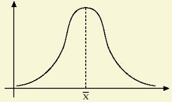

Tema 4: Análisis de problemas y toma de decisiones
================================================================

La modelización
---------------

***Modelo:***

1. Representación simplificada de una parte de la realidad.
2. Su principal objetivo es permitir una mejor comprensión y descripción de la parte de la realidad que representa.

Un modelo se pueden clasificar considerando diversos criterios:

1. **Modelos objetivos y subjetivos.** Se emplean uando en la toma de decisiones intervienen sucesos no experimentables objetivamente y no existen métodos formales, los modelos han de ser:
    1. Informales
    2. Subjetivos
    3. Basarse en la intuición
2. **Modelos analíticos y de simulación.** Los modelos analíticos sirven para obtener soluciones; información sobre los efectos de las posibles decisiones de forma que el decisor elija la alternativa que le resulte más conveniente. En este sentido, pueden ser prescriptivos o descriptivos.

    Entre estos modelos se encuentran:

    1. **De optimización**. Permiten determinar los valores que ha de darse a las variables de modo que se maximice o minimice otra variable que se tiene como objetivo. Son **prescriptivos**.
    2. **De simulación**. Representaciones simplificadas de la realidad, sobre las que se opera para estudiar los efectos de distintas alternativas de actuación. Son **descriptivos**.
    3. **Estáticos**. Aquellos que no utilizan la variable tiempo.
    4. **Dinámicos**. Incorporan el tiempo como variable o parámetro fundamental.
    5. **Deterministas**. Los datos se suponen conocidos con certeza.
    6. **Probabilísticos aleatorios o estocásticos**. Uno o varios datos solo se conocen en términos de probabilidades.

Ambientes de decisión
---------------------

El nivel de información determina el tipo de ambiente de la decisión. Se distinguen los siguientes **ambientes de decisión**:

1. **Certeza.** El decisor conoce con absoluta seguridad los estados de la naturaleza que van a presentarse.
2. **Riesgo.** El decisor no sabe qué estados de la naturaleza se presentarán, pero sí cuales pueden presentarse y la probabilidad que tiene cada uno de ellos.
3. **Incertidumbre estructurada.** Se conocen los estados de la naturaleza, pero no la probabilidad de cada uno de ellos.
4. **Incertidumbre no estructurada.** Es aquél en el que ni siquiera se conocen los posibles estados de la naturaleza.

Para pasar de un tipo de ambiente a otro es necesario obtener un cierto grado de información: cuando mayor se la información, menor será la incertidumbre.

***Proceso de aprendizaje.*** Según la teoría de la decisión, es el proceso de consecución de información que (en algún caso) permite pasar de un ambiente a otro.

Criterios de decisión en ambiente de incertidumbre
--------------------------------------------------

En un entorno de escasez de información como es el de incertidumbre, ha de intervenir en gran medida la subjetividad:

- **Incertidumbre no está estructurada** y no se puede obtener más información. La decisión deberá basarse en la intuición.
- **Incertidumbre está estructurada**. La decisión continúa incorporando una carga de subjetividad muy elevada.

Los principales **criterios de decisión** en un entorno de incertidumbre estructurada son los siguientes:
5
1. **Criterio de Laplace, racionalista o de igual verosimilitud**. Parte del postulado de Bayes: si no se conocen las probabilidades asociadas a cada uno de los estados de la naturaleza no hay razón para pensar que uno tenga más probabilidades que otros.

    Se calcula la media aritmética de los resultados que se pueden derivar de cada una de las decisiones y, dependiendo de los resultados: 

    - **Favorables**. Se elije el resultado medio más elevado.
    - **Desfavorables**. Se elige el resultado medio más bajo.

2. **Criterio optimista.** Aquel que seguiría una persona que pensara que, para cualquier estrategia elegida, el estado presentado sería el más favorable para ella:
    - **Resultados favorables** \(\rightarrow\) **criterio maxi-max**. Se determina cuál es el resultado más elevado que puede alcanzarse con cada estrategia y, posteriormente, se elige aquella a la que le corresponda el máximo entre esos máximos.
    - **Resultados desfavorables** \(\rightarrow\) **criterio mini-min**. Se determina cuál es el mejor resultado que puede obtenerse con cada estrategia (el menor) y se elige aquella a la que le corresponda el mínimo entre esos mínimos.
3. **Criterio pesimista o de Wald.** Seguido por una persona que piense que para cualquier estrategia elegida, el estado presentado es el menos favorable para ella.
4. **Criterio de optimismo parcial de Hurwicz.** Compromiso entre los criterios optimista y pesimista mediante un **coeficiente de optimismo** ($\alpha$); comprendido entre $0$ y $1$, y de su complemento a la unidad; que es el denominado **coeficiente de pesimismo** ($1 - \alpha$).
    - El mejor de los resultados de cada estrategia se pondera con el coeficiente de optimismo, en tanto que el peor de los resultados se pondera con el de pesimismo.
5. **Criterio del mínimo pesar o de Savage.** Es seguido por los que tienen aversión a arrepentirse por equivocarse. Formalmente, ha de partiste de la elaboración de la denominada **matriz de pesares**. El **pesar** es lo que se deja de ganar por no elegir correctamente.

Una estrategia $A$ está **dominada** por otra estrategia $B$, si cualquiera que sea el estado de la naturaleza que se presente, $B$ es igual o mejor que $A$.

La teoría de los juegos de estrategia
-------------------------------------

En los **juegos de estrategia** el resultado final depende de las decisiones tomadas por los diversos jugadores. Se pueden clasificar de acuerdo con diversos criterios:

1. **Número de participantes** en los juegos.
2. **Ganancia total obtenida por el conjunto de todos los participantes**. Cuando el total de lo que unos ganan coincide con el total de lo que otros pierden, el saldo total es cero, o de suma nula.
    - Los juegos de suma no nula pueden ser de suma constante o de suma variable, según sea constante o variable ese saldo neto total.
3. **Número de jugadas** que comprenden.
4. **Información de la que disponen los participantes** en el momento de jugar. Los juegos pueden ser de información completa y de información incompleta.
5. **Elementos que intervengan en las decisiones**. Se distingue:

    - **Juegos de estrategia pura**. En las decisiones de los jugadores solo interviene su actuación.
    - **Juegos de estrategia mixta**. Interviene algún elemento aleatorio introducido por los propios jugadores.

---

**Juego rectangular**. Para obtener una solución de un juego rectangular tendremos que hallar las mejores estrategias de los jugadores y el **valor del juego**: la cantidad que gana un jugador y que el otro la pierde.

**Juegos con punto de silla**. Juegos en los que el maxi-min del ganador coincide con el mini-max del perdedor.

- La técnica para encontrar un punto de silla es determinar un número que sea el menor de su fila y el mayor de su columna (supuesto que las columnas se correspondan con las posibles decisiones del perdedor y las filas con las del ganador). Puede cero o más puntos de silla.

Probabilidad y riesgo
---------------------

***Probabilidad de Laplace.*** Si de un total de $n$ casos, todos igualmente factibles, un suceso $S$ puede presentarse en $h$ de los casos, la probabilidad de ocurrencia de ese suceso, $P(S)$, es el cociente entre el número de casos favorables y el de casos posibles:

$$P\left( S \right) = \frac{h}{n}$$

***Probabilidad estimada o empírica.*** Según la concepción frecuencial u objetivista de la probabilidad, se tomaría la frecuencia relativa de la aparición del suceso, considerando que el número de observaciones del experimento es suficientemente grande. La probabilidad, en sí, es el límite de la frecuencia relativa cuando el número de observaciones crece indefinidamente.

***Suceso compuesto.*** suceso en el que acontecen dos sucesos $S$ y $T$:

$$P\left( S \cap T \right) = P\left( T \right) \cdot P\left( S \middle| T \right) = P\left( S \right) \cdot P(T|S)$$

***Probabilidad condicionada,*** $P(S|T)$***.*** Probabilidad que tiene $S$ sabiendo que ocurrió $T$. Si $S$ y $T$ son sucesos independientes:

\begin{align*}
P\left( S \middle| T \right) &= P(S) \\
P\left( T \middle| S \right) &= P(S)
\end{align*}

***Sucesos excluyentes.*** Aquellos sucesos que no pueden presentarse conjuntamente.

***Variable aleatoria.*** Aquella de la que no se sabe con certeza el valor que tomará, sino que sólo se conoce qué valores puede tomar y que probabilidades tiene cada uno de ellos.

***Distribución de probabilidad.*** Conjunto de valores que puede tomar una variable aleatoria y sus respectivas probabilidades. Se suele representar por medio de un **histograma**: rectángulos cuyas áreas son proporcionales a los tamaños de las probabilidades que representan.

***Esperanza matemática, valor esperado o media:***

1. Media aritmética ponderada de los valores que puede tomar la variable.
2. La probabilidad de cada valor se usa como coeficiente de ponderación.
3. Es un valor de referencia que señala donde se encuentra centrada la distribución de probabilidad.
4. Fórmula:

    $$E\left( x \right) = x_{1} \cdot p_{1} + x_{2} \cdot p_{2} + \ldots + x_{n} \cdot p_{n} = \overline{x}$$

***Varianza:***

1. Esperanza matemática de los cuadrados de las desviaciones de los valores probables respecto a su media.
2. Da idea de la forma de la distribución de probabilidad.
3. La unidad de medida de la varianza es el cuadrado de la unidad de medida de la variable de que se trate:

$$\sigma^{2}\left( x \right) = \left( x_{1} - \overline{x} \right)^{2} \cdot p_{1} + \left( x_{2} - \overline{x} \right)^{2} \cdot p_{2} + \ldots + \left( x_{n} - \overline{x} \right)^{2} \cdot p_{n}$$

***Desviación típica.*** Raíz cuadrada positiva de la varianza. Se mide en las mismas unidades que la variable en cuestión:

$$\sigma\left( x \right) = \sqrt{\sigma^{2}(x)}$$

1. **Desviación típica muy pequeña** \(\rightarrow\) probabilidad elevada de que la variable tome un valor próximo al esperado.
2. **Desviación típica muy elevada** \(\rightarrow\) probabilidad elevada de que la variable se desvíe al alza o baja respecto ese valor medio.
3. **Caso de certeza** \(\rightarrow\) la dispersión vale cero y va creciendo a medida que el riesgo va siendo mayor.

Si hay varias alternativas, a cada una de las cuales le corresponde un valor esperado diferente y un nivel de riesgo distinto, la decisión depende de su **aversión al riesgo**; subjetividad del decisor:

- Decisores con gran aversión al riesgo precisan gran beneficio esperado para asumir niveles de riesgo relativamente pequeños.
- Decisores con poca aversión al riesgo están dispuesto a arriesgarse a cambio de beneficios esperados moderados.

***Coeficiente de variación.*** Parámetro que combina el riesgo y la esperanza matemática:

$$\text{CV}\left( x \right) = \frac{\sigma\left( x \right)}{E\left( x \right)}$$

El análisis bayesiano
---------------------

***Teorema de Bayes.*** Permite modificar las probabilidades a media que se avanza en el proceso de aprendizaje:

$$P\left( S_{i} \middle| T \right) = \frac{P\left( S_{i} \right) \cdot P(T|S_{i})}{P\left( T \middle| S_{1} \right) \cdot P\left( S_{1} \right) + P\left( T \middle| S_{2} \right)P\left( S_{2} \right) + \ldots + P\left( T \middle| S_{n} \right) \cdot P(S_{n})}$$

La determinación del grado de confianza
---------------------------------------

***Variable discreta.*** El número de valores que puede tomar la variable es finito.

***Variable continua.*** La variable aleatoria puede tomar un número infinito de valores. Uno de los tipos de variables continuas más importante es el integrado por las denominadas **variables normales**, a cuyas distribuciones de probabilidad se les denomina también **distribuciones normales**.

*Figura 4.1 Distribución normal*

Características de las distribuciones normales:

1. Simétricas y forma acampanada, por lo que su representación se denomina **campana de Gauss**.
2. Probabilidad de que la variable tome un valor concreto es cero.
3. Probabilidad de que variable tome un valor comprendido en un cierto intervalo finito es una cantidad finita e igual al área existente bajo la campana en ese intervalo. El área total que hay bajo la campana vale $1$.
4. Esperanza matemática de la variable se encuentra en el centro de la distribución y, dado que ésta es simétrica y que su área total es igual a $1$, tanto el área situada a la izquierda de su valor esperado, como la existente a su derecha, han de valer $0,5$.
5. Esta distribución queda descrita conociendo su esperanza matemática y de su varianza:
    - La esperanza matemática determina el lugar en el que se encuentra centrada la distribución
    - La varianza determina su forma

La siguiente expresión significa que la variable $x$ sigue una distribución normal con una esperanza matemática igual a $E(x)$ y una desviación típica igual a $\sigma(x)$:

$$x \rightarrow N\left\lbrack E\left( x \right),\ \sigma(x) \right\rbrack$$

***Teorema fundamental del límite.*** Si una variable está formada por la suma de un infinito número de variables independientes entre sí, cada una de las cuales tiene una distribución de media y varianza finitas, esa variable seguirá una distribución normal.

Cuando una variable, $x$, está formada por la suma de otras variables, su esperanza es igual a la suma de las esperanzas de estas variables:

$$E\left( x \right) = E\left( x_{1} \right) + E\left( x_{2} \right) + \ldots + E(x_{n})$$

Si estas variables son independientes entre sí, la varianza de la variable-suma es la suma de las varianzas:

$$\sigma^{2}\left( x \right) = \sigma^{2}\left( x_{1} \right) + \sigma^{2}\left( x_{2} \right) + \ldots + \sigma^{2}\left( x_{n} \right)$$

***Distribución normal estandarizada o tipificada.*** Aquella cuya esperanza matemática vale cero y cuya desviación típica es igual a uno. Se denomina $\xi$ a la variable que tiene esta distribución:

$$\xi \rightarrow N(0,1)$$

Si variable $x$ sigue distribución normal, entonces la variable tipificada es:

$$\xi = \frac{x - E\left( x \right)}{\sigma(x)}$$

A este proceso de disponer la variable $x$ en número de desviaciones típicas respecto a su media, se le denomina **tipificación**. Tipificando la variable, es posible calcular cualquier probabilidad relativa a la misma.

La teoría de la información
---------------------------

***Teoría de la información.*** Desarrollada por Shannon. Ofrece un enfoque para medir la información proporcionada por la materialización de un suceso, que depende de la probabilidad de su acaecimiento; proporciona tanta más información cuanto mayor sea la sorpresa que produce, es decir, cuanto menor sea la probabilidad de su acaecimiento.

Se denomina $h(P)$ a la información proporcionada por la realización de un suceso de probabilidad $P$. Para determinar la forma concreta de esta función, se debe tener en cuenta que:

1. Debe ser decreciente con $P$ porque la información aumenta al reducirse la probabilidad del suceso.
2. La función ha de tender a infinito cuando la probabilidad $P$ tienda a cero.
3. La materialización de un suceso seguro no proporciona información alguna por lo que la función debe tomar el valor cero cuando $P$ sea igual a uno.
4. A cada uno de los infinitos posibles valores de $P$ les debe corresponder una única medida de información.
5. La información proporcionada por la ocurrencia conjunta de dos o más sucesos independientes entre sí debe ser igual a la suma de las informaciones que proporcionan los distintos sucesos en su acontecer.

\begin{alignat*}{2} % 2 alignment pairs
h\left( P \right) &= \log\left( \frac{1}{p} \right) &&= - \log(P) \\
h\left( P \right) &= \log_{2}\left( \frac{1}{p} \right) &&= - \log_{2}\left( P \right)\ \lbrack bits\rbrack \\
h\left( P \right) &= \ln\left( \frac{1}{p} \right) &&= - \ln\left( P \right)\left\lbrack \text{nits} \right\rbrack
\end{alignat*}

El logaritmo puede ser 

- Neperiano (en cuyo caso la información viene medida en **nits**)
- Decimal (la unidad será el **hartley**)
- Binario (la información se mide en **bits**)

Por comodidad se suele usar la base binaria:

$$h\left( P \right) = - \log_{2}\left( P \right)$$

Si se considera un conjunto de sucesos complementarios y mutuamente excluyentes entre sí, la información esperada será:

$$H = - \left\lbrack P_{1} \cdot \log\left( P_{1} \right) + P_{2} \cdot \log\left( P_{2} \right) + \ldots + P_{n} \cdot \log\left( P_{n} \right) \right\rbrack$$

***Entropía.***

- Mide la incertidumbre que afecta al sistema antes de saber cuál de los sucesos va a producirse.
- Es siempre positiva.
- Es máxima cuando todos los sucesos tienen la misma probabilidad de presentarse.

**Mensaje**. Comunicación o noticia cuyo acaecimiento hace variar la probabilidad de un suceso ($j$) desde $P_{j}$ hasta $Q_{j}$ modificando la incertidumbre.

**Contenido informativo del mensaje**.  Variación de incertidumbre (o modificación de la información) que derivada de la ocurrencia de $j$. Vale:

$$h\left( P_{j} \right) - h\left( Q_{j} \right) = - \log\left( P_{j} \right) + \log\left( Q_{j} \right) = \log\left( \frac{Q_{j}}{P_{j}} \right)$$

**Información de canal**. Para un conjunto de sucesos, el contenido informativo esperado del mensaje es:

$$I\left( Q:P \right) = Q_{1}\log\left( \frac{Q_{1}}{P_{1}} \right) + Q_{2}\log\left( \frac{Q_{2}}{P_{2}} \right) + \ldots + Q_{n}\log\left( \frac{Q_{n}}{P_{n}} \right)$$

**La información de canal:**

- Siempre es positiva
- Alcanza su valor mínimo solo cuando el mensaje no modifica la incertidumbre existente
- Aumenta de valor a medida que son mayores las variaciones que experimentan las probabilidades de los diversos sucesos

Si el mensaje hiciera que algún suceso del sistema alcanzara una probabilidad igual a la unidad y, por tanto, que tal probabilidad resultara nula para todos los demás sucesos del mismo, se obtendría:

$$I\left( Q:P \right) = \log\left( \frac{1}{P_{j}} \right) = h(P_{j})$$
