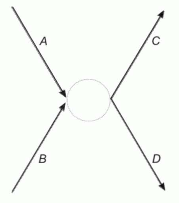
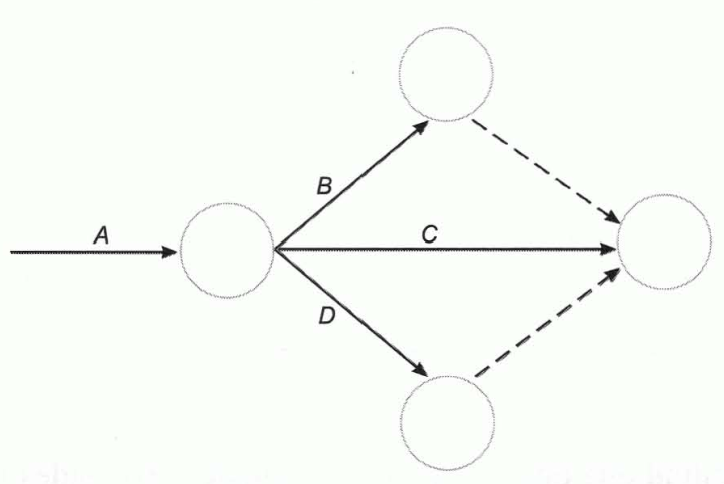

Tema 5: Técnicas instrumentales de planificación, programación y control
========================================================================

Los árboles de decisión
-----------------------

***Decisiones secuenciales:***

- Aquellas que se encuentran sometidas a un proceso dinámico y adaptativo en un período de tiempo más o menos amplio en el que las decisiones se concatenan.
- Cada una condiciona a las que le siguen y viene condicionada por las que le anteceden y por los estados de la naturaleza que se hayan presentado.

***Árbol de decisión.*** Sistema de representación del proceso decisional en el que se reflejan:

- Posibles alternativas por las que se puede optar
- Resultados que corresponden a cada alternativa

Según cual sea el estado de la naturaleza que se presente. Está constituido por nudos y ramas:

- **Nudos o vértices.** Representan nudos:
    - **Decisionales**. Situaciones en las que debe tomarse una u otra decisión. Representados por **cuadrados**
    - **Aleatorios**. El decisor se enfrenta a distintos estados de la naturaleza o suceso aleatorios. Representados por **círculos**.
- **Ramas o aristas.** Que parten:
    - **De nudos decisionales**. Representan **alternativas de decisión**.
    - **De nudos aleatorios**. Representan **posibles estados de la naturaleza**.

Cuando se conocen las probabilidades de los diversos estados, éstas se representan sobre las ramas. Al final de cada camino se reseña el resultado que correspondería a esa sucesión de decisiones y sucesos.

Cada nudo tiene un **valor asociado**:

- **Nudo aleatorio**. Esperanza matemática de los valores situados al final de las ramas que parten de él.
- **Nudo decisional**. Mejor de los valores en los que tienen destino las ramas que parten de él.

El valor esperado de la información perfecta
--------------------------------------------

1. ***Información perfecta.*** Aquella en la que la probabilidad de que sea correcta es el cien por cien.
2. ***Valor esperado de la información (VEI).*** Es la esperanza matemática del valor de la información.
3. ***Valor esperado neto de la información (VENI).*** Diferencia del VEI y su coste.
4. ***Valor esperado de la información perfecta (VEIP).*** Límite máximo que podrá pagarse por la información perfecta y por cualquier otra.

La programación lineal
----------------------

***Problema de programación lineal.*** Consiste en:

- Una función objetivo lineal, que se ha de maximizar o minimizar
- Un conjunto de restricciones de carácter lineal

Se trata de determinar los valores de las variables que optimizan la función cumpliéndose las restricciones:

Maximizar (o minimizar):

$$Z = c_{1} \cdot X_{1} + c_{2} \cdot X_{2} + \ldots + c_{n} \cdot X_{n}$$

Sometida a las restricciones:

\begin{align*}
a_{11} \cdot X_{1} + a_{12} \cdot X_{2} + \ldots + a_{1n} \cdot X_{n} \leq b_{1} \\
a_{21} \cdot X_{1} + a_{22} \cdot X_{2} + \ldots + a_{2n} \cdot X_{n} \leq b_{2} \\
\ldots \\
a_{m1} \cdot X_{1} + a_{m2} \cdot X_{2} + \ldots + a_{\text{mn}} \cdot X_{n} \leq b_{m}
\end{align*}

Y, siempre, la condición de no negatividad de las variables:

$$X_{1},X_{2},\ldots,X_{n} \geq 0$$

***Resolución gráfica de un problema de programación lineal.***

1. Representar las ecuaciones que se obtienen al establecer las restricciones como si fueran igualdades y sólo en el primer cuadrante, pues las variables no pueden ser negativas.
2. Representar la función objetivo tomando un valor arbitrario cualquiera para $Z$.
3. Trazar paralelas a esta última recta dependiendo del problema:
    - De **maximización**. Tan alejadas como sea posible del origen de coordenadas.
    - De **minimización**. Lo más próximas posible al origen de coordenadas.

    En ambos casos, hasta determinar la más lejana que tenga algún punto perteneciente a la **región de las soluciones posibles**.

4. Determinar el punto de esa paralela que se encuentra en el área de soluciones posibles. Las coordenadas de ese punto son la solución óptima. Si hubiera varios puntos, el problema tendría tantas soluciones como puntos.

Método PERT. Introducción
-------------------------

***Método PERT (Program Evaluation and Review Technique).*** Instrumento al servicio de la toma de decisiones que permite la:

- Planificación
- Ejecución
- Control

de proyectos que:

- Requieren la coordinación de un gran número de actividades entre las que existen relaciones de precedencia
- Se han de realizar en un tiempo limitado
- Con unos medios también limitados

***Método CPM (Critical Path Method).*** Método similar al PERT. Posteriormente se introdujo la relación que existe entre el coste de cada actividad y su duración (J.E.Kelley).

***Método Roy.*** Método dual del PERT.

***Diferencias de notación entre el PERT y CPM.***

| PERT          | CPM                           |
|---------------|-------------------------------|
| Suceso        | Nudo                          |
| Actividad     | Trabajo                       |
| Holguras      | Flotante                      |
| Tiempo early  | Tiempo más bajo de iniciación |
| Tiempo last   | Tiempo más alto de iniciación |

*Tabla 5.1 Diferencias de notación entre el método PERT y el CPM*

**Diferencias Formales:**

* **PERT vs. CPM**: PERT usa tres estimaciones de tiempo, mientras que CPM usa solo una.
* **Método Roy vs. PERT/CPM**: 
    * PERT/CPM. Las actividades son flechas y los nudos interconectan actividades.
    * Método Roy. Las actividades son nudos y las flechas indican el orden temporal, lo que es más intuitivo y congruente con la Teoría de Grafos.

El PERT, como instrumento de **programación temporal**, requiere:

1. Relacionar el conjunto de actividades que se ha de realizar.
2. Estimar el tiempo que requiere cada una de ellas.
3. Determinar el orden en el que han de realizarse las actividades, es decir, determinar las precedencias existentes entre ellas.

Este método obliga a identificar las actividades que integran el proyecto, resaltando las dependencias y condicionamientos existentes entre ellas, así como sus duraciones.

**Principales aportaciones del PERT**:

1. Producción de planes realistas, detallados y de fácil difusión, que incrementan las probabilidades de alcanzar los objetivos del proyecto.
2. Predicción de las duraciones y de la certidumbre de las mismas.
3. Centrar la atención en las partes del proyecto susceptibles de impedir o demorar su realización.
4. Informar de la incompleta utilización de los recursos.
5. Sencilla simulación de alternativas.
6. Obtención de informes completos y frecuentes del estado del proyecto.

**Objetivos del PERT:**

- Anticipar la duración mínima del proyecto.
- Identificar actividades **críticas** que, si se retrasan, demoran la ejecución total del proyecto.

El método PERT en certeza
-------------------------

***Tabla de precedencias.*** Paso previo a la aplicación del método PERT que recoge las relaciones de precedencia existentes entre las actividades.

***Grafo PERT.*** Formado por nudos y flechas. 

- **Nudos**. Estados o situaciones
    - **Primer nudo**. Estado de comienzo del proyecto
    - **Último nudo**. Situación en la que se ha finalizado el proyecto
- **Flechas**. Actividades del proyecto

Cada flecha ha de tener un nudo de origen y otro de destino:

- **Nudo de origen.** Situación en la cual se han finalizado las actividades precedentes: puede comenzar la actividad en cuestión.
- **Nudo de destino.** Situación en la cual se ha finalizado la actividad en cuestión: pueden comenzar las que le siguen en el orden secuencial según la tabla de precedencias.

***Tipos elementales de prelaciones o precedencias:***

- **Prelaciones lineales.** Se presentan cuando, para poder iniciar una determinada actividad, es necesario que haya finalizado previamente una única actividad.
- **Prelaciones de convergencia.** Para poder iniciar una cierta actividad es necesario que hayan finalizado previamente dos o más actividades.
- **Prelaciones de divergencia.** Para que puedan iniciarse dos o más actividades es necesario que se haya terminado anteriormente una única actividad.
- **Relaciones que dan lugar a convergencia y divergencia.** Para que se puedan iniciar un conjunto de dos o más actividades, es preciso que se haya finalizado previamente más de una actividad.

*Figura 5.1 Ejemplo de grafos parciales*

Las relaciones de precedencia permiten construir los grafos parciales que, componiéndolos y numerando los nodos, se emplean para obtener el grafo PERT. Deben respetarse los siguientes principios:

1. **Principio de designación sucesiva**. Prohíbe numerar un nudo si se encuentra sin numerar alguno de los nudos de los que parten flechas que finalizan en él.
2. **Principio de unicidad del estado inicial y del estado final.** Prohíbe la existencia de más de un nudo de comienzo ni más de un nudo final, pues solo puede existir una situación de inicio del proyecto y una situación de finalización del mismo.
3. **Principio de designación unívoca.** Prohíbe la existencia de dos flechas que partan del mismo nudo y que tenga, también, el mismo nudo de destino.

*Figura 5.2 Ejemplo de PERT*

***Actividad ficticia.*** Enlace lógico que permite reflejar formalmente las prelaciones existentes entre las diferentes actividades que forman el proyecto. Se utilizan para resolver problemas en la representación, por ejemplo:

- Existen simultáneamente prelaciones lineales de convergencia o divergencia.

*Figura 5.3 Representación incorrecta (arriba) y correcta empleando actividades ficticias (abajo). Se supone que las actividades A y B preceden a la C y la actividad A precede a la D*

- Actividades paralelas.

*Figura 5.4 Representación incorrecta (arriba) pues se violan los principios de unicidad del estado final y de designación unívoca y representación correcta mediante actividades ficticias (abajo)*

- Las actividades ficticias se utilizan siempre que exista más de una actividad que no preceda a ninguna otra. La flecha que va directamente de un nudo a otro, sin conectarse con una actividad ficticia a través de un nudo intermedio, ha de ser la que corresponda a la actividad con una duración más prolongada.

*Figura 5.5 Ejemplo del uso de actividades ficticias cuando más de una actividad no precede a ninguna otra*

***Camino.*** conjunto de actividades sucesivas.

***Tiempo early.*** 

1. Número mínimo de unidades de tiempo necesarias para alcanzar la situación representada por ese nudo.
1. Es la duración del camino más largo que conduce, desde el nudo inicial, a ese nudo.
1. Se calcula, en el grafo, procediendo desde el nudo inicial hacia el final.

***Tiempo last.***

1. Momento más tardío admisible para llegar a la situación descrita por este nudo sin retrasar la ejecución del proyecto sobre el mínimo imprescindible.
1. Se calcula, en el grafo, procediendo desde el nudo final hacia el inicial.
1. Consideraciones:
    - El tiempo *last* del último nudo tiene que ser igual a su tiempo *early* porque implica que el proyecto ha terminado y no se admite que finalice en un tiempo inferior al mínimo imprescindible.
    - El tiempo *last* de un nudo es la diferencia entre el tiempo *last* del último nudo y la duración del camino más largo que conduce, en sentido inverso, del último nudo al nudo en cuestión.

***Oscilación de un nudo.*** Diferencia entre su tiempo *last* y su tiempo *early*.

***Camino crítico:***

1. Formado por las actividades en las que no debe producirse ninguna demora si se desea que el trabajo se termine en el mínimo tiempo posible.
1. Es el camino que tiene mayor duración entre los que unen el primer y el último nudo.
1. Las oscilaciones de los nudos que se encuentran en el camino crítico valen cero.

***Actividades críticas.*** Actividades que forman parte del camino crítico ejecuciones son objeto de mayor grado de control para evitar su retraso.

***Holgura.*** Margen de tiempo con el que cuentan las actividades que no son críticas.

Figura 5.6 Representación de nodos y sus características: $\mathbf{i}$ nudo de origen, $\mathbf{j}$ nudo de destino, $\mathbf{E}$ tiempo *early*, $\mathbf{L}$ tiempo *last* y $\mathbf{d}_{\mathbf{\text{ij}}}$ duración de la actividad

- **Holgura total.** Margen de tiempo sobrante suponiendo que a la situación representada por el nudo de origen se llega lo más pronto posible y que a la del destino se llega lo más tarde admisible.

$$H_{T} = L_{j} - E_{i} - d_{\text{ij}}$$

- **Holgura libre.** Margen de tiempo sobrante suponiendo que el nudo de origen se alcanza lo más pronto posible y que al de destino se llega también lo más pronto posible. También se puede calcular restando la oscilación del nudo de destino a la holgura total.

$$H_{L} = E_{j} - E_{i} - d_{\text{ij}} = H_{T} - O_{j}$$

- **Holgura independiente.** Margen que sobra suponiendo que al nudo de origen se llega lo más tarde que es admisible y que al de destino se llega lo más pronto posible. Otra forma de calcularla es restar la oscilación del nudo de origen a la holgura libre.

$$H_{I} = E_{j} - L_{i} - d_{\text{ij}} = H_{L} - O_{i}$$

Las oscilaciones de los nudos han de ser siempre cantidades no negativas por lo que la holgura total ha de ser mayor o igual que la libre y ésta mayor o igual que la independiente:

\[H_T \geq H_L \geq H_I\]

Los gráficos de Gantt
---------------------

***Gráficos de control.*** Técnicas más elementales de programación temporal de actividades.

***Gráfico de Gantt.*** Gráfico de control:

- Representa en el eje de:
    - **Abcisas**. Tiempo o las fechas de realización del proyecto
    - **Ordenadas**. Actividades que lo integran
- Cada barra tiene una longitud directamente proporcional a su duración y comienza en el momento de la iniciación de la tarea que representa, finalizando en el de su terminación.

Permiten controlar visualmente la ejecución de los trabajos.

Figura . Gráfico de Gantt

El método PERT en incertidumbre
-------------------------------

***Método PERT en incertidumbre o en riesgo.*** Aplicación del método PERT cuando no se puede prever las duraciones de las actividades pero se suponen conocidas sus distribuciones de probabilidad.

La duración de cada actividad es una variable aleatoria que se ajusta a cierta distribución de probabilidad (distribución beta), cuya esperanza matemática es:

$$E\left( d \right) = \frac{t_{o} + 4t_{m} + t_{p}}{6}$$

Y cuya varianza vale:

$$\sigma^{2} = \frac{\left( t_{p} - t_{o} \right)^{2}}{36}$$

Donde:

- $d$. Duración de la actividad.
- $t_{o}$. Duración optimista.
- $t_{m}$. Duración normal o más probable.
- $t_{p}$. Duración pesimista.

Una vez estimadas las duraciones esperadas de las actividades, se sitúan sobre las flechas correspondientes, y se procede de la misma forma que en ambiente de certeza, pero, en este caso la duración del camino crítico será la **duración esperada** del proyecto, es decir, la esperanza matemática del tiempo de ejecución.

Si las duraciones de las actividades son independientes entre sí, la varianza de la duración del proyecto será igual a la suma de las varianzas de las duraciones de las tareas. Cuando es aplicable el teorema central del límite, la duración del proyecto seguirá una distribución normal.

El PERT-coste
-------------

***PERT-coste.*** Extensión del PERT-tiempo en la que se consideran explícitamente los costes.

***Costes directos.*** Aquellos que se pueden imputar claramente a las actividades que los genera. Aumentan a medida que se reducen las duraciones de las tareas.

***Costes indirectos.*** No están vinculados a la producción, sino al tiempo, por lo que se imputan a la generalidad del proyecto y no a las actividades en concreto. Aumentan cuanto mayor sea la duración del proyecto.

***Coeficiente de costes.*** Importe en el que se modifica el coste directo de una actividad al modificar su duración una unidad de tiempo:

$$\frac{c_{e} - c_{n}}{t_{n} - t_{e}}$$

Donde:

-   $c_{n}$. Coste directo correspondiente a la duración normal de la tarea.
-   $c_{e}$. Coste directo correspondiente a la duración extrema de la tarea.
-   $t_{n}$. Duración normal.
-   $t_{e}$. Duración extrema.

Para reducir el tiempo de realización del proyecto sobre el inicialmente previsto de la forma más económica posible, se debe acelerar la siguiente actividad crítica con menor coeficiente de costes. Se continúa recursivamente hasta que todas las actividades críticas se encuentren en su duración extrema.

La **duración óptima del proyecto** será aquella que tenga el mínimo coste total; aquella para la que sea mínima la suma de los costes directos e indirectos.
