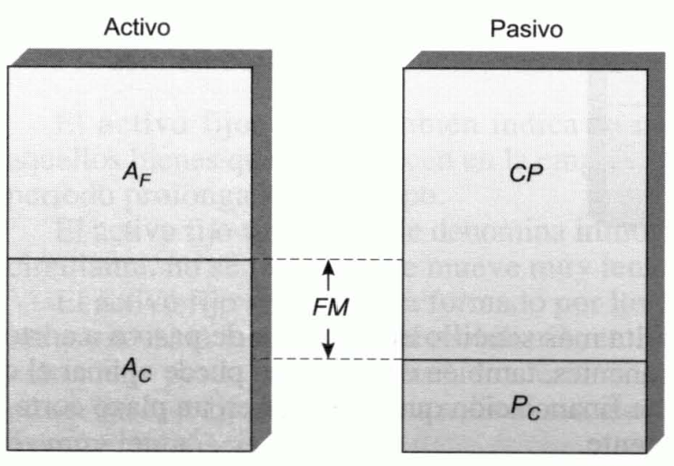
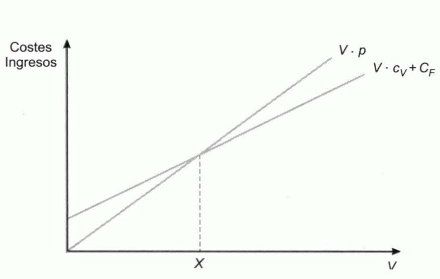

Tema 6: Elementos financieros
=============================

Introducción
------------

**Conjunto de bienes y derechos de la empresa.** Resultado del proceso de realización de inversiones que ha desarrollado a lo largo del tiempo.

***Estructura económica de la empresa.*** Características que tiene el conjunto de bienes y derechos de la empresa.

***Estructura financiera de la empresa.*** Características del conjunto de medios financieros que permiten realizar inversiones en bienes y derechos.

***Estructura económico-financiera de la empresa.*** Conjunto de la estructura económica y de la estructura financiera.

El balance: conceptos básicos
-----------------------------

***Balance.*** Documento financiero en el que se detallan las inversiones que la empresa ha ido realizando a lo largo de su existencia y las fuentes de financiación de esas inversiones. Consta de dos partes:

- **Activo,** $\mathbf{A}$**.** Se divide en
    - **Activo fijo**. El que permanece durante un período prolongado de tiempo.
    - **Activo circulante**. "Circula"; que vence en un período más o menos breve de tiempo.
- **Pasivo.** Se divide en:
    - **Pasivo a corto plazo**. Deudas que vencen en un breve período de tiempo.
    - **Capitales permanentes**. Constituido por las restantes deudas y los fondos propios.

***Patrimonio, patrimonio neto o neto patrimonial.*** Diferencia entre el activo y los recursos ajenos.

En el activo se reflejan los bienes y derechos de la empresa y en el pasivo las deudas (**recursos ajenos,** $\mathbf{D}$), para obtener la ecuación del patrimonio:

$$A = D + Neto$$

En sentido amplio el pasivo es el conjunto de las fuentes de financiación del activo (deudas o recursos ajenos y recursos propios, $K$).

***Estado del inventario.*** Documento que detalla los componentes del activo y del pasivo con sus respectivos valores. El convenio es situar el activo a la izquierda y el pasivo a la derecha. El activo total ha de coincidir con el pasivo total.

***Balance anual.*** Estado del inventario anual.

***Plan general de contabilidad.*** Conjunto de normas que tratan de homogeneizar los criterios contables en muy diversos aspectos entre los que se incluye la terminología empleada por las diversas empresas en sus documentos contables.

***Capital Social.*** Formado por las aportaciones directas de los socios a la financiación de la empresa. En las sociedades anónimas este capital se encuentra dividido en partes alícuotas denominadas **acciones**.

Si una empresa en un año concreto:

- **Tiene pérdidas**. Su importe se recoge en el activo.
- **Obtiene beneficios**. Hasta el momento de su reparto se sitúan en el pasivo. El beneficio:
    - **Repartirse** a los socios en forma de **dividendos**.
    - **Retenerse** para financiar activos, pasando a denominarse **reservas** (fondo propio que se recoge en el pasivo).

***Dividendos.*** Cantidades que, como beneficios anuales de la empresa, se reparten a los socios.

El objetivo financiero de la empresa
------------------------------------

***Objetivo financiero primario.*** Maximizar la riqueza de sus accionistas por su vinculación a la empresa, es decir, maximizar el precio de la acción. Se toma este objetivo porque:

1. Es un objetivo razonablemente operativo sobre el que construir modelos y reglas de decisión.
2. Los accionistas son los propietarios de la empresa y eligen al equipo directivo que se supone, trabaja en pro de sus intereses.
3. Supone someterse al juicio del mercado. Tomar las decisiones que más elevan el precio de la acción equivale a elegir las decisiones que provocarán una mayor mejora en la empresa.

Aunque una empresa no cotice en Bolsa, su objetivo debe ser el mismo: maximizar el precio que tendría la acción si la tuviera y cotizara en el mercado.

Factores de los que depende el precio de la acción. Las decisiones financieras de la empresa
--------------------------------------------------------------------------------------------

En cuanto al precio de las acciones debe considerarse:

- El beneficio no es tan importante como la rentabilidad. Si el beneficio aumenta a costa de elevar el tamaño de la empresa en una proporción superior, la rentabilidad de los propietarios puede verse mermada.
- El valor que tienen los fondos según el momento en el que se han generado.
- Es más importante el beneficio por acción y la rentabilidad que el beneficio total.

***Rentabilidad.*** Beneficio obtenido cada período por cada unidad monetaria invertida.

***Riesgo.*** Factor relevante en las decisiones financieras. Ante dos proyectos de inversión con la misma rentabilidad es preferible aquel que tenga un riesgo menor.

Factores influyentes en las decisiones financieras:

- **Selección de inversiones.**
- **Selección de fuentes de financiación.** El riesgo es proporcional al nivel de endeudamiento.
- **Decisiones de distribución de dividendos.** Las empresas se suelen limitan a pagar el mismo dividendo todos los años, o a distribuir una proporción constante de los beneficios, sin embargo:
    - Los accionistas pueden estar dispuestos a sacrificar una parte de sus dividendos para que se quede en la empresa y así:
        - Reforzar su financiación
        - Reduciéndose su riesgo
        - Acometer inversiones lo suficientemente rentables como para pagar mayores dividendos en el futuro

    La mejor política de dividendos es la que maximiza el precio de la acción. Las decisiones de política de dividendos afectan al pasivo.

La medida de la rentabilidad
----------------------------

***Rentabilidad.*** Relación entre los beneficios obtenidos y los fondos aplicados para obtenerlos.

***Beneficio.*** Debe distinguirse:

- **Beneficio económico, operativo, de explotación o bruto,** $\mathbf{\text{BE}}$**.*** Generado por los activos de la empresa: sus inversiones. No depende de la estructura financiera de la empresa.

- **Beneficio neto,** $\mathbf{\text{BN}}$**.*** El que queda para los propietarios de la empresa una vez deducidos del beneficio económico los intereses de las deudas:

$$BN = BE - D \cdot i$$

***Rentabilidad operativa, económica o bruta,*** $\text{RE}$***.*** Rentabilidad de sus activos: beneficio que estos han generado por cada unidad monetaria de activo:

$$RE = \frac{\text{BE}}{A}$$

***Rentabilidad financiera.*** Beneficio que obtienen los propietarios de la empresa por cada unidad monetaria de capital que han aportado a la misma:

$$RF = \frac{\text{BN}}{K}$$

***Beneficio líquido.*** Beneficio de los accionistas: la diferencia del beneficio neto y los impuestos determinados como porción del benefición en función de un gravamen \(t\):

$$BL = BN - BN \cdot t = \left( 1 - t \right) \cdot BN$$

***Rentabilidad financiera después de impuestos:***

$$RF_{D} = \frac{\left( 1 - t \right) \cdot BN}{K} = \left( 1 - t \right) \cdot RF$$

***Rentabilidad bruta de las ventas,*** $\text{RV}$***.*** Cociente entre el beneficio económico y el volumen de ventas medido en unidades monetarias, $V$. La rotación del capital total, $r_{T}$, es el número de veces que el capital total está comprendido en las ventas:

$$RV \cdot r_{T} = \frac{\text{BE}}{V} \cdot \frac{V}{A} = RE$$

Una baja rentabilidad puede deberse a que el margen de beneficio que dejan las ventas es bajo, a que el capital rota muy poco, o a ambas.

***Rentabilidad bursátil.*** División del dividendo entre la capitalización bursátil, $P \cdot N$. El dividendo se obtiene a partir del beneficio líquido en forma de dividendo, $\text{BL}$, y el coeficiente de reparto, $b$.

$$RB_{D} = \frac{D}{P \cdot N} = \frac{BL \cdot b}{P \cdot N}$$

El equilibrio económico-financiero de la empresa y el fondo de rotación o maniobra
----------------------------------------------------------------------------------

La composición del:

- **Activo**. Determina **estructura económica de la empresa**
- **Pasivo**. Determina **estructura financiera**
- **Conjunto**. Conforma su **estructura económico-financiera**

***Composición del activo:***

- ***Activo circulante,*** $A_{C}$***.*** Constituido por todos los bienes y derechos que no permanecen en la empresa, sino que circulan por ella y son reemplazados por otros. Está formado por:

    - La **tesorería**.*** Dinero en caja y saldos a la vista en instituciones de crédito.
    - El **realizable**.*** Partidas a corto plazo que pueden venderse o liquidarse (transformarse en tesorería) sin que se detenga la actividad de la empresa (créditos sobre clientes, letras de cambio o efectos a cobrar, inversiones financieras temporales, etc.).
    - Las **existencias** almacenadas.

- ***Activo fijo o inmovilizado,*** $A_{F}$***.*** Formado por todos aquellos bienes que permanecen en la empresa, que "se fijan" a ella durante un período prolongado de tiempo: terrenos, los edificios, el mobiliario, etc. La circulación de los activos es muy lenta.

- ***Composición del pasivo:***

    - ***Capitales permanentes,*** $\text{CP}$***.*** Son aquellas fuentes de financiación que se encuentran a disposición de la empresa en un período largo de tiempo (recursos financieros propios y créditos a medio y largo plazo).
    - ***Pasivo a corto plazo,*** $P_{C}$***.*** Integrado por las deudas que vencen en un período breve de tiempo (deudas con proveedores, créditos a corto plazo, etc.).

> El activo fijo ha de ser financiado con capitales permanentes y sólo el activo circulante ha de serlo con pasivo a corto plazo. De esta forma se evita el riesgo de que la empresa se vea en la necesidad de perder sus pagos durante un plazo más o menos largo.
>
> Además, una parte del activo circulante ha de ser financiado con capitales permanentes, evitando así el riesgo de un desfase entre el ritmo de cobros generados por el activo circulante y el ritmo de pagos derivado de la exigibilidad del pasivo a corto.

Es decir:

1. Lo que dura mucho (activo fijo) se financia con dinero que tienes mucho tiempo (capitales permanentes).
2. Lo que dura poco (activo circulante) se financia con dinero que debes devolver pronto (pasivo a corto plazo).
3. Pero, para evitar problemas, una parte de ese dinero que dura poco (activo circulante) también debería financiarse con dinero que tienes mucho tiempo (capitales permanentes) para tener un "colchón" y evitar desequilibrios en tus pagos.

***Fondo de rotación o fondo de maniobra.*** Diferencia entre el activo circulante y el pasivo a corto plazo.

*Figura 6.1 Activo, pasivo y fondo de maniobra*

El fondo de maniobra se puede definir como:

- Parte del activo circulante que no se financia con pasivo a corto plazo, sino con capitales permanentes, denominándose **capital de trabajo**.

$$FM = A_{C} - P_{C}$$

- Parte de capitales permanentes que no financia activo fijo, sino activo circulante.

$$FM = CP - A_{F}$$

Los ciclos de actividad de la empresa y el período medio de maduración
----------------------------------------------------------------------

***Ciclo de explotación, ciclo corto o ciclo dinero-mercancías-dinero.*** Se corresponde con el de los bienes del activo circulante. Está formado por el proceso en el que se:

1. Adquieren los materiales inventariables
1. Almacenan hasta incorporarse al proceso de transformación
1. Realiza la fabricación
1. Obtienen los productos terminados
1. Almacenan
1. Venden
1. Remiten a los clientes
1. Cobra a los clientes

Recuperando fondos de dinero con los que retribuir a los factores de producción.

***Período de maduración.*** Duración del ciclo de explotación.

***Período medio de maduración.*** Duración media del ciclo de explotación.

***Ciclo largo, ciclo de amortizaciones o ciclo de depreciación.*** Ciclo al que está sometido el activo fijo. La adquisición de este tipo de bienes, por ejemplo, maquinaria, supone una inversión que se irá depreciando a lo largo del tiempo, hasta el momento en que se reemplace por otra.

Las fases del ciclo de explotación y el período medio de maduración económico
-----------------------------------------------------------------------------

Las fases del ciclo de explotación son:

1. **Almacenamiento de las materias primas.** Constituyen una inversión que es valorada a precio de coste (precio de adquisición).
2. **Fabricación.** Al entrar en el proceso de producción se consumen las materias primas y su coste junto con el de otros factores, lo que determina el coste de los productos semiterminados.
3. **Almacenamiento de los productos terminados o fase de venta.** El valor de los productos terminados almacenados se determina sumando los cotes de los factores que tienen incorporados.
4. **Cobro a los clientes.** La venta de la producción implica una reducción en el valor del almacén de productos terminados, incrementando el crédito que se tenga sobre los clientes. Este crédito se valora en el precio de venta; al resultado de añadir al coste el margen de beneficios de la empresa. El saldo del crédito sobre clientes se reducirá a media que se vaya cobrando su importe.

El período medio de maduración económico está integrado por:

- Período medio de almacenamiento de materias primas, $PM_{a}$.
- Período medio de fabricación, $PM_{c}$.
- Período medio de venta, $PM_{v}$.
- Período medio de cobro a clientes, $PM_{e}$

$$PM = PM_{a} + PM_{c} + PM_{v} + PM_{e}$$

- Si $A$ es el consumo anual de materias primas y $a$ es el nivel medio de existencias en el almacén, el número de veces que, en un año, se consume el stock medio de materias primas es:

$$n_{a} = \frac{A}{a}$$

El número de días que tarda la empresa en consumir el nivel medio, es decir, el período medio de almacenamiento es:

$$PM_{a} = \frac{365}{n_{a}} = 365 \cdot \frac{a}{A}$$

- Si $C$ es el coste total de la producción anual y $c$ es el nivel medio de productos en curso de elaboración, $C/c$ indicará el número de veces que, en un año, se renueva el stock en curso de fabricación. Si dicho cociente se representa por $n_{c}$, el período de medio de fabricación es:

$$PM_{c} = \frac{365}{n_{c}} = 365 \cdot \frac{c}{C}$$

- Siendo $V$ el volumen anual de ventas, valorado a precio de coste, y $v$ el volumen medio de las existencias del almacén de productos terminados, el número de veces que, en un año, se renuevan las existencias de productos acabados es:

$$n_{v} = \frac{V}{v}$$

El número de días que, por término medio, tarda en producirse dicha renovación o período de venta es:

$$PM_{v} = \frac{365}{n_{v}} = 365 \cdot \frac{v}{V}$$

- Si $E$ es el volumen o montante anual de ventas y $e$ es el valor medio de la deuda que los clientes tienen con la empresa, el número de veces que, en un año, se renueva la deuda media de los clientes es:

$$n_{e} = \frac{E}{e}$$

El período medio de cobro, por tanto, es:

$$PM_{e} = \frac{365}{n_{e}} = 365 \cdot \frac{e}{E}$$

Por tanto, el período medio de maduración económico es:

$$PM = PM_{a} + PM_{c} + PM_{v} + PM_{e} = 365 \cdot \left( \frac{a}{A} + \frac{c}{C} + \frac{v}{V} + \frac{e}{E} \right)$$

El período de maduración económico es el tiempo promedio que tarda en recuperase una unidad monetaria invertida en el ciclo de explotación, de la que se deduce:

- Si se mantienen las ventas anuales, reduciéndose al mismo tiempo el período de almacenamiento, el de fabricación o el de ventas, será porque se ha conseguido reducir los recursos financieros inmovilizados en almacenes de materias primas, o bien en stocks de productos semielaborados o terminados.

- La reducción del período medio de cobro da lugar a una menor necesidad de capitales inmovilizados en créditos sobre terceros.

- Si la producción y venta anual se mantienen y la duración del ciclo de explotación se reduce, se reducirá también la necesidad de activos de la empresa, porque éstos rotan más rápidamente y, consiguientemente, se precisarán menos recursos financieros, incrementándose así la rentabilidad de la empresa.

El período medio de maduración financiero
-----------------------------------------

Si anualmente se compran $P$ unidades monetarias de materias primas y el
saldo medio con los proveedores es de $p$, el número de veces que cada
año se paga este saldo medio es:

$$n_{p} = \frac{P}{p}$$

El número medio de días que financian los proveedores o período medio de
pago es:

$$PM_{p} = \frac{365}{n_{p}} = 365 \cdot \frac{p}{P}$$

Por tanto, el período medio de maduración financiero será:

$$PMF = PM - PM_{p} = 365 \cdot \left( \frac{a}{A} + \frac{c}{C} + \frac{v}{V} + \frac{e}{E} - \frac{p}{P} \right)$$

El cálculo del fondo de maniobra mínimo o necesario
---------------------------------------------------

### Modelo analítico

Se consideran los siguientes términos (niveles medios):

-   Materias primas, $a$.

-   Productos semiterminados, $c$.

-   Productos acabados, $v$.

-   Créditos sobre clientes, $e$.

-   Tesorería, $t$.

-   Deuda con proveedores (pasivo a corto plazo), $p$.

$$FM = A_{C} - P_{C} = t + a + c + v + e - p = t + \frac{A}{365} \cdot PM_{a} + \frac{C}{365} \cdot PM_{c} + \frac{V}{365} \cdot PM_{v} + \frac{E}{365} \cdot PM_{e} - \frac{P}{365} \cdot PM_{p}$$

Si se considera que el consumo anual de materias primas coincide con el
volumen anual de compras a los proveedores:

$$FM = t + \frac{A}{365} \cdot (PM_{a} - PM_{p}) + \frac{C}{365} \cdot PM_{c} + \frac{V}{365} \cdot PM_{v} + \frac{E}{365} \cdot PM_{e}$$

En esta expresión, el cociente $\frac{A}{365}$ es el consumo medio
diario de materias primas. Multiplicando este consumo por el número de
días que dura el período medio de inmovilización de una unidad monetaria
en el almacén de materias primas, salvo los días que son financiados por
los proveedores, $PM_{a} - PM_{p}$, se obtiene el fondo de maniobra
necesario para financiar el inventario de materias primas. De forma
semejante se pude hacer con el resto de sumandos.

### Modelo sintético

Se consideran los siguientes términos:

-   $k$: coste medio diario.

-   $s$: consumo diario de materias primas.

-   $p_{s}$: precio de cada unidad física de materias primas.

-   $m$: número de unidades físicas de mano de obra utilizadas
    diariamente.

-   $p_{m}$: precio unitario de la mano de obra.

-   $g$: módulo diario de gastos generales.

-   $p_{g}$: precio unitario de los gastos generales.

$$k = sp_{s} + mp_{m} + gp_{g}$$

Cada unidad monetaria incorporada al ciclo de explotación tarda
$\text{PM}$ días en recuperarse. Si diariamente se incorporan $k$
unidades, la inmovilización media en activo circulante será:

$$A_{C} = PM \cdot k = PM \cdot \left( sp_{s} + mp_{m} + gp_{g} \right)$$

Si a los proveedores de materias primas se les paga al cabo de los
$x_{s}$ días desde su incorporación al proceso de producción, por
término medio estarán financiando las
$x_{s} \cdot s \cdot p_{s}\text{\ u.m.}$ que resultan de multiplicar el
consumo diario y el número de días de aplazamiento del pago. Del mismo
modo, si la mano de obra se abona con un aplazamiento de $x_{m}$ días, y
$x_{g}$ es el período medio de dilación en el pago de los gastos
generales, otros pasivos a corto plazo serán $x_{m} \cdot m \cdot p_{m}$
y $x_{g} \cdot g \cdot p_{g}$.

Por consiguiente, el pasivo a corto plazo valdrá:

$$P_{C} = x_{s} \cdot s \cdot p_{s} + x_{m} \cdot m \cdot p_{m} + x_{g} \cdot g \cdot p_{g}$$

El fondo de maniobra será:

$$FM = PM \cdot \left( sp_{s} + mp_{m} + gp_{g} \right) - \left( x_{s} \cdot s \cdot p_{s} + x_{m} \cdot m \cdot p_{m} + x_{g} \cdot g \cdot p_{g} \right)$$

$$FM = s \cdot p_{s} \cdot \left( PM - x_{s} \right) + m \cdot p_{m} \cdot \left( PM - x_{m} \right) + g \cdot p_{g} \cdot \left( PM - x_{g} \right)$$

El punto muerto
---------------

***Punto muerto o umbral de rentabilidad:*** volumen de ventas, en
unidades físicas, que hace el beneficio operativo igual a cero y a
partir del cual comienza a ser positivo.

***Beneficio operativo o beneficio de explotación:*** diferencia entre
los ingresos y los costes no financieros.

-   **Ingresos,** $\mathbf{I}$**:** producto del número de unidades
    físicas vendidas, $V$, por el precio de venta, $p$.

$$I = V \cdot p$$

-   **Costes:** hay que distinguir los costes fijos y los variables. Los
    primeros no dependen del volumen de producción y ventas mientras que
    los variables dependen de la cantidad producida y vendida. El coste
    variable total es el producto del número de unidades producidas y
    vendidas por el coste variable unitario, $c_{v}$. Denominando
    $C_{F}$ al coste fijo anual excluyendo los gastos financieros, el
    coste total no financiero será:

$$C = V \cdot c_{v} + C_{F}$$

El beneficio operativo será:

$$BE = V \cdot p - \left( V \cdot c_{v} + C_{F} \right)$$

Por tanto, el punto muerto es el volumen de producción y ventas, $X$,
tal que:

$$X \cdot p - X \cdot c_{v} - C_{F} = 0 \rightarrow X = \frac{C_{F}}{p - c_{v}}$$

A la diferencia entre el precio de venta y el coste variable unitario se
le denomina **margen unitario sobre costes variables o margen bruto
unitario**, $m$:

$$X = \frac{C_{F}}{m}$$

***Margen bruto total:*** es el producto entre el margen bruto unitario
y el número de unidades vendidas.

El punto muerto es el nivel de ventas en el cual los costes fijos son
cubiertos en su totalidad con el margen bruto total generado:

$$m \cdot X = C_{F}$$

{width="3.4199070428696414in"
height="1.8786122047244094in"}

Figura . El punto muerto representa la intersección entre la recta de
ingresos y la recta de costes

***Margen de seguridad:*** diferencia entre las ventas previstas y el
punto muerto. El riesgo de pérdidas será tanto mayor cuanto más estrecho
sea este margen.

El riesgo también depende de la relación existente entre los costes
fijos y los variables.

Los ratios como instrumento de análisis de la estructura económico-financiera de la empresa
-------------------------------------------------------------------------------------------

***Ratios de situación:*** permiten estudiar cómo se distribuyen el
activo y el pasivo. Se obtienen a partir de los datos del Balance. Hay
tres tipos:

-   **Relativos al activo:** se estudia la estructura económica de la
    empresa.

    -   Ratio del activo circulante: $\frac{A_{C}}{A}$

    -   Ratio del activo fijo: $\frac{A_{F}}{A}$

    -   Ratio de tesorería: $\frac{T}{A}$

    -   Realizable: $\frac{R}{A}$

    -   Existencias: $\frac{E}{A}$

-   **Referentes al pasivo:** s estudia su estructura financiera.

    -   Pasivo a corto plazo: $\frac{P_{C}}{P}$

    -   Recursos propios: $\frac{K}{P}$

    -   Recursos ajenos: $\frac{\text{RA}}{P}$

    -   Capitales permanentes: $\frac{C_{P}}{P}$

-   **Ratios de síntesis:** se utilizan datos del activo y del pasivo.

    -   Ratios de equilibro financiero a corto plazo:

        1.  Ratio de liquidez: $\frac{A_{C}}{P_{C}}$

        2.  Ratio de tesorería inmediata: $\frac{T}{P_{C}}$

        3.  Ratio de tesorería ordinaria: $\frac{T + R}{P_{C}}$

    -   Ratios de equilibrio financiero a largo plazo:

        1.  Ratio de capital propio inmovilizado: $\frac{A_{F} - RA}{K}$

        2.  Ratio de capital propio en circulante: $\frac{\text{FM}}{K}$

        3.  Ratio de garantía: $\frac{A}{D}$

        4.  Ratio de financiación del inmovilizado:
            $\frac{\text{CP}}{A_{F}}$

    -   Ratios de apalancamiento:

        1.  Ratio de endeudamiento a corto plazo: $\frac{P_{C}}{K}$

        2.  Ratio de endeudamiento a largo plazo: $\frac{\text{RA}}{K}$

        3.  Ratio de endeudamiento total: $\frac{D}{K}$

***Ratios de rotación:*** miden el número de veces que la masa
patrimonial correspondiente se encuentra comprendida en el volumen de
ventas o cifra de negocios del período (suele ser un año).

-   **Rotación de activos:**

    -   Rotación del activo total: $\frac{V}{A}$

    -   Rotación del activo fijo: $\frac{V}{A_{F}}$

    -   Rotación del activo circulante: $\frac{V}{A_{C}}$

    -   Rotación de clientes y efectos a cobrar: $\frac{V}{e}$

    -   Rotación de existencias: $\frac{C}{E}$

-   **Rotación de fuentes de financiación:**

    -   Rotación de capitales permanentes: $\frac{V}{\text{CP}}$

    -   Rotación de capitales propios: $\frac{V}{K}$

    -   Rotación de capitales totales: $\frac{V}{P}$

***Método Dupont:*** es un procedimiento de descomposición, análisis e
interpretación de la rentabilidad, basado en ratios que actúan entre sí
de forma multiplicativa.

La rentabilidad neta se descompone como:

$$RT = \frac{\text{BN}}{P} = \frac{\text{BN}}{A} = \frac{\text{BN}}{V} \cdot \frac{V}{A}$$

Donde $\frac{\text{BN}}{V}$ es la rentabilidad neta de las ventas, o
margen neto sobre ventas y $\frac{V}{A}$ es la rotación del activo.

La rentabilidad financiera se descompone de la siguiente forma:

$$RF = \frac{\text{BN}}{K} = \frac{\text{BN}}{V} \cdot \frac{V}{A} \cdot \frac{A}{K}$$

El último ratio que aparece en esta fórmula es una medida del grado de
endeudamiento: es el resultado de añadir la unidad al ratio de
endeudamiento total.

$$\frac{A}{K} = \frac{P}{K} = \frac{D + K}{K} = \frac{D}{K} + 1$$

