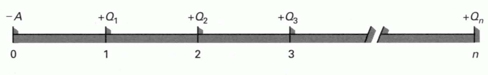
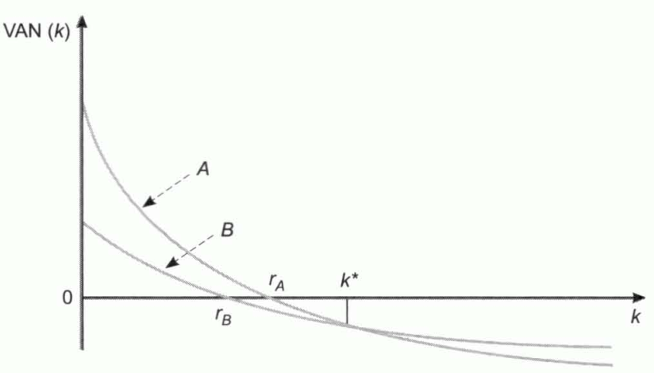
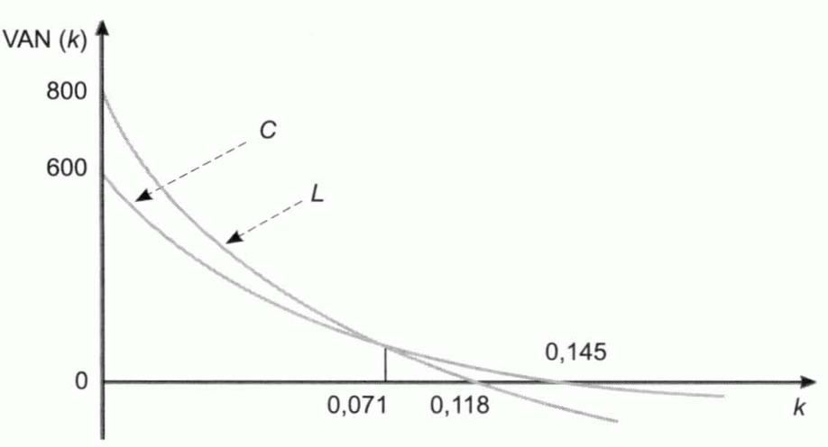

Tema 7: Las inversiones y su selección. La rentabilidad de las inversiones
==========================================================================

Concepto y tipos de inversiones
-------------------------------

Las inversiones se pueden clasificar considerando distintos criterios, entre los que se encuentran:

- **Inversiones de activo fijo y de activo circulante.** Las empresas se plantean las decisiones de selección de activos fijos, considerando a las inversiones en activo circulante anexas.

- **Inversiones financieras y productivas.** Las inversiones financieras se materializan en activos de carácter financiero, como las obligaciones, las acciones, los pagarés, etc., y las inversiones productivas, son las que se concretan en activos que sirven para producir bienes y consumos.

- **Inversiones productivas.** Se distinguen estos tipos de inversiones:
    - **Inversiones de reemplazamiento para el mantenimiento.** Necesarias para sustituir los bienes de equipo desgastados o estropeados que son precisos para continuar la producción.
    - **Inversiones de reemplazamiento para reducir costes o para mejorar tecnológicamente.** Se sustituyen equipos que funcionan, pero que se encuentran obsoletos, por otros con consumos inferiores o que incorporan mejoras tecnológicas.
    - **Inversiones de ampliación de los productos o mercados existentes.** Realizadas para elevar la producción de los productos existentes o para ampliar los canales y las posibilidades de distribución en los mercados a los que ya sirve la empresa.
    - **Inversiones de ampliación a nuevos productos o mercados.** Efectuadas para elaborar nuevos productos o para extenderse a nuevas áreas geográficas o, en general, a nuevos mercados.
    - **Inversiones impuestas.** No se efectúan por motivos económicos sino para cumplir leyes, convenios colectivos, etc.

Las inversiones de mantenimiento suelen ser las que requieren menos análisis y en las que el proceso decisional es más sencillo. Además, dentro de cada grupo, los trámites necesarios suelen ser tanto más prolongados y complejos cuanto mayor es el importe que requiere la inversión.

Variables fundamentales que definen un plan de inversión
--------------------------------------------------------

Desde el punto de vista económico, lo único relevante es

- El **desembolso inicial** que requiere la inversión
- Los **flujos de caja** que cabe esperar de la misma
- Los momentos en que se espera que sean generados cada uno de ellos
- El **riesgo** que comporta

El plan de una inversión se puede representar como en la siguiente figura:

*Figura 7.1 Plan de una inversión*

Donde:

- $A$ es el desembolso inicial
- $Q_{t}$ es el flujo de caja del momento $t$
- $n$ es el número de años que dura la inversión

También se puede representar del siguiente modo:

\[-A / Q_1 / Q_2 / \dots / Q_n\]

El factor de riesgo se incorpora al cálculo de la rentabilidad.

***Flujo de caja o flujo neto de caja.*** Diferencia entre el cobro generado por la inversión en ese momento y los pagos que esa inversión requiere en ese instante del tiempo.

Las decisiones de selección de inversiones deben basarse en los flujos de cajas, que son diferencias entre cobros y pagos, y no en los beneficios, que son diferencias entre ingresos y gastos.

***Rentabilidad o rentabilidad esperada.*** Rentabilidad que se espera obtener con la inversión.

***Rentabilidad requerida,*** $\mathbf{k}_{\mathbf{h}}$***.*** Rentabilidad exigida a la inversión.

Una inversión no es realizable a menos que su rentabilidad esperada supere a su rentabilidad requerida.

***Tipo libre de riesgo,*** $R_{f}$***.*** Rentabilidad que tienen los activos que carecen de riesgo.

***Prima de riesgo,*** $p_{h}$***.*** Suplemento de rentabilidad que se incorpora a la inversión debido al riesgo que comporta. Se calcula teniendo en cuenta el tipo libre de riesgo, $R_{f}$, y la rentabilidad requerida de cierta inversión, $k_{h}$.

$$p_{h} = k_{h} - R_{f}$$

***Rentabilidad neta de riesgo.*** Diferencia entre su rentabilidad y su prima de riesgo requerida.

La relación existente entre la rentabilidad que se exige a una inversión cuando no hay inflación, $i$, y la que se exige cuando la hay, $k$, es la siguiente:

$$k = i + g + i \cdot g$$

Donde $g$ es la tasa de inflación anual.

- La rentabilidad requerida debe ser superior al coste de la financiación.
- Si se debe elegir entre dos inversiones mutuamente excluyentes que tienen el mismo nivel de riesgo, la rentabilidad mínima que ha de requerirse de cada una de ellas es la rentabilidad esperada de la otra.

Métodos estáticos de selección de inversiones
---------------------------------------------

***Métodos estáticos o criterios aproximados.*** No tienen en cuenta el hecho de que los capitales tienen distintos valores en los diferentes momentos del tiempo. El más utilizado es el plazo de recuperación.

***Plazo de recuperación,*** $P$***.*** Período de tiempo que tarda en recuperarse el desembolso inicial con los flujos de caja. Da preferencia a aquellas inversiones cuyo plazo de recuperación sea menor. Se trata de un criterio de liquidez.

Si los flujos de caja son constantes e iguales a $Q$, y la duración de la inversión es igual o superior que el propio plazo de recuperación, denominando $A$ al desembolso inicial, $P$ será:

$$P = \frac{A}{Q}$$

Los inconvenientes de este criterio son:

- No tiene en cuenta los flujos de caja anteriores ni posteriores al plazo de recuperación.
- Se suman unidades monetarias de los diversos años, como si fueran homogéneas, y el total se compara con el desembolso inicial, que se encuentra referido a otro momento del tiempo.

Otros métodos estáticos muy empleados en la práctica son:

1. El criterio del flujo total por unidad monetaria comprometida.
1. El criterio del flujo de caja medio anual por unidad monetaria comprometida.
1. El criterio de la comparación de costes.
1. La tasa de rendimiento contable.

***Flujo de caja total por unidad monetaria comprometida.*** Es igual al coeficiente:

$$r^{'} = \frac{Q_{1} + Q_{2} + \ldots + Q_{n}}{A}$$

La regla es:

- Realizar la inversión cuando este importe es superior a la unidad
- Considerarla indiferente cuando es igual a uno
- No efectuarla si resulta inferior a la unidad

Características:

- \(r^{'}\) es la cantidad de u.m. que la inversión genera durante toda su vida por cada u.m. invertida.
- Una inversión es tanto mejor cuanto mayor sea el importe.

Inconvenientes:

1. Se suman unidades monetarias de los diversos años como si fueran homogéneas
1. El total se compara con el desembolso inicial que también está referido a otro momento.
1. Se refiere al conjunto de la vida de la inversión lo que impide comparar inversiones que tienen diferente duración.
1. No se trata de una verdadera rentabilidad.

***Criterio del flujo de caja medio anual por unidad monetaria comprometida.*** Consiste en calcular el flujo neto de caja medio anual, $\overline{Q}$, y determinar cuánto corresponde por cada unidad monetaria invertida:

\begin{alignat*}{2} % 2 alignment pairs
\overline{Q} &= \frac{Q_{1} + Q_{2} + \ldots + Q_{n}}{n} \\
r^{''} &= \frac{\overline{Q}}{A}
\end{alignat*}

Características:

- El coeficiente $r''$ es lo que genera la inversión anualmente por cada unidad monetaria invertida.
- Una inversión se considera tanto mejor cuanto mayor sea $r''$.

Los inconvenientes de este criterio son:

1. Se suman unidades monetarias de los diversos años como si fueran homogéneas
1. El total se compara con el desembolso inicial que también está referido a otro momento.
1. No se trata de una verdadera rentabilidad.
1. No es aplicable para comparar inversiones de diferentes duraciones porque da preferencia a las más breves.

***Método de comparación de costes.*** Consiste en calcular los costes anuales que corresponden a las diversas alternativas de inversión y elegir la que tenga el menor coste anual total.

Inconvenientes:

- No constituye un procedimiento de valoración de inversiones ni permite calcular su rentabilidad.
- No usa la información económica relevante.

***Tasa de rendimiento contable o rentabilidad media.*** Relaciona mediante cociente el beneficio anual que se espera que genera el proyecto, con la inmovilización media que requiere en activo fijo y circulante.

Inconvenientes:

- Los mismos que el *método de comparación de costes*.

Métodos dinámicos de selección de inversiones
---------------------------------------------

***Métodos dinámicos de selección de inversiones.*** Aquellos que incorporan el factor tiempo y tienen en cuenta el hecho de que los capitales tiene distinto valor en función del momento en el que se generan. Los principales métodos dinámicos de selección son:

- El valor actual neto $\text{VAN}$
- La tasa interna de rentabilidad $\text{TIR}$
- El plazo de recuperación con descuento

***Valor actual,*** $\text{VA}$***:*** La suma de los flujos de caja llevados al momento actual, considerando una rentabilidad anual $k$.

$$VA = \frac{Q_{1}}{1 + k} + \frac{Q_{2}}{\left( 1 + k \right)^{2}} + \ldots + \frac{Q_{n}}{\left( 1 + k \right)^{n}}$$

La inversión será:

- **Efectuable** cuando el valor actual del proyecto es mayor que lo que hay que desembolsar por él, $A$.
- **Indiferente** cuando su $\text{VA}$ coincida con el desembolso inicial.
- **No será efectuable** cuando el valor actual de sus flujos de caja sea inferior al desembolso inicial.

***Valor actual neto,*** $\text{VAN}$***.*** Diferencia entre su valor actual y su desembolso inicial:

$$VAN = - A + \frac{Q_{1}}{1 + k} + \frac{Q_{2}}{\left( 1 + k \right)^{2}} + \ldots + \frac{Q_{n}}{\left( 1 + k \right)^{n}}$$

Entre un conjunto de inversiones efectuables debe darse preferencia a aquellas cuyo valor actual neto sea más elevado.

***Inversiones analizables.*** Inversiones en las que la suma aritmética de los flujos de caja supera al desembolso inicial.

***Inversiones simples.*** Aquellas que se encuentran formadas por un desembolso inicial y un conjunto posterior de flujos de caja que son todos no negativos:

El valor actual neto, como función del tipo de descuento, responderá a la expresión:

$$\text{VAN}\left( k \right) = - A + \frac{Q_{1}}{1 + k} + \frac{Q_{2}}{\left( 1 + k \right)^{2}} + \ldots + \frac{Q_{n}}{\left( 1 + k \right)^{n}}$$

En las inversiones simples (que además son analizables) el VAN evoluciona como función del tipo de descuento de la siguiente manera:

*Figura 7.2 Evolución del VAN como función del tipo de descuento*

Cuando el tipo de descuento vale cero, el VAN es:

$$\text{VAN}\left( 0 \right) = - A + Q_{1} + Q_{2} + \ldots + Q_{n} = S - A$$

- A medida que la rentabilidad requerida crece, el $VAN(k)$ ha de irse reduciendo, pues, por ser una inversión simple, los flujos de caja posteriores al momento $0$ son todos positivos
- Cuando $k$ tiende a infinito, el valor actual neto tiende a $(- A)$, por lo que presenta una asíntota en esa altura.
- La curva es convexa respecto al eje de abscisas.
- Dado que al aumentar el tipo de descuento el $\text{VAN}\left( k \right)$ se reduce continuamente, pasando de valores positivos a negativos, existirá un único valor de $k$ que haga el $VAN(k)$ igual a cero.

***Tipo de rendimiento interno, tasa interna de rentabilidad o tasa de retorno,*** $\text{TIR}$***.*** Tipo de descuento $r$ que hace el valor actual neto de una inversión igual a cero. Es el valor de $r$ tal que:

$$- A + \frac{Q_{1}}{1 + k} + \frac{Q_{2}}{\left( 1 + k \right)^{2}} + \ldots + \frac{Q_{n}}{\left( 1 + k \right)^{n}} = 0$$

Una inversión será:

- **Efectuable** cuando su rentabilidad, $r$, sea superior a la rentabilidad requerida de la misma, $k$
- **No lo será** cuando aquella sea inferior
- **Indiferente** cuando ambas rentabilidades coincidan

Si se ha de seleccionar entre un conjunto de inversiones efectuables, deberá darse preferencia a las que tengan mayor rentabilidad neta de riesgo.

Dependiendo de si hay inflación:

- No la hay. La rentabilidad obtenida sería la **rentabilidad real** de la inversión.
- Hay expectativas de que vaya a haber una inflación $g$. Se ha obtenido la **rentabilidad aparente**; $r_{A}$. Para calcular la rentabilidad real se debe utilizar la siguiente expresión:

$$r_{R} = \frac{r_{A} - g}{1 + g}$$

Las comparaciones entre las rentabilidades de las inversiones pueden plantearse bien en términos de rentabilidades aparentes o reales. Una inversión es efectuable cuando:

- Su rentabilidad aparente ($r_{A}$) es superior a la rentabilidad aparente que se le exige ($k$)
- Su rentabilidad real ($r_{R}$) supera a la tasa de inflación que se requiere, $i$.

Ambos criterios son equivalentes porque si $[r_{A} > k]$, la tasa real será superior a la rentabilidad real requerida:

$$i = \frac{k - g}{1 + g}$$

***Método de prueba y error.*** Permite calcular la $\text{TIR}$ cuando la inversión dura más de dos años. Se prueban distintos tipos de descuento hasta encontrar aquel que hace el valor actual neto igual a cero. Si con un tipo de descuento se obtiene un valor:

- **Positivo** (mayor a cero). Habrá de probarse con otro más elevado.
- **Negativo**. Habrá de probarse con otro más pequeño.

Existen dos fórmulas que permite acotar el valor de $r$, para las que es necesario definir:

- Importe de multiplicación, $M$:

$$M = Q_{1} \cdot 1 + Q_{2} \cdot 2 + Q_{3} \cdot 3 + \ldots + Q_{n} \cdot n$$

- Importe de división, $D$:

$$D = \frac{Q_{1}}{1} + \frac{Q_{2}}{2} + \frac{Q_{3}}{3} + \ldots + \frac{Q_{n}}{n}$$

Siendo $S$ la suma aritmética de los flujos de caja y $A$ el desembolso inicial de la inversión, las fórmulas aproximadas son:

\begin{align*}
r^{*} &= \left( \frac{S}{A} \right)^{\frac{S}{M}} - 1 \\
r^{**} &= \left( \frac{S}{A} \right)^{\frac{S}{D}} - 1
\end{align*}

La tasa $r^{*}$ proporciona una aproximación por defecto, en tanto que la tasa $r^{**}$ aproxima por exceso, es decir:

$$r^{*} < r < r^{**}$$

- Si \(r^{*} < \text{rentabilidad requerida}\). \(r\) es mayor y puede concluirse que la inversión es efectuable sin necesidad de hacer más cálculos.
- Si \(r^{**} < \text{rentabilidad requerida}\). La inversión no es efectuable.

***Plazo de recuperación o pay-back con descuento.*** Período de tiempo que tarda en recuperarse, en términos actuales, el desembolso inicial:

- Según este método, las inversiones son tanto mejores cuanto menor sea su plazo de recuperación con descuento.
- Prima la liquidez de las inversiones sobre su rentabilidad y que no tiene en cuenta los flujos generados con posterioridad al propio plazo de recuperación.

***Tasa de valor actual,*** $T$***.*** \(VAN\) que se obtiene con la inversión por cada unidad monetaria comprometida:

$$T = \frac{\text{VAN}}{A}$$

Una inversión será:

- **Efectuable** cuando su tasa sea positiva
- **Indiferente** cuando la tasa valga cero
- **No será efectuable** cuando $T$ sea negativa.

Entre las inversiones efectuables, este criterio da preferencia a aquellas cuya tasa de valor actual sea más elevada:

Tiene interés en inversiones fraccionables: aquellas en las que se puede adquirir una participación. Quien piensa en invertir $\text{N\ u.m.}$ en proyecto, puede calcular el valor actual neto de su participación mediante el producto entre $T$ y $N$.

***Índice de rentabilidad o coeficiente beneficio/coste.*** Cociente entre el valor actual neto de todos los cobros generados por el proyecto y el valor actual neto de todos los pagos que requiere, incluyendo entre éstos últimos el desembolso inicial.

Una inversión será **efectuable** sólo cuando el índice sea superior a la unidad. Entre un conjunto de inversiones efectuables, debe darse preferencia a aquellas cuyo índice sea más elevado.

El índice de rentabilidad conduce a las mismas decisiones de selección de inversiones que el $\text{VAN}$.

El VAN y la TIR en algunos casos especiales
-------------------------------------------

### Un modelo general de valoración de inversiones y cálculo de rentabilidades

El modelo que, partiendo de flujos generados en cualesquiera momentos, permite determinar el valor actual neto y la rentabilidad anual, utilizando como tipo de descuento la rentabilidad requerida anualmente, es el siguiente:

\begin{align*}
VAN &= - A + \frac{Q_{1}}{\left( 1 + k \right)_{1}^{t}} + \frac{Q_{2}}{\left( 1 + k \right)_{2}^{t}} + \ldots + \frac{Q_{n}}{\left( 1 + k \right)_{n}^{t}} \\
0 &= - A + \frac{Q_{1}}{\left( 1 + r \right)_{1}^{t}} + \frac{Q_{2}}{\left( 1 + r \right)_{2}^{t}} + \ldots + \frac{Q_{n}}{\left( 1 + r \right)_{n}^{t}}
\end{align*}

En estas expresiones:

- $Q_{1}$ es el próximo flujo de caja generado por la inversión
- $t_{1}$ el momento en el que se producirá, expresado en años contados desde la actualidad
- $Q_{2}$ es el siguiente flujo
- $t_{2}$ el momento en el que se generará, expresado también en años desde el momento actual

### El supuesto en el que los flujos de caja son constantes

Denominando $Q$ al flujo constante, el valor actual neto es:

\begin{align*}
VAN &= - A + \frac{Q}{\left( 1 + r \right)_{1}^{t}} + \frac{Q}{\left( 1 + r \right)_{2}^{t}} + \ldots + \frac{Q}{\left( 1 + r \right)_{n}^{t}} \\
&= - A + Q \cdot \left\lbrack \frac{1}{\left( 1 + r \right)_{1}^{t}} + \frac{1}{\left( 1 + r \right)_{2}^{t}} + \ldots + \frac{1}{\left( 1 + r \right)_{n}^{t}} \right\rbrack\
\end{align*}

El importe que se encuentra entre corchetes es el valor actual de una corriente de flujos de caja unitarios, que tiene duración de $n$ años. Se le designa como $a_{\left. \ n \right\rceil k}$.

Aplicando las propiedades de las progresiones, el valor actual neto es igual a:

$$VAN = - A + Q \cdot \frac{1 - \left\lbrack \frac{1}{\left( 1 + k \right)^{n}} \right\rbrack}{k}$$

Y la $\text{TIR}$ es:

$$0 = - A + Q \cdot \frac{1 - \left\lbrack \frac{1}{\left( 1 + r \right)^{n}} \right\rbrack}{r}$$

### El supuesto en el que los flujos de caja son constantes y la duración de la inversión tiende a infinito

Se considera cómo calcular el \(VAN\) cuando:

1. Se considera que tiende a infinito (dura mucho).
2. Hay unos flujos de caja constantes (genera la misma cantidad de dinero constantemente).

$$VAN = - A + \frac{Q}{k}$$

En cuanto a la $\text{TIR}$:

$$r = \frac{Q}{A}$$

### El supuesto en el que los flujos de caja crecen a una tasa constante

Se supone que los flujos de caja crecen a una tasa $f$, expresada en tanto por uno. Por tanto, el $\text{VAN}$ de la inversión será:

$$VAN = - A + Q_{1} \cdot \left\lbrack \frac{1}{1 + k} + \frac{1 + f}{\left( 1 + k \right)^{2}} + \ldots + \frac{\left( 1 + f \right)^{n - 1}}{\left( 1 + k \right)^{n}} \right\rbrack$$

Aplicando las propiedades de las progresiones geométricas resulta:

$$VAN = - A + Q_{1} \cdot \frac{1 - \left\lbrack \frac{\left( 1 + f \right)^{n}}{\left( 1 + k \right)^{n}} \right\rbrack}{k - f}\ $$

Y la tasa de rentabilidad interna es el valor de $r$ que cumple:

$$0 = - A + Q_{1} \cdot \frac{1 - \left\lbrack \frac{\left( 1 + f \right)^{n}}{\left( 1 + r \right)^{n}} \right\rbrack}{r - n}\ $$

### El supuesto en el que los flujos de caja crecen a una tasa constante y además la duración de la inversión tiende a infinito

Si al supuesto del apartado anterior se añade el de que la duración de la inversión tiende a infinito, el $\text{VAN}$ será:

$$VAN = - A + \frac{Q_{1}}{k - f}$$

Y la $\text{TIR}$:

$$r = \frac{Q_{1}}{A} + f$$

Cuando la duración de la inversión tiende a infinito y todos los flujos se mantienen al nivel del primero, la rentabilidad de la inversión es igual al cociente entre el flujo constante y el desembolso inicial. Es decir, el aumento de rentabilidad que provoca el crecimiento de los flujos es precisamente igual a la tasa de crecimiento de los flujos.

Relaciones entre el VAN y la TIR
--------------------------------

### Los métodos VAN y TIR en las decisiones de aceptación o rechazo de proyectos independientes

Cuando el tipo de descuento es mayor que $r$:

1. El $\text{VAN}$ es negativo y por tanto la inversión no es efectuable con arreglo a este criterio.
2. Según el tipo de rendimiento interno, tampoco será efectuable la inversión en ese caso, porque la rentabilidad requerida, $k$, es superior a la rentabilidad esperada del proyecto, $r$.

Si la rentabilidad requerida es inferior que la rentabilidad de la inversión, el proyecto es efectuable según el criterio de la $\text{TIR}$ y también lo es según el $\text{VAN}$.

Cuando la rentabilidad esperada de la inversión coincide con la que se le requiere, su valor actual neto es igual a cero y el proyecto es indiferente tanto si se utiliza este criterio como si se utiliza la $\text{TIR}$.

En la determinación de la efectuabilidad o rechazo de una inversión simple, el $\text{VAN}$ y la $\text{TIR}$ siempre conducen a la misma decisión.

### Los métodos VAN y TIR en las decisiones de aceptación o rechazo de proyectos mutuamente excluyentes que tienen el mismo nivel de riesgo

1. Caso en el que no existe discrepancia entre los dos criterios aunque se utilice un único tipo de descuento.

> Sean dos proyectos que tienen el mismo nivel de riesgo y para cuya valoración se aplica el mismo tipo de descuento, es decir, se les exige la misma rentabilidad.

 

Figura 7.3 $\mathbf{\text{VAN}}$ de dos proyectos de inversión como función del tipo de descuento

> Si los dos proyectos fueran independientes entre sí y sus rentabilidades fueran mayores que la requerida, se deberían efectuar los dos. Pero se supone que estas inversiones son mutuamente excluyentes y que, por tanto, hay que elegir una de ellas:

Según el criterio y el ejemplo anterior:

- \(\text{TIR}\). Es preferible la inversión cuya rentabilidad sea mayor, en la figura anterior sería la inversión $A$.
- \(\text{VAN}\). También es preferible $A$ porque su $\text{VAN}$ es superior para cualquier tipo de descuento inferior a $k^{*}$.

Para tipos superiores a $k^{*}$, ninguna de las inversiones es efectuable y, por tanto, no tiene interés estudiar cuál es menos mala.

1. La tasa $k^{*}$ es el tipo de descuento para el cual son idénticos los $\text{VAN}$ de ambas inversiones.
2. La intersección de ambas curvas es la **intersección de Fischer**.

***Caso de posible discrepancia entre los dos criterios cuando se utiliza un único tipo de descuento.***

> Pueden aparecer discrepancias entre los dos criterios si existe alguna intersección de Fischer en el primer cuadrante.

 

Figura 7.3 $\mathbf{\text{VAN}}$ de dos proyectos de inversión como
función del tipo de descuento

***Resolución de la discrepancia.***

> Ante un conjunto de proyectos de inversión mutuamente excluyentes, el problema no es tanto determinar cuál es preferible sino de averiguar cuál es efectuable; y solo uno de ellos lo es:

Todos tienen el mismo nivel de riesgo. Solo es efectuable el de mayor rentabilidad
> Si todos los proyectos tienen el mismo nivel de riesgo, sólo es efectuable aquel cuya rentabilidad es mayor o, lo que es lo mismo, aquel cuyo $\text{VAN}$ es positivo cuando se utiliza el tipo de descuento adecuado, y éste no tiene que ser, necesariamente, el mismo para las distintas inversiones.

La rentabilidad requerida y la diferencia de riesgo entre las inversiones mutuamente excluyente
-----------------------------------------------------------------------------------------------

Si entre dos inversiones alternativas existe distinto nivel de riesgo, deberá darse preferencia a aquella cuya rentabilidad neta de riesgo sea más elevada.

En consecuencia, una inversión ha de rentar, al menos, el mayor de los siguientes valores:

1. El resultado de añadir, al tipo puro, la prima de inflación y la prima de riesgo.
2. El coste de la financiación, también denominado coste del capital.
3. La rentabilidad esperada de otra inversión alternativa que tenga su mismo nivel de riesgo.

Denominando:

- $p$ - prima de riesgo requerida del proyecto
- $R_{f}$ - tipo libre de riesgo
- $k_{i}$ - coste de la financiación
- $r'$ - rentabilidad del proyecto alternativo
- $p'$ - prima de riesgo requerida de este último

Las tres condiciones se expresan del siguiente modo:

\begin{alignat*}{2}
r - p &> R_{f}\ o\ bien,\ &&r > R_{f} + p \\
r - p &> r^{'} - p^{'}o\ bien,\ &&r > r^{'} - p^{'} + p \\
r &> k_{i}
\end{alignat*}

Puesto que la rentabilidad ha de ser la mayor de las tres condiciones y
superior a la rentabilidad requerida:

\begin{align*}
&Condición\ de\ efectuabilidad:r > k \\
&donde:k = Máx\left\lbrack \left( R_{f} + p \right);\left( r^{'} - p^{'} + p \right);k_{i} \right\rbrack
\end{align*}

La relación entre el plazo de recuperación simple y los criterios $\mathbf{\text{VAN}}$ y $\mathbf{\text{TIR}}$ cuando los flujos de caja son constantes y la duración de la inversión es ilimitada
---------------------------------------------------------------------------------------------------------------------------------------------------------------------------------------------------

Cuando flujos de caja constantes y duración de la inversión mayor que el propio plazo de recuperación simple:

$$P = \frac{A}{Q}$$

Cuando flujo de caja constante e inversión dura indefinidamente:

\begin{align*}
VAN &= - A + \frac{Q}{k} \\
r &= \frac{Q}{A}
\end{align*}

Cuando duración de la inversión tiende a infinito, desembolso inicial se recupera en algún momento y flujo de caja constante:

$$VAN = Q \cdot \left( \frac{1}{k} - P \right)$$

Y también:

$$r = \frac{1}{P}$$

> El criterio del plazo de recuperación puede conducir al rechazo de inversiones cuyo $\text{VAN}$ es positivo y cuya rentabilidad es superior a la requerida.

El problema de las inversiones mixtas
-------------------------------------

***Inversiones no simples.*** Formadas por las inversiones:

- Puras. Solo tienen una solución real para la ecuación de la $\text{TIR}$.

- Mixtas. A veces, al usar la **TIR** para analizar una inversión, pueden surgir algunas complicaciones:

    * La **curva de la TIR** puede no cruzar el eje en ningún punto, o cruzarlo en varios, lo que dificulta obtener un resultado claro. En estos casos, es mejor usar el **criterio del Valor Actual Neto (VAN)**.
    * Si estás comparando **dos proyectos "mixtos"** (es decir, que tienen tanto entradas como salidas de dinero en diferentes momentos), la TIR puede volver a dar problemas. La solución más común es:
        * **Calcular el VAN** de los flujos de caja negativos (las salidas de dinero) y traerlos al momento inicial (momento 0).
        * **Sumar ese VAN** al desembolso inicial de la inversión.
        * Luego, calcular la **TIR** de la forma habitual con este nuevo desembolso inicial.
        * Para descontar esos flujos de caja negativos, debes usar el **coste de financiación ($k_i$)** o el **tipo libre de riesgo ($R_f$) más una prima de riesgo** adecuada. Siempre elige el valor más alto entre estas dos opciones.
