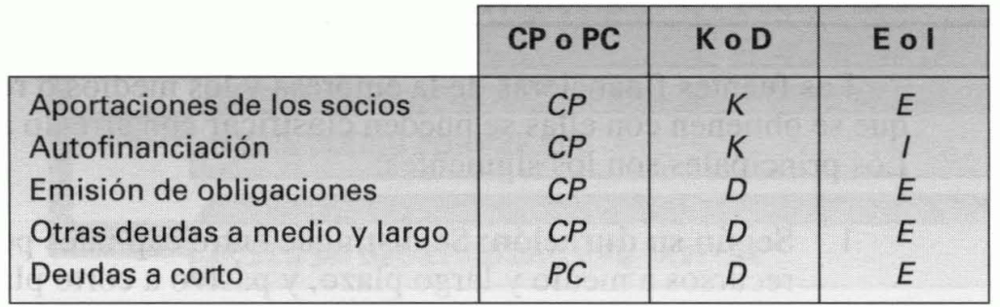

Tema 8: Las fuentes de financiación y su selección. El coste del capital
================================================================

Concepto de financiación, y tipos de fuentes y recursos financieros
-------------------------------------------------------------------

***Financiación:*** consecución de los medios necesarios para efectuar
inversiones.

***Fuentes financieras:*** orígenes de los distintos recursos de
financiación. Se pueden clasificar de acuerdo con diversos criterios,
entre los que se encuentran:

1.  **Según su duración:** la consideración de una fuente financiera
    como de plazo corto o no, depende de la actividad de la empresa.

    a.  Capitales permanentes, $\text{CP}$: aportaciones de los socios,
        emisión de obligaciones, otras formas de endeudamiento a medio y
        largo plazo y autofinanciación.

    b.  Pasivo a corto plazo, $\text{PC}$: financiación de los
        proveedores de factores y los préstamos y créditos bancarios a
        corto plazo.

2.  **Según su titularidad:**

    a.  Recursos financieros propios, $K$: son aquellos que no han de
        devolverse nunca. Son las aportaciones de los socios y la
        retención de beneficios o autofinanciación.

    b.  Recursos financieros ajenos, $D$: su devolución le será exigida
        a la empresa en un período de tiempo más o menos amplio.
        Provienen de las distintas formas de endeudamiento.

3.  **Según su procedencia:**

    a.  Recursos financieros externos, $E$: son los conseguidos en el
        exterior de la empresa captando el ahorro de otros. Son las
        aportaciones de los socios, emisión de obligaciones y todas las
        demás formas de endeudamiento.

    b.  Recursos financieros internos, $I$: son los generados dentro de
        la empresa mediante su propio ahorro. La fuente de recursos
        internos es la autofinanciación.

{width="3.9930391513560806in"
height="1.229825021872266in"}

Figura . Clasificación de las principales fuentes financieras de la
empresa atendiendo a los distintos criterios

La importancia del coste del capital
------------------------------------

Los principales motivos para la determinación del coste del capital son:

-   La rentabilidad requerida de las inversiones no puede ser nunca
    inferior que su coste de financiación. Por tanto, hay que conocer el
    coste del capital para decidir entre inversiones.

-   El endeudamiento eleva la rentabilidad financiera, y con ello el
    valor de las acciones, solo cuando la rentabilidad operativa de la
    empresa es mayor que el coste de sus deudas. Para tomar decisiones
    referentes al endeudamiento de la empresa es preciso prever su
    rentabilidad económica y conocer el coste de sus deudas.

-   Selección de fuentes de financiación. Son preferibles las fuentes
    financieras menos costosas.

El cálculo del coste de una fuente de financiación, en general
--------------------------------------------------------------

***Coste de una fuente de financiación:*** es el tipo de descuento que
hace que el valor actual neto de sus flujos de caja sea nulo.

Si una empresa percibe inicialmente $A$ unidades monetarias y ha de
abonar posteriormente $Q_{1}$ al final del primer año, $Q_{2}$ al final
del segundo, ..., y $Q_{n}$ al final del último, el coste de la fuente
de financiación será el valor de $k_{f}$ que cumple:

$$0 = A - \frac{Q_{1}}{1 + k_{f}} - \frac{Q_{2}}{\left( 1 + k_{f} \right)^{2}} - \ldots - \frac{Q_{n}}{\left( 1 + k_{f} \right)^{n}}$$

Equivalentemente:

$$0 = - A + \frac{Q_{1}}{1 + k_{f}} + \frac{Q_{2}}{\left( 1 + k_{f} \right)^{2}} + \ldots + \frac{Q_{n}}{\left( 1 + k_{f} \right)^{n}}$$

En el cálculo del coste de una fuente de financiación surgen las mismas
dificultades que en la determinación de la rentabilidad de una inversión
y, cuando no puede despejarse $k_{f}$, son aplicables las mismas
aproximaciones por exceso y por defecto que para la $\text{TIR}$.

El coste de los préstamos y empréstitos, y el cálculo de una cuota de amortización constante
--------------------------------------------------------------------------------------------

Para calcular el coste efectivo de un préstamo o de un empréstito, se ha
de aplicar la expresión anterior, donde $A$ será el principal del
crédito neto de gastos y los flujos posteriores,
$Q_{1},\ Q_{2},\ \ldots,\ Q_{n}$, serán los pagos necesarios para
devolver el crédito y abonar sus intereses.

Cuando no existen gastos de intermediación ni impuestos y, además, los
intereses se pagan anualmente y todos los años, y la emisión y el
reembolso del crédito se efectúan por su nominal, el coste coincide con
el tipo de interés. Si el tipo de interés del crédito es $i$, su coste
será el $k_{i}$ que cumple la expresión:

$$0 = A - \frac{i \cdot A}{1 + k_{i}} - \frac{i \cdot A}{\left( 1 + k_{i} \right)^{2}} - \ldots - \frac{i \cdot A + A}{\left( 1 + k_{i} \right)^{n}}$$

$$0 = A - i \cdot A \cdot \left\lbrack \frac{1}{1 + k_{i}} + \frac{1}{\left( 1 + k_{i} \right)^{2}} + \ldots + \frac{1}{\left( 1 + k_{i} \right)^{n}} \right\rbrack - \frac{A}{\left( 1 + k_{i} \right)^{n}}$$

El importe situado entre corchetes es el **valor actual de una corriente
de flujos de caja unitarios** que tiene una duración de $n$ años. Se le
designa como $a_{\left. \ n \right\rceil k_{i}}$. Por consiguiente:

$$0 = A - i \cdot A \cdot a_{\left. \ n \right\rceil k_{i}} - \frac{A}{\left( 1 + k_{i} \right)^{n}}$$

De forma equivalente:

$$0 = A - i \cdot A \cdot \frac{\left( 1 + k_{i} \right)^{n} - 1\ }{\left( 1 + k_{i} \right)^{n} \cdot k_{i}} - \frac{A}{\left( 1 + k_{i} \right)^{n}}$$

Cuando $i$ y $k_{i}$ coinciden:

$$A - k_{i} \cdot A \cdot \frac{\left( 1 + k_{i} \right)^{n} - 1\ }{\left( 1 + k_{i} \right)^{n} \cdot k_{i}} - \frac{A}{\left( 1 + k_{i} \right)^{n}} = A - A \cdot \frac{\left( 1 + k_{i} \right)^{n} - 1\ }{\left( 1 + k_{i} \right)^{n}} - \frac{A}{\left( 1 + k_{i} \right)^{n}} = A \cdot \left\lbrack 1 - \frac{\left( 1 + k_{i} \right)^{n} - 1\ }{\left( 1 + k_{i} \right)^{n}} - \frac{1}{\left( 1 + k_{i} \right)^{n}} \right\rbrack$$

Demostrando que la expresión del coste del crédito se cumple cuando
$k_{i}$ es igual a $i$.

***Sistema de cuotas constantes:*** todos los períodos se paga la misma
cuota $Q$ en concepto de intereses y de devolución principal. Por
consiguiente, su coste será el $k_{i}$ que cumple la ecuación:

$$0 = A - \frac{Q}{1 + k_{i}} - \frac{Q}{\left( 1 + k_{i} \right)^{2}} - \ldots - \frac{Q}{\left( 1 + k_{i} \right)^{n}} = A - Q\left\lbrack \frac{1}{1 + k_{i}} + \frac{1}{\left( 1 + k_{i} \right)^{2}} + \ldots + \frac{1}{\left( 1 + k_{i} \right)^{n}} \right\rbrack = A - Q \cdot a_{\left. \ n \right\rceil k_{i}}$$

El efecto de los impuestos
--------------------------

Los intereses de los préstamos y empréstitos, así como los demás gastos
que comportan son deducibles en el impuesto sobre el beneficio. Si el
tipo de gravamen en este tributo es el $t$ por uno, con cada unidad
monetaria pagada en forma de intereses o comisiones la empresa ahorra
$t$ unidades monetarias.

Si el único gasto que tiene un crédito son los intereses anuales, y
estos se pagan todos los años, el coste de ese crédito antes de tener en
cuenta los impuestos, $k_{i}$, es el tipo de interés y éste es lo que la
empresa tiene que abonar cada año por cada unidad monetaria que le queda
de deuda. Si por cada unidad monetaria de intereses se ahorra $t$ unidad
monetaria de impuestos, el coste del crédito después de tener en cuenta
la deducción de los intereses en el tributo, $k_{i}'$, será:

$$k_{i}^{'} = k_{i} - t \cdot k_{i} = k_{i} \cdot (1 - t)$$

El coste del crédito comercial
------------------------------

***Crédito comercial:*** es el concedido a la empresa por sus
proveedores permitiendo el pago aplazado de sus adquisiciones. Los pagos
se aplazan un cierto número de días, $D$, y, en muchas ocasiones, los
proveedores hacen un descuento por pagar al contado del $s$ por uno. Por
tanto, el precio al contado es de $C \cdot (1 - s)$ unidades monetarias.
Cuando se paga a plazo, el proveedor carga unos intereses iguales a
$\text{sC}$, lo cual significa que cada $D$ días aplica un tipo de
interés, $h$, igual a:

$$h = \frac{s \cdot C}{C \cdot \left( 1 - s \right)} = \frac{s}{1 - s}$$

El coste anual del crédito comercial, $k_{c}$, es:

$$k_{c} = \left( 1 + h \right)^{\frac{360}{D}} - 1$$

Esta tasa, $k_{c}$, puede compararse con las de otras fuentes de
financiación alternativas para elegir la más conveniente.

El aplazamiento de los pagos hace que el beneficio fiscal sea menor y
los impuestos se reducen en $s \cdot C \cdot t$ por unidad de producto
adquirida a plazo. Como consecuencia, el descuento neto de impuestos es:

$$s \cdot C - s \cdot C \cdot t = s \cdot C \cdot (1 - t)$$

Y la tasa $h$ ha de sustituirse por $h'$:

$$h^{'} = \frac{s \cdot C \cdot (1 - t)}{C \cdot \left( 1 - s \right)} = \frac{s \cdot (1 - t)}{1 - s} = h \cdot (1 - t)$$

El efecto de la inflación y el cálculo del coste según valores de mercado
-------------------------------------------------------------------------

La inflación favorece a los deudores y perjudica a los acreedores. La
relación entre el **coste aparente**, $k_{A}$, y el **coste real** o
coste del crédito en términos de capacidad adquisitiva, $k_{R}$, será:

$$k_{R} = \frac{k_{A} - g}{1 + g}$$

Donde $g$ es la tasa de inflación anual.

Dicho de otro modo, si la inflación anual esperada es $g$ y quien
financia a la empresa considera que, dadas sus características de riesgo
y la rentabilidad de las inversiones seguras, la tasa real esperada de
la operación ha de ser $k_{R}$, aplicará una tasa nominal, $k_{A}$:

$$k_{A} = k_{R} + g + k_{R} \cdot g$$

Conocida la cotización bursátil del título $P_{i}$ y los flujos de caja
que generará en el futuro, $Q_{1},\ Q_{2},\ \ldots,\ Q_{n}$, el coste
es:

$$P_{i} = \frac{Q_{1}}{1 + k_{i}} + \frac{Q_{2}}{\left( 1 + k_{i} \right)^{2}} + \ldots + \frac{Q_{n}}{\left( 1 + k_{i} \right)^{n}}$$

El coste, $k_{i}$, es antes de impuestos e inflación. Al tener en cuenta
los impuestos el coste se reduce.

Los impuestos hacen que difieran la rentabilidad de los acreedores y el
coste de los deudores.

El coste del capital obtenido mediante la emisión de acciones
-------------------------------------------------------------

Habitualmente las acciones no tienen plazo de amortización, por lo que
su duración ha de considerarse ilimitada. Para cada accionista
individual la acción es un título que puede vender y obtener un cierto
precio al final de algún periodo, pero para el mercado en su conjunto
las acciones no se amortizan nunca.

Por tanto, denominando $d_{e}$ al dividendo del enésimo año y $k_{e}$ a
la rentabilidad esperada que exigen los accionistas de una empresa, el
precio de una acción será el $P_{e}$ que cumpla la expresión:

$$P_{e} = \frac{d_{1}}{1 + k_{e}} + \frac{d_{2}}{\left( 1 + k_{e} \right)^{2}} + \frac{d_{3}}{\left( 1 + k_{e} \right)^{3}} + \ldots$$

Si los dividendos anuales esperados fueran constantes e iguales a $d$,
la expresión aplicable sería la siguiente:

$$P_{e} = \frac{d}{k_{e}}$$

Fijando esta cotización a la acción, los accionistas se aseguran de que
su rentabilidad esperada coincide con la que ellos quieren:

$$k_{e} = \frac{d}{P_{e}}$$

Por consiguiente, el coste del capital obtenido mediante la emisión de
acciones es $k_{e}$, es decir, la rentabilidad que exigen quienes
aportan estos fondos.

En la mayoría de los casos lo razonable es pensar que los accionistas
esperen que el dividendo vaya aumentando con el paso del tiempo, debido
a las siguientes razones:

-   Si la renta del país crece, la de la empresa media también lo hará,
    es decir, los beneficios crecerán. Dado que los dividendos son el
    resultado de repartir beneficios, si estos aumentan parece razonable
    que también crezcan aquellos.

-   Cuando existe inflación y los dividendos son constantes su valor
    real se va reduciendo con el tiempo. Si la empresa desea pagar un
    dividendo constante en términos reales, el número de unidades
    monetarias que habrá de abonar cada año tendrá que crecer en una
    tasa igual que la de inflación.

-   Las empresas tienen como uno de sus objetivos el del crecimiento del
    beneficio y si este objetivo se consigue también tenderán a crecer
    los dividendos.

Si los inversores esperan que el dividendo crezca según una cierta tasa,
$f$. Si así fuera, el precio de la acción sería el siguiente:

$$P_{e} = \frac{d_{1}}{1 + k_{e}} + \frac{d_{1} \cdot (1 + f)}{\left( 1 + k_{e} \right)^{2}} + \frac{d_{1} \cdot \left( 1 + f \right)^{2}}{\left( 1 + k_{e} \right)^{3}} + \ldots$$

$$P_{e} = \frac{d_{1}}{k_{e} - f}$$

De donde se deduce que:

$$k_{e} = \frac{d_{1}}{P_{e}} + f$$

Las principales razones por las que los accionistas requieren una
rentabilidad mayor que los acreedores se derivan del mayor riesgo que
deben soportar:

-   Los dividendos se reparten cuando la empresa obtiene beneficios y,
    además, se decide repartir la totalidad o parte de esos beneficios,
    en lugar de retenerlos íntegramente de la empresa para hacer frente
    a sus necesidades de inversión. Es decir, a diferencia de las
    obligaciones, que incorporan la **obligación** del pago de los
    intereses y la devolución del principal, las acciones no incorporan
    un compromiso de pago de dividendos.

-   Si quebrar la empresa, se liquidarían sus activos y con el importe
    obtenido se pagarían sus deudas. Si después de pagar a los
    obligacionistas y a los demás acreedores quedara algún dinero, este
    se repartiría a los accionistas, quienes son los últimos en cobrar.

-   Los inversores esperan obtener plusvalías (ganancias de capital),
    pero, evidentemente, se pueden encontrar con pérdidas de capital o
    minusvalías. Los precios de las acciones oscilan mucho más que los
    de las obligaciones, por lo cual su riesgo es mucho más elevado.

El coste de la autofinanciación y las decisiones de distribución de dividendos
------------------------------------------------------------------------------

La riqueza del accionista por cada acción de la que es propietario es el
resultado de añadir al precio de la acción las unidades monetarias
correspondientes que se repartan como dividendo:

$$R = P_{e} + m = \frac{d}{k_{e}} + m$$

Si la empresa retuvieras las $m$ unidades monetarias para invertirlas
con una rentabilidad anual esperada igual a $r$, la riqueza del
accionista por cada acción que posea será:

$$R^{'} = \frac{d + r \cdot m}{k_{e}}$$

Dado que se desea maximizar la riqueza del accionariado, la condición de
retención de las $m$ unidades será que:

$$R^{'} \geq R \rightarrow \frac{d + r \cdot m}{k_{e}} \geq \frac{d}{k_{e}} + m \rightarrow \frac{d}{k_{e}} + \frac{r \cdot m}{k_{e}} \geq \frac{d}{k_{e}} + m$$

De donde se deduce finalmente que la condición de retención de los
beneficios es:

$$r \geq k_{e}$$

Por consiguiente, $k_{e}$, es el coste de los recursos propios,
independientemente de su procedencia (emisión de acciones o
autofinanciación).

La política de dividendos óptima consiste en repartirlos siempre que la
rentabilidad que se espere obtener en la empresa si se les retiene, $r$,
sea inferior que la rentabilidad esperada requerida por los accionistas,
$k_{e}$. Sin embargo, habitualmente se aplica una de las siguientes
políticas:

1.  Pagar un dividendo nominal constante, reduciendo la incertidumbre de
    los accionistas y elevando la estabilidad de la cotización de la
    acción.

2.  Pagar dividendos reales constantes, lo cual obliga a que
    nominalmente crezcan aproximadamente a la misma tasa que la
    inflación. La incertidumbre del accionista es menor que en el caso
    anterior pues se palia el riesgo correspondiente a la inflación.

3.  Aplicar un coeficiente de reparto estable. El coeficiente de
    reparto, $b$, es el tanto por uno de los beneficios que se
    distribuye en forma de dividendos. El coeficiente $1 - b$ será el
    coeficiente de retención. Si el beneficio es constante a lo largo de
    los años, esta política es equivalente a la anterior. Si el
    beneficio crece a una tasa aproximadamente igual a la de inflación,
    esta política equivale a la segunda. Pero si el beneficio oscila
    sensiblemente, esta política da lugar a una gran variabilidad de los
    dividendos e incertidumbre de los accionistas.

4.  Alguna de las políticas anteriores, pero con cierta flexibilidad.

5.  Pago de dividendos variables en función de las necesidades
    financieras de la empresa dadas las inversiones disponibles. Esta es
    la mejor política de dividendos. Cuando la rentabilidad esperada de
    las inversiones disponibles sea inferior que el coste del capital
    propio, se deben repartir los beneficios.

El coste medio ponderado del capital
------------------------------------

Este coste promedio se calcula como una media aritmética ponderada de
los costes de las diversas fuentes, utilizándose como ponderaciones los
valores de mercado de las mismas.

$$k_{0} = \frac{k_{e} \cdot S + k_{i}^{'} \cdot B}{S + B}$$

Donde $S$ son los recursos propios, $k_{e}$ su coste anual y $B$ los
ajenos, siendo $k_{i}^{'}$ su coste anual neto de impuestos.

El coste del capital y la selección de inversiones. El coste de oportunidad del capital
---------------------------------------------------------------------------------------

En la práctica puede haber otras fuentes de financiación de la inversión
y es posible que alguna de ellas tenga un coste inferior y que no eleve
sustancialmente el riesgo de la empresa, lo cual podría provocar un
aumento de los dividendos esperados sin que se alterara la rentabilidad
requerida por los accionistas. Si así fuera, esta posibilidad podría ser
preferible a la autofinanciación por dar lugar a un mayor crecimiento
del precio de la acción y a una riqueza del accionista más elevada.

Además, cuando ha de elegirse entre un conjunto de inversiones
**mutuamente excluyentes** la rentabilidad esperada que ha de exigirse
de una de ellas es la que se deja de obtener al dejar de realizar la
inversión alternativa. En el sentido de coste de oportunidad, la
rentabilidad esperada de esta última es el coste del capital invertido
en aquella.

