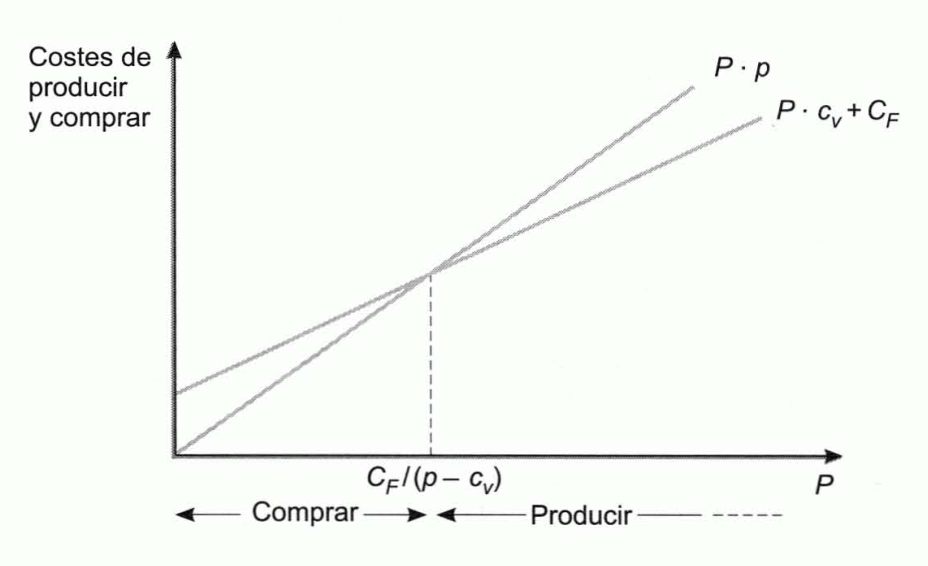
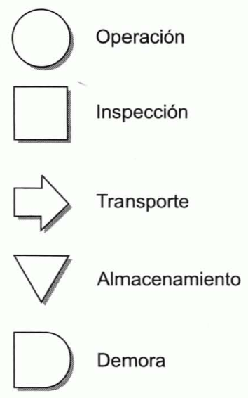
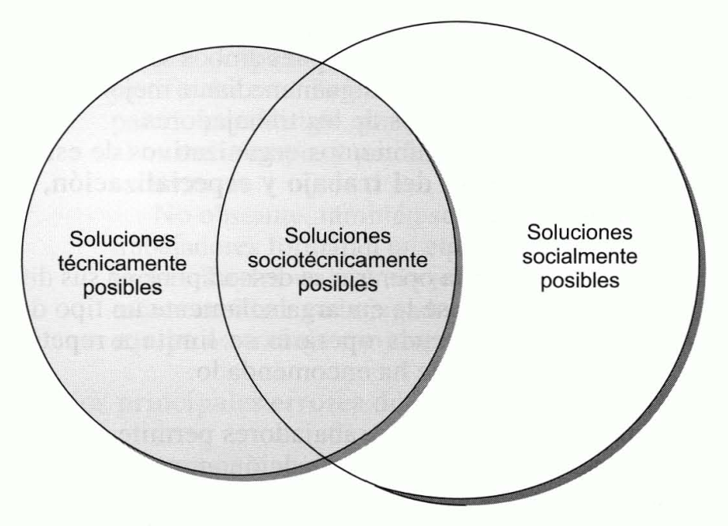
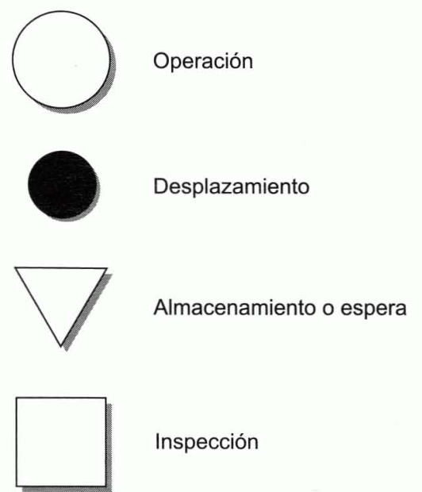

Tema 9: Elementos productivos. El proceso de producción y el factor humano
==========================================================================

Introducción
------------

***Función productiva:*** consiste en el empleo de factores humanos y
materiales para la elaboración de bienes y la prestación de servicios.

***Dirección de la producción:*** proceso de toma de decisiones en el
ámbito de la función productiva.

***Utilidad:*** las empresas crean utilidad y riqueza produciendo, y las
familias destruyen la utilidad y riqueza consumiendo. Existen utilidades
de **forma, tiempo, lugar y propiedad**. Las tres últimas se crean,
mediante la función de marketing, poniendo los productos a disposición
de los consumidores en los momentos y lugares que éstos desean, y
facilitando la transferencia de su propiedad. La utilidad de forma es la
creada mediante la conversión de materias primas y otros factores de
producción, en productos terminados.

A medida que aumenta la utilidad de un bien, se incrementa su valor para
los consumidores y, consiguientemente, el precio que están dispuestos a
pagar por él.

***Diseño del producto:*** no es competencia exclusiva de la dirección
de producción. El proceso de diseño engloba las siguientes etapas
(cuando está destinado al mercado en general):

-   Se precisan estudios de investigación comercial para conocer las
    reacciones de los consumidores a diferentes alternativas, así como
    pruebas de mercado y estimaciones de las ventas potenciales y de las
    rentabilidades de los diferentes nuevos productos, todo lo cual
    concierne a la dirección de marketing.

-   La dirección de producción transforma el concepto inicial en un
    producto final y diseña el sistema de modo que el nuevo producto se
    elabore tan eficientemente como sea posible. Para que un nuevo
    producto resulte rentable no es suficiente que el mercado lo acepte,
    sino que además ha de ser producido económicamente.

La primera decisión: producir o comprar
---------------------------------------

***Decisión de producir o comprar:*** la primera decisión que ha de
plantearse ante la producción de un nuevo producto, es la posibilidad de
comprar fuera el producto terminado, en estado de semielaboración o
algunos de sus componentes, en lugar de producirlos en la propia
empresa.

Esta decisión puede tomarse atendiendo al objetivo de minimizar costes.
Así, siendo $p$ el precio que habría que pagar por cada unidad si se
adquiere fuera, $c_{v}$ el coste variable asociado a la producción de
una unidad, $C_{F}$ los costes fijos anuales necesarios para acometer la
elaboración del bien, $P$ el número de unidades necesarias al año,
interesará producir cuando:

$$C_{F} + c_{v} \cdot P < p \cdot P$$

$$P > \frac{C_{F}}{p - c_{v}}$$

El problema y su resolución se ha presentado en la siguiente figura. En
ella se supone que el precio de adquisición es superior al coste
variable unitario, si no fuera así la compra sería preferible cualquiera
que fuera el valor de $P$. El cociente $\frac{C_{F}}{p - c_{v}}$
determina el nivel mínimo de unidades anuales necesarias para que la
decisión de producción sea preferible a la de compra.

{width="4.1753554243219595in"
height="2.5466076115485565in"}

Figura . Resolución gráfica del problema de producir o comprar

La dirección de la producción: objetivos y principales tipos de decisiones
--------------------------------------------------------------------------

***Principales objetivos de la dirección de la producción:*** hacen
referencia a los costes, la productividad, la calidad, la fiabilidad y
la capacidad de adaptación. En términos generales puede decirse que el
objetivo de la dirección de la producción es minimizar los costes de
producción, maximizar la productividad de los factores, o ambos,
cumpliendo los niveles requeridos de calidad, fiabilidad y capacidad de
adaptación.

***Clasificación de las decisiones tomadas en el ámbito de la
producción:*** se pueden clasificar con arreglo a muy diversos
criterios.

-   **Agrupación funcional:** distingue entre decisiones de proceso, de
    capacidad productiva, de inventarios, de recursos humanos y de
    calidad.

-   Agrupación que diferencia entre **decisiones estratégicas y
    decisiones tácticas**: las primeras afectan a la empresa durante un
    período de tiempo largo, durante el cual son irreversibles. Las
    decisiones tácticas son más cotidianas y su efecto se extiende sobre
    un período breve de tiempo.

***Decisiones de proceso:*** son todas las que se relacionan con el
diseño del proceso físico de producción. Estas decisiones requieren una
gran coordinación entre el departamento de producción y el de marketing.
Constituyen decisiones estratégicas la selección del tipo de proceso de
producción y de los equipos productivos. Son decisiones tácticas las
referentes al orden del flujo de procesos y las de mantenimiento y
conservación de los equipos.

***Decisiones de capacidad:*** tienen por objetivo que la empresa cuente
con la capacidad de producción adecuada: ni excesiva ni escasa. Son
decisiones estratégicas las relativas a la determinación del tamaño de
las instalaciones, a su localización y al establecimiento del nivel de
recursos humanos. Son tácticas las decisiones referentes a la
utilización de horas extraordinarias, a la negociación de subcontratas y
a la programación de las actividades.

***Decisiones en materia logística:*** son las decisiones estratégicas
relativas a la fijación del tamaño general de los almacenes y al diseño
de un sistema de control de inventarios. Son tácticas las decisiones
sobre cuánto y cuándo ordenar en cada pedido.

***Decisiones de recursos humanos:*** tratan de optimizar el
comportamiento de este factor en la producción. Constituyen decisiones
estratégicas las referentes al diseño del puesto de trabajo y a la
selección de un sistema de incentivos. Son decisiones tácticas las del
control cotidiano y las de fijación de estándares de trabajo y
rendimientos.

***Decisiones en materia de calidad:*** son estratégicas las decisiones
de fijación de estándares de calidad y las referentes a la determinación
de la estructura organizativa que permite optimizar la calidad. Son
tácticas las decisiones sobre selección de muestras de control y las que
han de tomarse en el control cotidiano que se realiza para comprobar el
grado de cumplimiento de los estándares.

Principales diferencias entre la elaboración de bienes y la producción de servicios
-----------------------------------------------------------------------------------

***Producto:*** resultado del proceso productivo que pude ser un bien o
un servicio.

***Bien:*** unidad tangible que puede almacenarse, transformarse
físicamente y transportarse.

***Servicio:*** producto intangible que no es susceptible de ser
almacenado ni transportado.

***Diferencias en la dirección de producción de bienes y servicios:***

1.  **Inventarios y capacidad de producción.** Cuando la demanda se
    reduce, el productor de bienes puede seguir utilizando toda su
    capacidad de producción almacenando los productos que no se venden.
    En los períodos en los que la demanda supera su capacidad de
    producción puede atenderla con los bienes almacenados. Esta
    flexibilidad que proporcionan los inventarios no la tiene el
    productor de servicios, pues estos son como bienes extremadamente
    perecederos. Por tanto, el productor de servicios debe prever la
    demanda con mucha precisión. Si la demanda fuera muy inferior a su
    capacidad de producción, incurriría en costes innecesarios. Si, por
    el contrario, la demanda superara a su capacidad, no podría atender
    el exceso.

2.  **Medida de la calidad.** Debido a la naturaleza intangible de los
    servicios, al productor le resulta difícil controlar su calidad y
    también es difícil que el cliente la mida. Por ello, habitualmente
    se considera que la reputación del productor de servicios depende
    más de su imagen que de la calidad de sus productos.

3.  **Dispersión de los centros de producción.** El fabricante de bienes
    puede centralizar su producción en un lugar y distribuir
    posteriormente sus productos transportándolos a donde se encuentran
    los consumidores. Por el contrario, el productor de servicios está
    obligado a dispersar geográficamente sus instalaciones si desea
    atender a consumidores situados en diversos lugares.

4.  **Integración entre producción y marketing.** En la producción de
    bienes suele existir cierta distancia entre el productor y el
    consumidor. Entre ellos median una serie de intermediarios que
    forman el canal de distribución. Puesto que son estos intermediarios
    quienes se encuentran más próximos al consumidor final, tiene gran
    importancia la promoción que ellos realizan de los productos de la
    empresa fabricante. Sin embargo, en el caso de los servicios la
    relación entre el cliente y el fabricante es inmediata y esa
    promoción la efectúan los empleados del productor. En general, la
    integración que existe entre las actividades de marketing y
    producción es mayor en la producción de servicios.

Los costes de producción y su control
-------------------------------------

***Clasificación de los costes:***

-   Costes variables.

-   Costes fijos:

    -   Inactividad.

    -   Puesta en marcha.

***Sistemas de producción:***

-   **Simples:** el output es solo un producto de características
    técnicas homogéneas.

-   **Múltiple:** compuesta o conjunta: se obtienen varios productos o,
    al menos, parte del proceso es común a varios productos.

***Imputación de los costes:*** es de suma importancia para la
distribución del beneficio del ejercicio entre los distintos productos
que contribuyan a su formación y para un apropiado control de los
costes. Hay dos técnicas de imputación principales:

-   ***Full-costing:*** los costes fijos se distribuyen entre los
    productos prorrateándolos en proporción a sus costes variables
    totales o a los costes de los materiales que llevan incorporados.

-   ***Direct costing:*** a cada producto $j$ se le imputa como precio
    de coste solamente su coste variable. A la diferencia entre el
    precio de venta, $p_{j}$, y el coste variable unitario, $c_{v_{j}}$,
    se le denomina **margen unitario bruto**.

$$m_{j} = p_{j} - c_{v_{j}}$$

> Al multiplicar el margen unitario bruto por las unidades físicas
> vendidas, $P_{j}$, se obtiene el **margen bruto total del producto**:

$$MB_{j} = m_{j} \cdot P_{j}$$

> Sumando los márgenes brutos de los diversos productos, se obtiene el
> **margen bruto de la empresa**, del que, finalmente, se deducen los
> costes fijos, $C_{F}$, para determinar el margen de beneficio neto.

$$MB = MB_{1} + MB_{2} + \ldots + MB_{n}$$

$$MN = MB - C_{F}$$

***Costes estándares:*** es la forma de control de costes más importante
y difundida. Suponiendo que se trata de un sistema de producción simple
y denominando:

-   $P$: cantidad de producción en unidades físicas.

-   $F$: consumo del factor cuyo coste se desea controlar en unidades
    físicas.

-   $f$: precio de cada una de las unidades físicas del factor cuyo
    coste se desea controlar.

-   $s$: subíndice empleado para la previsión (o estándar).

-   $r$: subíndice para hacer referencia al valor real o efectivo.

Se denomina **desviación total**, $\text{DT}$, a la diferencia entre el
coste real y el coste previsto correspondiente a la producción real:

$$DT = x_{r} \cdot P_{r} \cdot f_{r} - x_{s} \cdot P_{r} \cdot f_{s} = P_{r} \cdot \left( x_{r} \cdot f_{r} - x_{s} \cdot f_{s} \right)$$

El importe situado entre paréntesis es la desviación que existe por cada
unidad de producto: se preveía consumir $x_{s}$ unidades físicas a
$f_{s}$ u.m. cada una, y realmente se ha consumido $x_{r}$ u.f., cada
una de las cuales costó $f_{r}$ u.m.

***Causas de la desviación:*** la variación respecto al estándar que se
ha producido en el precio del factor, y la habida en la cantidad de
factor aplicado por cada unidad de producto elaborada:

-   Desviación en precios o económica:

$$DP = \left( f_{r} - f_{s} \right) \cdot F_{r} = \left( f_{r} - f - s \right) \cdot x_{r} \cdot P_{r}$$

-   Desviación en cantidades o técnica:

$$DC = \left( F_{r} - x_{s} \cdot P_{r} \right) \cdot f_{s} = \left( x_{r} \cdot P_{r} - x_{s} \cdot P_{r} \right) \cdot f_{s} = \left( x_{r} - x_{s} \right) \cdot P_{r} \cdot f_{s}$$

Sumando la desviación en precios y la desviación en cantidades se
obtiene la desviación total.

Este análisis se realiza para cada uno de los factores de producción.

La medida de la productividad
-----------------------------

***Productividad:*** es la relación entre la producción de un periodo y
la cantidad de recursos consumidos para alcanzarla.

***Productividad global:*** es el cociente entre su producción total (la
de todos los productos) y la totalidad de los factores utilizados para
alcanzarla. La única dificultad para calcular la productividad global es
que los diferentes factores y los distintos productos son heterogéneos
y, por tanto, sus cantidades físicas no son sumables. Por ello, la
producción total y la cantidad total de factores empleados se han de
valorar en unidades monetarias. Para poder efectuar comparaciones entre
la productividad de un período y la de otro, sin que las oscilaciones de
los precios de los factores y de los productos influyan en los
resultados, las valoraciones han de efectuarse aplicando precios
constantes.

Denominando:

-   $P_{j}$: número de unidades físicas elaboradas del producto $j$ en
    período$0$, y $p_{j}$ a su precio unitario en ese periodo.

-   $F_{i}$: cantidad utilizada del factor $i$ en el periodo $0$ (en
    unidades físicas), y $f_{i}$ a su coste unitario en ese periodo.

-   $\Delta$: variación positiva o negativa experimentada por la
    variable ante la que se sitúa este símbolo en el período $1$
    respecto al periodo $0$.

Si la empresa utiliza $m$ factores para elaborar $n$ productos,
efectuando las valoraciones con los precios $0$ ($p_{i}$ y $f_{i}$), la
productividad de la empresa en ese periodo sería:

$$\overline{P_{0}} = \frac{p_{1} \cdot P_{1} + p_{2} \cdot P_{2} + \ldots + p_{n} \cdot P_{n}}{f_{1} \cdot F_{1} + f_{2} \cdot F_{2} + \ldots + f_{m} \cdot F_{m}}$$

Siendo la del periodo $1$:

$$\overline{P_{1}} = \frac{p_{1} \cdot (P_{1} + \Delta P_{2}) + p_{2} \cdot (P_{2} + \Delta P_{2}) + \ldots + p_{n} \cdot (P_{n} + \Delta P_{n})}{f_{1} \cdot (F_{1} + \Delta F_{1}) + f_{2} \cdot (F_{2} + \Delta F_{2}) + \ldots + f_{m} \cdot (F_{m} + \Delta F_{m})}$$

***Índice de productividad global,*** $\text{IPG}$***:*** coeficiente
que mide por cociente la relación entre la productividad del periodo $1$
y la del periodo $0$.

$$IPG = \frac{\overline{P_{1}}}{\overline{P_{0}}} = \left\lbrack \frac{p_{1} \cdot (P_{1} + \Delta P_{2}) + p_{2} \cdot (P_{2} + \Delta P_{2}) + \ldots + p_{n} \cdot (P_{n} + \Delta P_{n})}{f_{1} \cdot (F_{1} + \Delta F_{1}) + f_{2} \cdot (F_{2} + \Delta F_{2}) + \ldots + f_{m} \cdot (F_{m} + \Delta F_{m})} \right\rbrack \cdot \left\lbrack \frac{f_{1} \cdot F_{1} + f_{2} \cdot F_{2} + \ldots + f_{m} \cdot F_{m}}{p_{1} \cdot P_{1} + p_{2} \cdot P_{2} + \ldots + p_{n} \cdot P_{n}} \right\rbrack$$

***Tasa de productividad global,*** $\text{TPG}$***:*** mide la
proporción de variación de la productividad entre los dos periodos.

$$TPG = \frac{\overline{P_{1}} - \overline{P_{0}}}{\overline{P_{0}}} = IPG - 1$$

***Índices de cantidades de Laspeyres:*** se utilizan para saber en qué
proporción ha variado la producción de un periodo a otro, utilizando
precios constantes.

-   Índice de evolución de la cantidad de producción de Laspeyres:

$$IL_{P} = \frac{p_{1} \cdot (P_{1} + \Delta P_{2}) + p_{2} \cdot (P_{2} + \Delta P_{2}) + \ldots + p_{n} \cdot (P_{n} + \Delta P_{n})}{p_{1} \cdot P_{1} + p_{2} \cdot P_{2} + \ldots + p_{n} \cdot P_{n}}$$

-   Índice de evolución de las cantidades empleadas de factores es:

$$IL_{F} = \frac{f_{1} \cdot (F_{1} + \Delta F_{1}) + f_{2} \cdot (F_{2} + \Delta F_{2}) + \ldots + f_{m} \cdot (F_{m} + \Delta F_{m})}{f_{1} \cdot F_{1} + f_{2} \cdot F_{2} + \ldots + f_{m} \cdot F_{m}}$$

El $\text{IPG}$ se pude obtener a partir de los índices de Laspeyres
como:

$$IPG = \frac{IL_{P}}{IL_{F}}$$

Cuando se conocen los índices de Laspeyres, el índice de productividad
global pude calcularse de este modo. Posteriormente, la tasa de
productividad global se calcula como diferencia entre el $\text{IPG}$ y
la unidad.

La calidad
----------

***Calidad:*** grado de adecuación del producto para el uso al que se le
destina. La adecuada planificación y control de la calidad requiere el
seguimiento de las siguientes fases:

1.  **Determinación de los factores de los que depende la calidad.** La
    calidad es un atributo que tiene como peculiaridad la de medirse en
    relación a otros atributos. Corresponde al área de marketing
    investigar el mercado para determinar los factores por los que los
    consumidores miden la calidad del producto; estos serán los
    atributos relevantes.

2.  **Establecimiento de la forma de medir la calidad de cada uno de los
    factores.** Los procedimientos existentes son muy numerosos y
    dependen del tipo de factor de que se trate.

3.  **Fijación de estándares de calidad.** Estimar la calidad de un
    producto significa comparar los atributos de esa unidad con los del
    producto tipo o estándar, lo cual requiere definir previamente éste
    último con cierta precisión. La tipificación o normalización es un
    requiso previo al control de calidad. Normalizar significa
    clasificar productos en grupos homogéneos con relación a los
    atributos de calidad. En algunos casos es difícil o excesivamente
    costoso que los productos se ajusten con exactitud a una norma
    rígida, por lo que suelen especificarse unos **límites de
    tolerancia**.

4.  **Establecimiento de un programa de inspección.** Es muy frecuente
    que resulte imposible o excesivamente costoso revisar la totalidad
    de las unidades de productos, por lo que se ha de recurrir a una
    **inspección por muestreo**. Este muestreo debe ser aleatorio para
    evitar que la arbitrariedad del inspector introduzca sesgos de
    selección. Dado que el control se basa en una muestra, es imposible
    tener la seguridad de que el tanto por ciento de unidades
    defectuosas es inferior al máximo tolerable o **porcentaje de
    control**, pero cabe estimar que la probabilidad de que sea aceptada
    una partida incumpliendo dicho porcentaje, se reduce a medida que se
    incrementa el tamaño de la muestra, y se acerca al 100% cuando la
    dimensión de la muestra se aproxima al tamaño de la partida. Por
    tanto, el problema es equilibrar la menor probabilidad de error con
    el mayor coste que el aumento de la muestra supone.

5.  **Determinación y corrección de las causas de la baja calidad.**

***Calidad total:*** principio de organización en el que el departamento
de calidad coordina todos los esfuerzos de los demás departamentos en lo
relativo a la calidad. Esta idea pone un gran énfasis en la necesidad de
prever los posibles defectos y esto es algo que requiere esa
coordinación de los diversos departamentos; la calidad no es solo
responsabilidad del departamento de calidad: es responsabilidad de
todos.

***Política de cero defectos o política de acertar a la primera:***
aboga por la realización de los esfuerzos motivacionales precisos para
elaborar bien el producto desde el principio, para no tener que corregir
posteriormente los errores, dado el coste que ello supone.

Principales tipos de procesos de producción y alternativas tecnológicas
-----------------------------------------------------------------------

***Criterios de clasificación de los procesos de producción:***

1.  **Destino del producto:** se distingue entre producción por encargo
    y producción para el mercado. En la **producción por encargo**, la
    empresa espera a que le soliciten un pedido para elaborar el bien o
    servicio, en tanto que en la **producción para el mercado** se
    produce para los consumidores en general.

2.  **Razón que provoca la producción:** puede ser la existencia de una
    orden de fabricación o el mantenimiento del nivel de los
    inventarios, distinguiéndose así entre la **producción por órdenes
    de fabricación** y **producción para almacén**.

3.  **Grado de tipificación del producto:** se distingue entre
    **producción individualizada** y **producción en serie o en masa**.
    La primera es aquella en la que cada unidad de producto responde a
    unas características específicas, en tanto que en la segunda todas
    las unidades son iguales.

4.  **Dimensión temporal del proceso:** permite distinguir entre la
    **producción intermitente** y la **continua**.

La producción por encargo suele ser por órdenes de fabricación,
individualizada e intermitente, y que la producción para el mercado
generalmente es para almacén, en serie y continua. Sin embargo, en
ocasiones se dan casos de producción:

-   Por encargo o por órdenes de fabricación que, cuando la aceptación
    del producto es grande, dan lugar a producción en masa o en serie y
    con proceso continuo.

-   Para el mercado o para almacén que se realiza individualmente y de
    forma intermitente, como es el caso de los productos de artesanía.

-   Que siendo de tipo continuo en casi todas las fases del proceso,
    individualizan una o más de ellas (generalmente las de acabado) para
    atender a determinados encargos u órdenes de fabricación. Esto suele
    suceder cuando existen varias posibilidades de combinar módulos que
    están normalizados.

***Tecnología:*** combinación de capacidades, conocimientos,
herramientas, máquinas, ordenadores y equipo que se utilizan en el
diseño, y la distribución de bienes y servicios.

Las decisiones de selección de un tipo de proceso y de elección de una
tecnología se encuentran tan interrelacionadas y se condicionan
mutuamente tanto que habitualmente se toman de forma simultánea y
conjunta. La tecnología elegida condiciona, además, el diseño del puesto
de trabajo, por lo cual hasta hace no mucho se consideraba que éste era
posterior a la selección tecnológica. Hoy, también el diseño del puesto
de trabajo y la elección de la tecnología tienden a considerarse como
decisiones simultáneas, bajo el denominado **diseño de enfoque
socio-técnico**.

Las principales opciones existentes son:

1.  **Producción manual:** el hombre proporciona tanto la fuerza como el
    manejo de las herramientas. Para el trabajador supone un esfuerzo
    físico considerable y el producto obtenido no suele ser homogéneo,
    pero no por ello ha de resentirse la calidad.

2.  **Producción mecanizada:** la máquina proporciona la fuerza, pero es
    el hombre el que maneja los útiles y las herramientas. El trabajador
    no tiene que realizar tanto esfuerzo físico.

3.  **Producción automática:** las máquinas proporcionan la fuerza y,
    además, controlan otras máquinas y herramientas, de forma que el
    hombre se limita a programar y supervisar el aparato mecánico. Un
    caso particular es la producción robotizada. Actualmente se puede
    utilizar en la producción en masa y en la individualizada.

***Robot:*** máquina reprogramable capaz de realizar numerosas tareas
que requieren la manipulación programada de materiales y herramientas.
La utilización de estas máquinas permite la creación de sistemas de
fabricación tan flexibles que se pueden adaptar rápidamente a la
elaboración de unos productos distintos.

***Sistemas CAD-CAM:*** las siglas CAD provienen del término anglosajón
*computer-aided design* (diseño asistido por ordenador) y CAM de
*computer-aided manufacturing* (fabricación asistida por ordenador). Los
sistemas CAD permiten diseñar productos y partes de ellos en ordenador
con mayor rapidez y con menos errores que si se hace en un papel. La
función de los sistemas CAM comienza donde finaliza la de los sistemas
CAD. Un sistema CAM permite al fabricante utilizar ordenadores para
analizar las fases que debe seguir una máquina para elaborar un producto
o una parte del mismo. Posteriormente, se transmiten al equipo de
producción las instrucciones para que realice las fases adecuadas y en
el orden correcto.

Tanto en la elección del tipo de proceso como en la elección de la
tecnología, resulta determinante la demanda prevista. La amortización de
los grandes y/o costosos equipos de producción que habitualmente son
precisos para el mantenimiento de una producción mecanizada o
automática, provoca unos gastos que solo se compensan con unos ingresos
elevados, lo cual requiere un alto nivel de demanda.

Los bienes de equipo
--------------------

Las principales decisiones que atañen a los equipos de producción son
las concernientes a su selección, a la determinación de su duración a su
amortización y a su mantenimiento.

### Las decisiones de selección

La principal característica de los bienes de equipo es que constituyen
**inversiones de renovación o reemplazo**, es decir, inversiones que han
de renovarse al final de su duración para que la empresa pueda continuar
su actividad de producción.

Si se trata de determinar el valor actual neto de la cadena de infinitas
renovaciones de un equipo del tipo $i$, que dura $n$ periodos, siendo
$k$ el tipo de actualización:

$$\text{VAN}C_{i} = VAN_{i} \cdot \frac{\left( 1 + k \right)^{n}}{\left( 1 + k \right)^{n} - 1}$$

La utilización del valor actual neto simple, sin acudir al artificio de
la cadena de renovaciones, solamente es correcta cuando los diferentes
equipos alternativos tienen la misma duración.

La **renta anual equivalente** también se pude utilizar para seleccionar
bienes de equipo. La renta anual constante que es equivalente al equipo
$i$ es aquella que, teniendo su misma duración ($n$ años), produce el
mismo valor actual neto, es decir, aquella cuyo flujo de caja anual
constante, $Q_{i}'$, es tal que:

$$\text{VA}N_{i} = Q_{i}^{'} \cdot a_{\left. \ n \right\rceil k}$$

La elección entre un conjunto de equipos alternativos es un problema de
selección entre proyectos de inversión mutuamente excluyentes y ha de
ser tratado como tal, sin más diferencia que la de tener en cuenta que
son inversiones de renovación o reemplazo y que, por ello, ha de tomarse
una base temporal homogénea, se aun número finito de años o ilimitada.
Por tanto, son aplicables tanto el criterio del valor actual neto como
el del tipo de rendimiento interno. Además, el tipo de descuento no
tiene necesariamente que ser el mismo para los dos equipo alternativos.

### La duración óptima

***Vida técnica de un equipo:*** duración potencial, es decir, aquel
periodo de tiempo durante el cual puede ser útil y producir normalmente.

***Duración óptima:*** vida económica, es decir, aquella que hace máximo
el valor actual neto de la inversión del equipo.

***Valor de retiro,*** $V_{t}$***:*** importe en el que se podría vender
el equipo en el momento $t$. Constituye el último flujo de caja que
generaría si se le enajenara en ese instante. Es el valor que tiene el
bien fuera de la empresa al cabo de $t$ periodos.

La duración óptima de un equipo se calcula determinando el valor de $t$
para el cual es máximo el valor actual neto, es decir, maximizar:

$$- A + \frac{Q_{1}}{1 + k} + \frac{Q_{2}}{\left( 1 + k \right)^{2}} + \ldots + \frac{Q_{t}}{\left( 1 + k \right)^{t}} + \frac{V_{t}}{\left( 1 + k \right)^{t}}$$

Sea $n$ la vida técnica del equipo ($n > t$), el valor actual neto del
equipo correspondiente a esta duración es:

$$\text{VA}N_{n} = - A + \frac{Q_{1}}{1 + k} + \frac{Q_{2}}{\left( 1 + k \right)^{2}} + \ldots + \frac{Q_{t}}{\left( 1 + k \right)^{t}} + \frac{Q_{t + 1}}{\left( 1 + k \right)^{t + 1}} + \ldots + \frac{Q_{n}}{\left( 1 + k \right)^{n}} + \frac{V_{n}}{\left( 1 + k \right)^{n}}$$

Comparando las dos expresiones, se observa que lo que se trata de
maximizar se puede expresar también del siguiente modo:

$$\text{VA}N_{n} = \frac{V_{t}}{\left( 1 + k \right)^{t}} + \frac{Q_{t}}{\left( 1 + k \right)^{t}} - \frac{Q_{t + 1}}{\left( 1 + k \right)^{t + 1}} - \ldots - \frac{Q_{n}}{\left( 1 + k \right)^{n}} - \frac{V_{n}}{\left( 1 + k \right)^{n}}$$

El importe $\text{VA}N_{n}$ no depende de $t$, por lo cual el óptimo se
consigue cuando es máximo lo siguiente:

$$\frac{V_{t}}{\left( 1 + k \right)^{t}} + \frac{Q_{t}}{\left( 1 + k \right)^{t}} - \frac{Q_{t + 1}}{\left( 1 + k \right)^{t + 1}} - \ldots - \frac{Q_{n}}{\left( 1 + k \right)^{n}} - \frac{V_{n}}{\left( 1 + k \right)^{n}} = \frac{1}{\left( 1 + k \right)^{t}} \cdot \left\lbrack V_{t} - \left( \frac{Q_{t}}{\left( 1 + k \right)^{t}} - \frac{Q_{t + 1}}{\left( 1 + k \right)^{t + 1}} - \ldots - \frac{Q_{n}}{\left( 1 + k \right)^{n - t}} - \frac{V_{n}}{\left( 1 + k \right)^{n - t}} \right) \right\rbrack$$

Siendo $\text{VA}R_{t}$ el valor que tienen en el momento $t$ los flujos
de caja que podría continuar generando el equipo (valor dentro de la
empresa):

$$\frac{1}{\left( 1 + k \right)^{t}} \cdot \left\lbrack V_{t} - \left( \frac{Q_{t}}{\left( 1 + k \right)^{t}} - \frac{Q_{t + 1}}{\left( 1 + k \right)^{t + 1}} - \ldots - \frac{Q_{n}}{\left( 1 + k \right)^{n - t}} - \frac{V_{n}}{\left( 1 + k \right)^{n - t}} \right) \right\rbrack = \frac{1}{\left( 1 + k \right)^{t}} \cdot \left( V_{t} - VAR_{t} \right)$$

En definitiva, la duración óptima es la que maximiza el valor actual de
la diferencia entre el valor del bien en el exterior y su valor dentro
de la empresa.

***Método MAPI o método del mínimo adverso:*** se determina la vida
óptima de un equipo bajo el principio de la minimización de los costes.
Se distinguen dos tipos de costes:

-   Costes que crecen a medida que la duración del equipo es mayor, como
    los de mantenimiento y reparación, y los de la denominada
    **inferioridad de servicio**. El coste de la inferioridad de
    servicio es el coste de oportunidad en el que se incurre por
    utilizar un equipo más o menos obsoleto tecnológicamente en relación
    al más avanzado.

-   Costes que se reducen a medida que es mayor la duración del equipo,
    como las amortizaciones. El coste anual por amortización será tanto
    menor cuanto mayor sea el número de años entre los que se reparte la
    base amortizable total.

La duración óptima de este enfoque es aquella para la cual es mínimo el
coste total, que es el resultado de sumar los costes crecientes y los
decrecientes. Al coste total mínimo se le denomina **mínimo adverso**.

### La amortización

Los bienes de equipo se deprecian (pierden valor) por estos motivos:

-   **Razones físicas:** como cuando una máquina se desgasta por el uso
    o por el mero paso del tiempo.

-   **Razones técnicas:** provocadas por los avances tecnológicos, hacen
    que las nuevas máquinas dejen obsoletas y depreciadas a las
    antiguas, por producir con menores costes que éstas, o con mayor
    calidad, etc.

-   **Razones económicas:** variaciones en las retribuciones de los
    factores y las alteraciones de la demanda. Un aumento en la
    retribución de un factor puede dejar obsoletos los sistemas de
    producción que se basaban en él y, con ello, quedar totalmente
    depreciados los equipos correspondientes. Muchos tipos de máquinas
    son adecuados para ciertos niveles de demanda, pero no para niveles
    superiores ni inferiores; por ello, quedan obsoletos cuando la
    demanda se modifica ostensiblemente.

***Amortización:*** imputación al coste de la producción, de la
depreciación experimentada por los elementos de activo fijo, una parte
del cual (y generalmente importante) es la formada por los equipos de
producción.

Si inicialmente un equipo vale $V_{0}$ u.m. (desembolso inicial) y, al
cabo de los $n$ años de su duración, se vende por un valor residual
igual a $V_{r}$ u.m., la **base amortizable**, $M$, que habrá de
amortizarse en los $n$ años, será:

$$M = V_{0} - V_{r}$$

Los **principales métodos de amortización** son:

-   **Método lineal o de cuotas fijas:** se amortiza todos los años la
    misma cantidad. La cuota de amortización anual, $A$, es:

$$A = \frac{M}{n}$$

-   **Método de los números dígitos crecientes:** cada cuota es
    directamente proporcional a los años transcurridos desde la
    adquisición del bien. La cuota del primer año, $A_{1}$, es
    directamente proporcional a $1$, la del segundo, $A_{2}$, a $2$, la
    del tercero, $A_{3}$, a $3$, etc. La suma de los dígitos es igual a:

$$1 + 2 + 3 + \ldots + \left( n - 1 \right) + n = \frac{n \cdot (n + 1)}{2}$$

$$A_{t} = \frac{2 \cdot t}{n \cdot (n + 1)} \cdot M = t \cdot A_{1}$$

-   **Método de los números dígitos en sentido decreciente:** es
    semejante al anterior, pero tomando la serie de los números
    naturales en sentido inverso. La primera cuota es directamente
    proporcional a $n$, la segunda a $n - 1$, la tercera a $n - 2$, etc.
    Y la última es directamente proporcional a $1$. Por tanto:

$$A_{t} = \frac{2 \cdot (n - t + 1)}{n \cdot (n + 1)} \cdot M$$

Una vez determinada la cuota del último año, las demás se pueden
calcular del siguiente modo:

$$A_{1} = n \cdot A_{n}$$

$$A_{2} = \left( n - 1 \right) \cdot A_{n}$$

$$A_{3} = \left( n - 2 \right) \cdot A_{n}$$

> Dado que en este método las cuotas de los primeros años son mayores
> que las de los últimos, se trata de un procedimiento de amortización
> acelerada.

-   **Método del tanto fijo sobre una base amortizable decreciente:**
    consiste en aplicar una proporción de amortización constante, $t$,
    sobre la parte de $V_{0}$ que queda por amortizar. Así, la cuota del
    primer año será:

$$A_{1} = t \cdot V_{0}$$

> Con ello, la parte que queda por amortizar es:

$$V_{0} - t \cdot V_{0} = V_{0} \cdot \left( 1 - t \right)$$

> Y la cuota del segundo año será el resultado de aplicar el tanto fijo
> a este importe, es decir:

$$A_{2} = t \cdot V_{0} \cdot \left( 1 - t \right)$$

> Tras esta segunda cuota, lo que queda por amortizar es:

$$V_{0} - t \cdot V_{0} - t \cdot V_{0} \cdot \left( 1 - t \right) = V_{0} \cdot \left( 1 - t \right)^{2}$$

> Continuando de este modo, se concluye que la último cuota será:

$$A_{n} = t \cdot V_{0} \cdot \left( 1 - t \right)^{n - 1}$$

> Y que tras ello el importe que quedará por amortizar será:

$$V_{0} \cdot \left( 1 - t \right)^{n}$$

> La parte de $V_{0}$ que no se ha de amortizar es el valor residual.
> Por tanto, la parte de $V_{0}$ que queda por amortizar tras la última
> cuota ha de ser igual a $V_{r}$:

$$V_{r} = V_{0} \cdot \left( 1 - t \right)^{n}$$

> De donde se deduce la expresión del tanto fijo $t$:

$$t = 1 - \left\lbrack \frac{V_{r}}{V_{0}} \right\rbrack^{\frac{1}{n}}\ $$

### El mantenimiento

***Mantenimiento:*** función cuyo objetivo es minimizar el tiempo
durante el cual se interrumpe el proceso de producción o su calidad
resulta alterada por un mal funcionamiento de los equipos, todo ello con
el menor coste posible. En esta función tiene un papel importante la
**tecnología**, que puede automatizar parte del proceso de
mantenimiento, reducir la frecuencia de las revisiones, avisar de la
necesitad de una intervención, y facilitar el acceso a los componentes
de la maquinaria.

-   **Mantenimiento correctivo:** se presenta cuando surge la avería,
    por lo que viene caracterizado por la incertidumbre de su aparición
    y por la consiguiente dificultad de planificación de las
    actividades.

-   **Mantenimiento preventivo:** tiene como objetivo reducir la
    probabilidad de averías, aumentar la vida útil de los equipos, y
    elevar el nivel de calidad de la producción. Puede ser perfectamente
    planificado. Tiene costes como el del personal especializado, los
    repuestos y la detención de actividad que puede requerir. Por ello,
    suele aplicarse especialmente en los equipos críticos, cuya
    paralización puede hacer que se detenga la producción, en los
    equipos de seguridad, y en los de mayor valor.

-   **Mantenimiento predictivo:** actúa cuando surge alguna desviación
    entre el comportamiento del equipo y el que se considera normal.

***Decisiones estratégicas:*** hay dos decisiones importantes en materia
de mantenimiento:

-   Contratar en el exterior el mantenimiento o tener personal e
    instrumentos para realizarlo. En la decisión han de influir factores
    como: cantidad de maquinara de la que se disponga, especialización
    que necesita el personal de mantenimiento, coste en que se incurre
    con cada parada provocada por una avería y la frecuencia de las
    intervenciones.

-   Centralizar el mantenimiento en un departamento o repartir el
    personal por plantas y talleres de producción. La centralización
    evita la infrautilización de recursos en unos talleres, cuando en
    otros existe falta de personas y medios. Sin embargo, puede ser más
    adecuada la descentralización cuando los equipos de los distintos
    talleres son muy diferentes o, por ejemplo, cuando estos se
    encuentran muy distantes y es primordial la rapidez de la
    intervención.

El análisis del flujo del proceso
---------------------------------

***Gráfico del flujo del proceso:*** incluye todas las fases por las que
va pasando un material, especificándose, en cada una de ellas, si se
trata de una operación, una inspección, un transporte, un almacenamiento
o una demora, utilizando los siguientes símbolos:

{width="1.3386176727909012in"
height="1.2464457567804024in"}{width="1.4412828083989502in"
height="0.9336493875765529in"}

Figura . Símbolos de las fases por las que pasa un material en el
gráfico del flujo del proceso

-   **Operación:** tarea o actividad realizada sobre el material

-   **Inspección:** revisión del material realizada para comprobar su
    cantidad o calidad.

-   **Transporte:** movimiento del material de un lugar a otro.

-   **Almacenamiento:** acumulación de los materiales a la espera de la
    siguiente operación.

-   **Demora:** retraso en la secuencia de las operaciones.

A la vista del gráfico, es posible tener una idea detallada del flujo de
materiales y pensar en otras alternativas para mejorarlo:

1.  ¿**Qué** fases son realmente necesarias? En algunas ocasiones pueden
    eliminarse, combinarse o simplificarse algunas fases.

2.  ¿**Quién** realiza cada fase? Es posible que se pueda rediseñar
    algunas fases de modo que se utiliza mano de obra menos cualificada,
    o menos horas de trabajo, o que éste se enriquezca y se mejore la
    productividad o las condiciones laborales.

3.  ¿**Dónde** se realiza cada fase? A veces es posible mejorar la
    distribución de la planta, reduciendo las distancias.

4.  ¿**Cuándo** se ejecuta cada fase? En algunos casos se descubre que
    se puede evitar alguna demora o almacenamiento innecesario, o bien
    actividades que crean **cuellos de botella** retrasando la
    realización del conjunto.

5.  ¿**Cómo** se realiza el proceso? Es posible que se puedan utilizar
    mejores métodos o equipos, o que se pueda simplificar y que se
    consuma menos tiempo.

La atención primordial suele centrarse en la eliminación de las demoras
y de los almacenamientos:

-   Las demoras se producen cuando el ritmo de entradas de una fase es
    superior al de las salidas de la fase anterior.

-   Los almacenamientos aparecen en el caso contrario, es decir, cuando
    el ritmo de salidas de una etapa es superior al flujo de entradas de
    la siguiente.

Al estudio del flujo de materiales debe acompañarse un análisis del
flujo de información requerido por el control administrativo del
proceso, realizándose éste de forma semejante a la de aquél, sin más que
sustituir materiales por documentos.

La distribución de la planta
----------------------------

***Disposición por procesos***: las diversas funciones se realizan
físicamente en lugares diferentes e inalterables, y los distintos
productos circulan en la planta siguiendo diferentes caminos según sea
el orden de su fabricación. Esta distribución resulta propia de la
producción por órdenes, individualizada e intermitente.

***Distribución por productos:*** los trabajadores y las máquinas se
sitúan en diferentes puntos de una línea por la que circulan los
materiales y los productos semiterminados. Las disposiciones físicas de
tales líneas pueden ser diferentes para los distintos tipos de
productos, siendo esta organización más adecuada que la anterior para la
producción para almacén, en serie y continua.

***Disposición de punto fijo:*** es idónea cuando resulta demasiado
costosa la circulación física del producto, el cual permanece inmóvil,
siendo hombres y máquinas quienes se mueven de unidad en unidad,
realizando las distintas fases del proceso. En muchos de estos casos,
los materiales y herramientas se colocan en círculos, estando el
producto situado en el centro. Para minimizar el tiempo preciso y los
costes del manejo de los materiales y herramientas, en los anillos
interiores se sitúan aquellos que se usan con más frecuencia, mientras
que en los externos se colocan los menos utilizados.

***Disposiciones combinadas:*** procesos que utilizan una disposición u
otra en cada fase, o que toman elementos característicos de cada
disposición en las distintas etapas.

Principios en la dirección de la fuerza de trabajo
--------------------------------------------------

***Fuerza de trabajo:*** factor humano en la producción.

***Principios en la dirección de la fuerza de trabajo:***

1.  **Coordinación entre el hombre y su puesto de trabajo.** Es
    preferible optimizar el puesto de trabajo y posteriormente
    seleccionar a la persona más adecuada para desempeñarlo, pero
    también puede ser necesario amoldar los puestos de trabajo a las
    personas que los desempeñan.

2.  **Establecimiento de estándares de rendimiento.** En los estándares
    se especifica lo que se espera que consiga el trabajador. Así, el
    trabajador puede autocontrolarse comparando los resultados obtenidos
    con los que se esperan de él.

3.  **Reconocimiento de los resultados obtenidos.** Comparando el
    resultado real obtenido por cada trabajador y su estándar, se
    obtiene una medida de sus resultados. Cuando éstos son favorables,
    es preciso reconocérselo al trabajador y recompensarle mediante
    cualquier procedimiento.

4.  **Establecer unos sistemas adecuados de supervisión y control.** El
    **supervisor** o capataz es un mando intermedio situado entre la
    dirección de la empresa y los trabajadores. Debe estar preparado
    tanto técnicamente como en capacidad directiva y en relaciones
    humanas, siendo capaz de establecer un ambiente de trabajo adecuado.
    Por su situación, el supervisor puede encontrarse sometido a
    intereses contrapuestos. Para que realice adecuadamente su función
    debe tener un autoridad congruente con las responsabilidades que
    tiene asignadas.

5.  **Asignar claramente las responsabilidades y tareas.** La confusión
    en la asignación de responsabilidades y tareas o su constante
    alteración generan frustración y abatimiento en los trabajadores.
    Como resultado, se producen situaciones de baja calidad, escasa
    productividad y conflictos entre las personas. Lo ideal es que los
    distintos trabajos se describan por escrito, definiéndose las
    responsabilidades que comportan y las tareas que los integran, y que
    estas descripciones se actualicen con cierta frecuencia.

La organización del trabajo
---------------------------

***Organización del trabajo:*** consiste en la síntesis de una serie de
tareas o actividades para conformar un puesto de trabajo que se asigna a
un trabajador o a un grupo de trabajadores, especificándose así el
contenido del puesto de trabajo y las responsabilidades de quienes lo
desempeñan.

### El enfoque sociotécnico

El enfoque sociotécnico para la organización y diseño del trabajo
consiguió su reconocimiento gracias a una serie de estudios realizados
por Eric Trist y su asociados, en minas de carbón de Inglaterra. Estos
investigadores llegaron a la conclusión de que las nuevas tecnologías, y
la forma en que se las estaba aplicando sin tener en cuenta el sistema
social, provocaban insatisfacción en el trabajo, costes y mayores
necesidades de supervisión y control, en detrimento del rendimiento y de
la productividad.

Sus estudios pusieron de manifiesto que toda organización productiva
incorpora un sistema técnico y un sistema social que están
interrelacionados y de cuyo funcionamiento conjunto depende el
rendimiento del sistema global en el que se integran.

Aplicando el enfoque de sistemas, estos investigadores observaron que no
es adecuado partir de un enfoque analítico y tratar de optimizar
separadamente cada uno de esos subsistemas, sino que ha de partirse de
una perspectiva sintética y sistemática en la que se tengan en cuenta
las interrelaciones que se producen entre los dos subsistemas, y entre
cada uno de ellos y el sistema global.

Cada uno de los subsistemas ofrece al otro una serie de posibilidades,
pero también le impone restricciones o exigencias.

{width="3.8684339457567805in"
height="2.7943350831146105in"}

Figura . Relación entre el subsistema técnico (izquierda) y el
subsistema social (derecha)

La intersección de los dos círculos contiene el conjunto de soluciones
que satisfacen tanto los requerimientos sociales como los de tipo
técnico. La organización óptima se encontrará en algún punto de esta
intersección.

En tal caso, la técnica determina que el óptimo y el sistema social ha
de adaptarse a esa solución como si los hombres fueran máquinas o partes
de una gran maquinaria.

***Determinismo tecnológico:*** organización del trabajo basada en una
perspectiva exclusivamente técnica, ignorando las restricciones
sociales.

### La Escuela de la Dirección Científica

La **Escuela de la Dirección Científica** se inició con los estudios
realizados por Frederick W. Taylor en la Midvale Steel Company en 1882.
Sus estudios fueron ampliados y mejorados por Frank y Lilian Gilbreth y
Henry L. Gantt, entre otros.

En esencia, los procedimientos organizativos de esta escuela se basan en
una extremada **división del trabajo y especialización**, con arreglo a
las siguientes fases:

-   El trabajo de cada operario se descompone en diferentes operaciones.

-   A cada operario se le encarga solamente un tipo de operación.

-   Posteriormente, cada operario se limita a repetir constantemente la
    operación que se le ha encomendado.

La especialización de los trabajadores permite que realicen las tareas
con mayor rapidez, con lo cual la producción aumenta, los costes se
reducen y se eleva la retribución al mismo tiempo que los beneficios de
la empresa. Es más, según Taylor, si no se benefician económicamente
tanto la empresa como sus trabajadores, los métodos serán un fracaso.

Para la aplicación de lo que él denominó organización científica, Taylor
estableció los siguientes principios:

1.  **Estudio científico del trabajo.** Se trata de determinar el mejor
    método de trabajo realizando un estudio de los tiempos y movimientos
    que requiere, optimizando la secuencia de tales movimientos u orden
    en el que se deben realizar, y eliminando los movimientos
    innecesarios.

2.  **Selección científica, instrucción y progresivo desarrollo de los
    trabajadores.** Los trabajadores deben ser seleccionados por su
    adecuación al trabajo que se les va a asignar e instruidos para
    llevarlo a cabo según el método establecido. Cuando se implanta un
    nuevo método y un trabajador no es adecuado para él, es
    responsabilidad de los directivos el asignarle a otro trabajo.

3.  **Cooperación entre los trabajadores y la dirección para incorporar
    los cambios de métodos y procedimientos que sean necesarios.**
    Aunque tanto los operarios como los directivos necesitarán algún
    tiempo para aceptar los nuevos métodos, deben ser conscientes de que
    han de trabajar según principios científicos.

4.  **División del trabajo entre la dirección y los trabajadores.** La
    dirección se encarga de dirigir; los trabajadores se ocupan de
    trabajar. Taylor justificaba esta división porque posiblemente el
    trabajador no esté preparado para dirigir, porque no se puede
    programar y ejecutar el trabajo al mismo tiempo, y por la necesaria
    especialización de las funciones directivas. No obstante, también
    señaló la necesidad de que la dirección y los trabajadores formaran
    un equipo de trabajo coordinado y cooperante.

Los **principales errores de Taylor** fueron:

-   Su excesiva **abstracción y rigidez**. Según él, la organización
    científica era una ciencia exacta y el individuo no era sino una
    máquina cuya única aspiración es ganar dinero. No comprendió la
    naturaleza humana y creó malestar y oposición en los trabajadores.

-   El **exceso de especialización**, que reduce las posibilidades de
    desarrollo de la persona y constriñe su personalidad.

-   La **separación radical entre dirección y trabajo**. Una persona no
    puede programar o ejecutar solamente, sino que siempre realiza en
    diversa medida ambos aspectos del trabajo.

La aplicación de los métodos de la Escuela de la Dirección Científica es
posible, pero no con tanta rigidez como la preconizada por Taylor y sus
seguidores.

### El enfoque del enriquecimiento del puesto de trabajo

Los cinco factores de motivación en el trabajo, a los que algunos
autores denominan **ejes centrales del trabajo** son los siguientes:

1.  La variedad de las operaciones a realizar (factor $V$)

2.  La identidad de la tarea (factor $I$).

3.  La importancia de la tarea (factor $M$).

4.  La autonomía del trabajador (factor $A$).

5.  La retroalimentación (factor $R$).

Hackman y Oldham desarrollaron un cuestionario de diagnóstico del puesto
de trabajo, que permite cuantificar estos factores. Posteriormente, se
mide la motivación potencial de un puesto de trabajo por el índice,
diseñado también por estos autores, siguiente:

$$IMP = \left( \frac{V + I + M}{3} \right) \cdot A \cdot R$$

Cuando este índice es elevado, señala que existe una elevada
potencialidad de motivación del trabajo en cuestión, en tanto que cuando
es bajo indica que el trabajo tiene escasas posibilidades de ser
motivador.

Una de las principales contribuciones de Hackman y Oldham al estudio del
enriquecimiento del trabajo es la idea de que los trabajos deben
estudiarse cuidadosamente para determinar su capacidad de motivación,
antes de enriquecerlos. El estudio debe seguir las siguientes fases:

1.  **Determinar si existen problemas de falta de motivación o
    insatisfacción con el trabajo.** Antes de enriquecer el trabajo, hay
    que encuestar a los trabajadores para determinar la motivación y
    satisfacción que tienen con sus tareas. Si el resultado es que se
    encuentran poco motivados, se debe pasar a la segunda fase; si no es
    así, se deben buscar los problemas en el sistema técnico o en el
    sistema global.

2.  **Determinar la capacidad de motivación del trabajo mediante una
    encuesta y la posterior medida mediante un índice como el**
    $\mathbf{\text{IMP}}$**.** Si el resultado es elevado, deben
    buscarse las dificultades en cuestiones que Herzberg denominada
    **factores de mantenimiento**, es decir, en factores relacionados
    con el puesto de trabajo, como el salario, las condiciones de
    trabajo y la seguridad en el empleo, pero no asociados directamente
    a él. Los factores asociados de forma directa al trabajo (**factores
    motivacionales**), son los anteriormente enumerados ($V,\ I,\ M,\ A$
    y $R$) y es de ellos de lo que depende la capacidad de motivación
    del trabajo.

3.  **Especificar los factores que provocan los problemas.** Tomando las
    puntuaciones de cada uno de los cinco factores de motivación, se
    determina cuáles son los que provocan falta de satisfacción.

4.  **Determinar si los trabajadores están dispuestos a que se altere su
    puesto de trabajo.** En algunos casos, los empleados no desean que
    se altere su trabajo, sino que prefieren seguir realizando las
    mismas tareas de siempre aunque les resulten poco motivadores y no
    les satisfagan. Las alternativas son no enriquecer el trabajo, o
    enriquecerlo y transferir a esos trabajadores a otros puestos.

El estudio de métodos y la medición del trabajo
-----------------------------------------------

***Estudio de métodos y medición del trabajo:*** constituyen las dos
áreas de lo que clásicamente se denomina estudio del trabajo, que
consiste en el empleo de ciertas técnicas que permiten analizar los
factores físicos que influyen en él o introducir mejores para
simplificarle, con el objetivo último de aumentar la productividad a
corto plazo.

### El estudio de métodos de trabajo

Un **estudio de los métodos de trabajo** debe seguir las siguientes
fases:

1.  **Definición de los objetivos y restricciones del estudio**. El
    **objetivo** puede consistir en conseguir economías de movimientos,
    economías de materiales, o una mejor utilización de los medios de
    producción, reduciendo así los costes y aumentando la productividad.

2.  **Selección del enfoque del estudio**. El **enfoque** puede
    consistir en un estudio de movimientos muy detallado que incluya la
    utilización de cámaras de vídeo para registrar las operaciones que
    realizan los trabajadores, o un estudio somero y rápido.

3.  **Informar a los trabajadores** sobre el estudio que se va a
    realizar, que sepan los objetivos que se pretenden y el enfoque que
    se va a seguir. También es importante que conozcan los beneficios
    que pueden derivarse para ellos, y que tengan la oportunidad de
    plantear dudas.

4.  **División del trabajo en sus elementos**. Se denomina **elemento de
    un trabajo** a una parte del mismo que contiene un conjunto de
    movimientos, actividades o tareas estrechamente relacionadas entre
    sí. El trabajo se divide en elementos para facilitar el análisis,
    pues cada elemento requerirá un método específico.

5.  **Estudio del método mediante gráficos**. Cada elemento se estudia
    mediante diagramas que facilitan la comprensión del papel que
    desempeña el conjunto y cómo se realiza el proceso de movimientos,
    actividades y tareas que lo forman. Sobre los diagramas se pueden
    estudiar otros métodos alternativos que simplifiquen el trabajo.

6.  **Seleccionar un método para cada elemento de trabajo**. Tras la
    selección comienza la implementación de los nuevos métodos, para la
    cual es de gran importancia que los trabajadores los acepten y que
    coordinen sus esfuerzos con los de la dirección de la empresa.

El tipo de diagrama que se debe utilizar depende del nivel al que se va
a realizar el estudio:

1.  **El proceso de producción global**. Su objetivo es detectar
    esperas, combinar o eliminar pasos superfluos y reducir
    desplazamientos.

2.  **El trabajador situado en un punto de trabajo fijo sin
    desplazamientos**. El objetivo del estudio es simplificar el trabajo
    y minimizar el número de movimientos que debe realizar el operario.
    Los dos procedimientos clásicos para ello son los siguientes:

    -   Elegir a la persona que mejor realiza la tarea y tomar su método
        como estándar. Los demás trabajadores deberán realizar la tarea
        según su método, y quienes no puedan hacerlo son trasferidos a
        otras tareas. Este enfoque se atribuye a Taylor.

    -   Observar los movimientos de varios trabajadores realizando la
        misma tarea y elegir de cada operario aquellos aspectos en los
        que destaca. Las observaciones se realizan mediante la filmación
        de la tarea y la determinación de los micromovimientos
        analizando la tarea fotograma a fotograma. Fue ideado por los
        esposos Gilbreth, quienes denominaron un movimiento elemental
        como Therblig.

Una vez identificados los movimientos necesarios para realizar una
tarea, se representan gráficamente:

-   **Diagrama de operaciones:** representación de las operaciones
    necesarias para realizar una tarea, mediante la utilización de los
    símbolos de la A.S.M.E. (Sociedad Americana de Ingenieros
    Mecánicos):

{width="1.940009842519685in"
height="2.260913167104112in"}

Figura . Símbolos de la A.S.M.E. para la representación de las
operaciones en un diagrama de operaciones

-   **Simograma:** representación simultánea para ambas manos en la que
    se reflejan los movimientos que realizan y los tiempos precisos para
    efectuarlos. De ese modo se comprueba que se cumplen principios de
    economía de movimientos como que las dos manos no deben estar
    ociosas al mismo tiempo o que una mano no debe utilizarse como punto
    de sujeción ya que para ello hay herramientas especiales.

3.  **La interacción del trabajador con otros trabajadores**. El
    objetivo es minimizar el tiempo ocioso y las interferencias entre
    trabajadores, utilizando un diagrama de actividades denominado
    **diagrama de equipo**.

4.  **La interacción del trabajador con la máquina**. El principal
    objetivo es minimizar el tiempo ocioso tanto del trabajador como de
    la máquina. Para ello es de gran utilidad otro tipo de diagrama de
    actividades que es el **diagrama hombre-máquina**.

***Diagrama de actividades:*** representación simultánea por orden
cronológico y en una misma escala de tiempo, de las tareas que realizan
los distintos trabajadores (**diagrama de equipo**) o el trabajador y
las máquinas (**diagrama hombre-máquina**).

### La medición del trabajo

***Medición del trabajo:*** consiste en un conjunto de técnicas cuyo
principal objetivo es determinar el tiempo requerido para realizar una
tarea. Las principales técnicas son:

-   **Estudio de tiempos**. Fue formalizado por Taylor y constituye el
    método cuantitativo más utilizado en la práctica. Antes de
    aplicarlo, se ha de dividir el trabajo en sus elementos, desarrollar
    un método para cada elemento, y seleccionar y entrenar a un
    trabajador o conjunto de trabajadores. Tras ello, comienza el
    estudio de tiempos con la repetida medida del tiempo que tarda cada
    uno de los trabajadores en realizar cada elemento del trabajo.

Se denomina **tiempo observado** **(**$\mathbf{\text{TO}}$**)** de un
elemento del trabajo a la media aritmética de los tiempos medidos a los
trabajadores, es decir, es lo que tarda por término medio un trabajador
bien entrenado, en realizar el elemento en cuestión, sin realizar un
esfuerzo anormal.

Un **grado de eficiencia (**$\mathbf{\text{GE}}$**)** del 100%
representa un ritmo de trabajo normal. Un alto porcentaje de los
trabajadores debe ser capaz de trabajar a este ritmo.

Se denomina **tiempo normalizado (**$\mathbf{\text{TE}}$**)** al
resultado de multiplicar el tiempo observado por el grado de eficiencia.
En el cálculo del tiempo normalizado se supone que el operario está
trabajando constantemente, sin interrupciones debidas a necesidades
personales o a contratiempos inevitables. Para tener en cuenta estas
necesidades complementarias de tiempo, el **tiempo estándar
(**$\mathbf{T}$**)** se calcula añadiendo un **tiempo suplementario
(**$\mathbf{\text{TS}}$**)** al tiempo normalizado. Generalmente, el
tiempo suplementario viene determinado como un cierto porcentaje del
tiempo normalizado:

$$T = TN + TS = TN + s \cdot TN = TN \cdot (1 + s)$$

-   **Tiempos predeterminados**. Figuran en una relación estandarizada
    de movimientos básicos junto con sus tiempos de ejecución. Para
    utilizar la relación, se divide la actividad que se desea medir en
    sus movimientos básicos, a cada movimiento básico se le asigna un
    grado de dificultad, y con las tablas se determina el tiempo
    requerido para cada movimiento básico. Posteriormente, el tiempo
    normal de la actividad se calcula sumando los tiempos requeridos por
    sus movimientos básicos. El tiempo estándar se determina añadiendo
    un tiempo suplementario al tiempo normal.

-   **Muestreo del trabajo**. Consiste en realizar un gran número de
    observaciones directas e instantáneas de una determinada operación y
    registrar lo que ocurre en ese instante para determinar el
    porcentaje de tiempo en que la operación se encuentra en determinado
    estado.

Se distinguen dos estados principales: el de actividad y el de
inactividad. Se basa en la idea de que el porcentaje de observaciones
que registran inactividad o actividad del trabajador o máquina, es una
estimación razonable del porcentaje de tiempo en que la operación se
encuentra en estado de inactividad o actividad. Se requiere que el
número de observaciones sea bastante elevado y que los momentos en los
que se realicen se seleccionen aleatoriamente.

Sistemas de remuneración por incentivos
---------------------------------------

Se supone que un trabajador tarda $t$ unidades de tiempo (u.t.) en
realizar la tarea. Si cada u.t. de trabajo se remunera a $s_{0}$ u.m.,
la remuneración del tiempo de trabajo de este trabajador será:

$$s_{0} \cdot t$$

Si el tiempo estándar previsto para realizar esta tarea es $T$ u.t., al
efectuarla en $t$ u.t., este trabajador le ahorra a la empresa la
diferencia entre $T$ y $t$ u.t., por cada una de las cuales hubiera
tenido que pagarle $s_{0}$ u.m. si hubiera trabajado a ritmo normal.
Para incentivarle, por cada u.t. ahorrada se le abona un **incentivo**
igual a $I$ u.m., de manera que la **prima por tarea realizada** vale:

$$P = I \cdot (T - t)$$

En total, por cada tarea recibirá un salario igual a:

$$S = s_{0} \cdot t + P = s_{0} \cdot t + I \cdot (T - t)$$

Hay cuatro sistemas principales de remuneración por incentivos, cuya
diferencia es el valor que asigna a $I$:

-   **Destajo:** al trabajador se le paga un incentivo igual a la
    remuneración unitaria del tiempo de trabajo:

$$I = s_{0} \rightarrow P = s_{0} \cdot \left( T - t \right) \rightarrow S = s_{0} \cdot t + s_{0} \cdot \left( T - t \right) = s_{0} \cdot T$$

-   **Sistema Halsey:** el valor de cada u.t. que el trabajador ahorra
    se reparte entre él y la empresa, de modo que:

$$I = \frac{s_{0}}{m} \rightarrow P = \frac{s_{0}}{m} \cdot \left( T - t \right) \rightarrow S = s_{0} \cdot t + \frac{s_{0}}{m} \cdot \left( T - t \right)$$

-   **Sistema Rowan:** la proporción que representa el incentivo
    unitario, $I$, sobre el salario unitario, $s_{0}$, es igual al que
    representa el tiempo efectivo de trabajo, $t$ sobre el previsto para
    realizar la tarea, $T$, es decir:

$$\frac{I}{s_{0}} = \frac{t}{T} \rightarrow I = s_{0} \cdot \frac{t}{T} \rightarrow P = s_{0} \cdot \frac{t}{T} \cdot \left( T - t \right) \rightarrow S = s_{0} \cdot t + s_{0} \cdot \frac{t}{T} \cdot \left( T - t \right)$$

-   **Sistema York o con prima por pieza:** la proporción que representa
    el incentivo, $I$, sobre el salario unitario, $s_{0}$, es igual a la
    que representa el tiempo estándar, $T$, sobre el ahorro de tiempo,
    $T - t$:

$$\frac{I}{s_{0}} = \frac{T}{T - t} \rightarrow I = s_{0} \cdot \frac{T}{T - t} \rightarrow P = s_{0} \cdot \frac{T}{T - t} \cdot \left( T - t \right) = s_{0} \cdot T \rightarrow S = s_{0} \cdot \left( t + T \right)$$

Este tipo de incentivos no siempre da lugar a aumentos de productividad
debido al efecto que tienen las presiones del grupo sobre las personas
cuyo desempeño es superior a la media. A menos que exista un ambiente
general de competencia entre las personas, si una de ellas trabaja más
rápido que las otras pude terminar encontrándose con un clima de
desconfianza y hostilidad hacia ella en el grupo.

