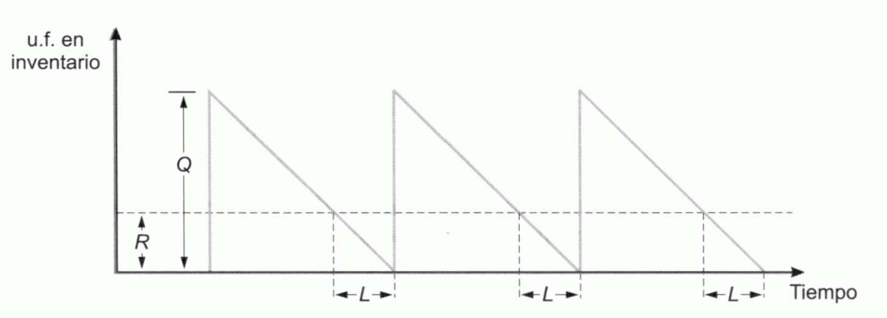
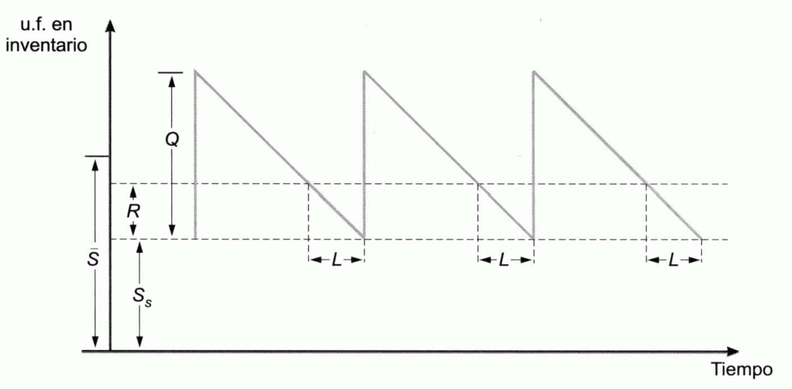

Tema 11: La logística
=====================

## Introducción

***Logística.*** Función que comprende las actividades y procesos necesarios para:

- Administración estratégica del flujo y almacenamiento de materias primas y componentes.
- Existencias en proceso y productos terminados.

De tal manera que éstos:

1. Estén en la cantidad adecuada
1. En el lugar correcto
1. En el momento apropiado

Comprende:

1. Consecución y almacenamiento de los factores necesarios para producir
1. Almacenamiento de los productos semiterminados
1. Distribución de los productos acabados hasta su destino en los distribuidores o clientes

***Inventario.*** Provisión de materiales que tiene como objeto principal facilitar la continuidad del proceso productivo y la satisfacción de los pedidos de los consumidores y clientes.

Actúan como reguladores entre los ritmos de salida de unas fases y los de entrada de las siguientes.

La clasificación más importante de los mismos es la que distingue entre:

1. Inventarios de materias primas
1. De productos semielaborados
1. De productos terminados

Características:

- Habitualmente los proveedores entregan materiales periódicamente y las empresas los precisan de forma prácticamente continua, por lo que resulta precisa la colocación de unos reguladores que son los **inventarios de materias primas**.
- En el proceso de producción es necesario un regulador o **inventario de productos semiterminados** entre aquellas fases del proceso cuyos ritmos de producción difieren, siendo las salidas de unas entradas para las siguientes.
- Del mismo modo, el ritmo de ventas no suele coincidir con el de generación de productos, por lo cual se hace precisa la utilización de **inventarios de productos terminados**.

Las decisiones sobre almacenes e inventarios están influenciadas por la producción y la capacidad de las instalaciones. Estas decisiones tienen grandes implicaciones financieras y de marketing, lo que a menudo genera conflictos de intereses.

- Los directivos financieros prefieren inventarios bajos para minimizar costos de financiación.
- Los directivos de producción y marketing prefieren inventarios altos para asegurar la continuidad de la fabricación y satisfacer la demanda.

    El objetivo es encontrar un equilibrio óptimo que beneficie los objetivos generales de la empresa.

La gestión de inventarios no es exclusiva de las empresas manufactureras: las empresas de servicios también se enfrentan a este desafío, ya que a menudo necesitan mantener inventarios de bienes para poder ofrecer sus servicios.

## Objetivos de los inventarios

Los objetivos de los inventarios son los siguientes:

- **Reducción del riesgo.**
    - Mantener un **stock de seguridad de productos terminados** para evitar que un repentino aumento de la demanda produzca un desabastecimiento que obligue a dejar de satisfacerla.
    - No es posible saber con toda certeza el tiempo que tardarán los proveedores en servir el pedido. Para evitar una detención del proceso de producción por agotamiento del almacén de materias primas, se mantiene un **stock de seguridad de materias primas**.

        Éste es necesario incluso cuando los proveedores son de absoluta confianza porque aumento inesperado de la intensidad de la demanda de productos terminados puede provocar una mayor necesidad de producción; lo cual requiere, una elevación del ritmo de salidas del almacén de materias primas que puede agotarle si no se dispone de un nivel mínimo.

- **Abaratar las adquisiciones y la producción.** La producción por lotes[^1] a veces es la forma óptima de producción porque se usa la misma maquinaria para elaborar distintos productos, lo cual puede resultar barato al distribuirse entre todos ellos (los lotes) los costes fijos de las máquinas.

    [^1]: Consiste en fabricar un gran lote de unidades en un periodo corto de tiempo y no volver a hacerlo hasta que ese lote está casi agotado.

    En las adquisiciones de materia prima también puede ser económico comprar por grandes lotes, para aprovechar descuentos por tamaño del pedido, repartir los costes de transporte, etc.

    En ambos casos son necesarios grandes almacenes. También abarata la adquisición de materias primas y la producción comprar en grandes cantidades cuando el precio se reduce transitoriamente.

- **Anticipar las variaciones previstas de la oferta y la demanda.** Existen ocasiones en las que pueden preverse las variaciones de la oferta y de la demanda.
    
    Por ejemplo, puede preverse que una amplia campaña de promoción de uno de los productos va a elevar la demanda de este. Para anticiparse a ella, la empresa acumula productos terminados.

    Otro tanto ocurre cuando la materia prima o los productos terminados están sometidos a variaciones estacionales.

- **Facilitar el transporte y la distribución del producto.** La producción se almacena para ser transportada en lotes cuando la fabricación está separada de los lugares de consumo.

    Otro tanto sucede en el proceso de elaboración de algunos productos que se van completando en sucesivas fases realizadas en puntos más o menos distantes entre sí.

## Los costes de los inventarios y su tamaño

Para decidir el nivel óptimo de los inventarios han de tenerse en cuenta sus costes, que son los siguientes:

- **Costes de almacenamiento, posesión o mantenimiento de inventarios.** A medida que el nivel de los almacenes aumente, se incrementa el volumen de recursos financieros inmovilizados en los mismos.

    Estos recursos tendrán un coste que será igual al coste:

    - Del capital que los financia (coste del pasivo)
    - El coste de oportunidad que comporta la rentabilidad que podría obtenerse si se invirtieran de otro modo (coste del activo alternativo)

    Se incurre en costes de alquiler o de amortización de los locales destinados a almacenes, costes de control de los productos, de manipulación física, de obsolescencia y mermas de los productos almacenados, de seguros, etc. Estos costes son tanto mayores cuanto mayor sea el inventario.

- **Costes de reaprovisionamientos, renovación del stock o realización de pedidos.** Con cada lote que se pide para reaprovisionar el almacén, se incurre en costes:

    1. Comerciales
    1. Administrativos
    1. De distribución
    
    Que suelen suponerse independientes de cual sea el tamaño del pedido.

    Dado que a medida que se incrementa el volumen de los almacenes se reduce el número de órdenes que es preciso realizar al año, el coste anual por pedidos se reduce con el nivel de los inventarios.

- **Costes de ruptura de stocks.** La ruptura de stocks se produce cuando la empresa se queda sin inventarios. Cuando la ruptura se produce en:
        
    - **El almacén de productos terminados**. La empresa se enfrenta a la imposibilidad temporal de satisfacer las demandas de sus clientes, lo cual provoca siempre una pérdida de imagen, y en ocasiones una pérdida de ventas.
    - **El inventario de materias primas o en el de productos semiterminados**. Detención total o parcial del proceso de producción, que provoca costes fijos de inactividad.

    Si la situación se prolonga, en ambos casos se puede dar lugar a la ruptura del inventario de productos terminados. Cuanto menor sea el tamaño del inventario, mayor es la probabilidad de incurrir en costes de ruptura.

En general, interesará mantener grandes inventarios cuando:

1. Los costes de realización de pedidos son elevados.
1. Los costes de almacenamiento son bajos.
1. Realizando grandes pedidos es posible obtener importantes descuentos de los proveedores.
1. Se espera un crecimiento sustancial de la demanda.
1. Se esperan fuertes subidas de precios

Complementariamente, se mantendrán bajos niveles cuando:

1. Los costes de almacenamiento son altos y los de realización de pedidos son bajos.
1. La demanda de la empresa es estable, siendo improbable un crecimiento súbito.
1. Los proveedores son de confianza y no existen dificultades de reaprovisionamiento.
1. No es posible aplazar el pago a los proveedores y existen dificultes de financiación de las existencias.
1. Se esperan importantes disminuciones de precios.

## Tipos de demanda

***Demanda independiente***. Determinada directamente por el mercado. Propia de aquellos artículos que son demandados por el mercado de manera inmediata, sin la mediación de otros bienes. Es el caso de la demanda de productos terminados, repuestos, etc.

***Demanda dependiente***. Se encuentra vinculada a la demanda de otros productos. Es una demanda mediata, en el sentido de que entre el mercado y los bienes que son objeto de esta median otros bienes.

***Bienes finales***. Bienes cuya demanda es independiente:

- **Si se conoce con certeza la demanda de un bien final**. También se conocerá la de los bienes cuya demanda depende de la de ellos, y el asegurar que se disponga de las cantidades necesarias en los momentos precisos será un proceso muy simple.
- **Si la demanda de los bienes finales es incierta**. También lo es la de los bienes cuya demanda depende de la de aquellos.

## Tipos de sistemas y modelos de inventarios

***Sistemas de inventarios.*** Está integrado por:

- Una estructura organizativa
- Por un conjunto de:
    1. Reglas
    1. Políticas
    1. Procedimientos de mantenimiento
    1. Control de los bienes inventariados

Características:

1. Al sistema le corresponde la ordenación de pedidos y su recepción.
1. Determina el tamaño de cada pedido y el momento en el que ha de enviarse la orden.
1. Ha de mantenerse información actualizada de:

    1. Qué se ha pedido
    1. Cuánto se ha pedido
    1. A quién se ha pedido

Hay dos tipos básicos de sistemas de inventarios:

- **Sistema de volumen de pedido constante (sistema $\mathbf{Q}$) o sistema de volumen económico de pedido:**
    - Todos los pedidos tienen el mismo tamaño y se realizan cuando se comprueba que es necesario, lo cual puede suceder en cualquier momento, dado el nivel de existencias del almacén y la demanda prevista.
    - Requiere una frecuente revisión de las existencias para determinar si es conveniente realizar un pedido.
- **Sistema de periodo constante (sistema $\mathbf{P}$), sistema periódico, sistema de revisión periódica o sistema de intervalo fijo de pedido:**
    - Se establece un periodo constante entre cada par de pedidos. Estos se efectúan cuando ha transcurrido ese periodo, y su tamaño es variable dependiendo del nivel que tenga el inventario al llegar a ese momento y de la demanda prevista.
    - Las revisiones solo se realizan llegado el momento de la reposición para determinar la cantidad que conviene recargar.

A igualdad de stock, el sistema \(\mathbf{P}\) provoca mayores rupturas que el de pedido constante. Para que el riesgo de que se produzca una ruptura sea semejante, el sistema \(\mathbf{Q}\) requiere el mantenimiento de unos inventarios mayores que el de pedido constante.

En la práctica, se utilizan los dos tipos de sistemas:

- El sistema $P$ se aplica en los inventarios de productos de poco valor.
- El sistema $Q$ se utiliza para artículos caros en los que se gana teniendo una inmovilización de recursos financieros más baja, compensa los gastos derivados del elevado nivel de control que requiere.

Los distintos **modelos** también se pueden diferenciar según el nivel de información existente:

- **Modelos deterministas.** La demanda se supone conocida con certeza.
- **Modelos probabilísticos o aleatorios.** La demanda solo se conoce en términos de probabilidades.

## Modelos deterministas

En 1915, F.W. Harris desarrolló el **modelo del volumen económico de pedido o de Wilson**, que es el más conocido y utilizado de los modelos deterministas.

Los supuestos en los que se basa son:

1. La demanda del producto es constante, uniforme y conocida.
1. El tiempo transcurrido desde la solicitud del pedido hasta su recepción (**plazo de entrega**) es constante.
1. El precio de cada unidad de producto es constante e independiente del nivel del inventario y del tamaño del pedido, por lo que no es una variable que deba incorporarse en el modelo. Esto incluye el supuesto de que no existen descuentos por tamaño del pedido.
1. El coste de mantenimiento o almacenamiento depende del nivel medio del inventario.
1. Las entradas en el almacén se realizan por lotes o pedidos constantes y el coste de realización de cada pedido es también constante e independiente de su tamaño.
1. No se permiten rupturas de stocks, sino que ha de satisfacerse toda la demanda.
1. El bien almacenado es un producto individual que no tiene relación con otros productos.

Cuando se cumplen estos supuestos, la evolución temporal del inventario, en unidades físicas, se ajusta a una forma como **dientes de sierra**. La forma que tienen estos dientes se explica por el supuesto de que las entradas se efectúan por lotes y de que las salidas se producen de forma constante y continua.

*Figura 11.1 Evolución temporal del inventario en unidades físicas*

En la figura anterior se ha supuesto que no existe stock de seguridad. Si hubiera un stock igual a $S$ unidades físicas, la representación correcta sería esta:

*Figura 11.2 Evolución temporal del inventario en unidades físicas asumiendo un stock de seguridad $\mathbf{S}$*

1. $Q$ - Tamaño del lote o pedido.
1. $L$ - Plazo de entrega.
1. $R$ - Número de unidades físicas que hay en el almacén en el momento de realizar el pedido además del stock de seguridad.

El tamaño del pedido influye en la frecuencia con la que se tendrán que realizar los pedidos y en el nivel del inventario:

- Cuanto menor es el tamaño del pedido, mayor es la frecuencia con la que hay que renovar el almacén y menor es el nivel medio del almacén.
- Si el tamaño del pedido es grande, también lo será el nivel medio del almacén y el coste de mantenimiento, pero el número de pedidos al año y el coste de realización de pedidos serán pequeños.
    
    El modelo de Wilson permite determinar el tamaño del pedido para el cual es mínimo el coste total.

En la *Figura 11.2* se puede observar que el nivel medio del inventario es:

$$\overline{S} = S_{S} + \frac{Q}{2}$$

Si el coste de tener una unidad almacenada durante un año es $g$, el coste anual de mantenimiento será:

$$C_{p} = g \cdot \left\lbrack S_{S} + \frac{Q}{2} \right\rbrack$$

Sea $q$ la demanda anual en unidades físicas. Dado que con cada pedido se solicitan $Q$ u.f., al año se realizará un número de pedidos igual a:

$$\frac{q}{Q}$$

Si el coste constante de realización de un pedido es $k$, el coste total anual de reaprovisionamiento será:

$$C_{R} = k \cdot \frac{q}{Q}$$

Por tanto, el coste total es:

\begin{align*}
C_{T} &= C_{R} + C_{p} \\
&= k \cdot \frac{q}{Q} + g \cdot \left\lbrack S_{S} + \frac{Q}{2} \right\rbrack
\end{align*}

El tamaño óptimo del pedido se calcula como el valor que hace que el coste total sea mínimo, resultando:

$$Q = \sqrt{\frac{2 \cdot k \cdot q}{g}}$$

> A partir de aquí, las fórmulas que incluyen un 360 es porque la fórmula se calcula respecto la duración de un año comercial de 360 días.

Una vez determinado el tamaño óptimo del pedido, se conoce:

- \(q/Q\) - Número de pedidos ha efectuar al año.
- \(360/q \cdot Q\) - Número de días que han de transcurrir entre cada dos pedidos tomando el año comercial de $360$ días.

Para determinar el nivel que tiene el inventario cuando se realiza el pedido, obsérvese que la demanda diaria vale.

$$\frac{q}{360}$$

Y, por tanto, la demanda correspondiente a los $L$ días que forman el plazo de entrega es:

$$R = L \cdot \frac{q}{360}$$

En consecuencia, el nivel del inventario en el momento del pedido es:

$$S_{S} + R = S_{S} + L \cdot \frac{q}{360}$$

Un caso particular del modelo de Wilson es aquel en el que ha de incorporarse el coste financiero al coste de posesión anual unitario, $g$. Al incorporarse al activo una unidad física de producto, su precio, $P$, tendrá que ser financiado. Si el coste financiero es igual a $i$ por uno anual, el coste financiero unitario anual es \(P \cdot i\)

Si, además, los otros gastos de almacenamiento unitarios importan $a$ u.m. al año, podrá escribirse:

$$g = a + P \cdot i$$

## Modelo probabilístico

En los modelos probabilísticos se supone que la demanda se conoce sólo en términos de probabilidades.

El modelo más sencillo considera aplicable el teorema central del límite, en virtud de lo cual estima que la demanda sigue una distribución de probabilidad normal.

En tal caso, utilizando las tablas de la distribución normal estandarizada es posible determinar el pedido que se debe efectuar, o el stock de seguridad que se debe mantener, de modo que se limite a cierto porcentaje de probabilidad que se produzca una ruptura de stocks, la de que la ruptura supere cierta cuantía, etc.

### Sistemas de control de inventarios

***Sistemas de control.*** Permiten hacer frente a dos problemas importantes:

- Mantener un control adecuado sobre cada elemento del inventario.
- Asegurar que se mantengan unos registros adecuados de los tipos de materiales existentes y de sus cantidades.

Las principales funciones del control de inventarios son:

- **Mantener un registro actualizado de las existencias.** En el **sistema de inventario continuo** (generalmente informatizado) el registro de todas las entradas y salidas permite conocer las existencias de los diversos productos. Sin embargo, periódicamente suele hacerse un recuento físico de las existencias en el almacén.
- **Informar sobre el nivel de existes para saber cuándo se debe hacer un pedido y cuánto se debe pedir de cada uno de los productos.** En muchos casos, se establecen reglas de decisión relativas a sistemas de pedido constante, $Q$, o de periodo constante, $P$, y el propio sistema informático que registra las existencias extiende una orden de pedido en el momento adecuado y del tamaño preciso.
- **Notificar situaciones fuera de lo común que pueden constituir síntomas de errores o de un mal funcionamiento del sistema.**
- **Elaborar informes.**

***Principio de Pareto.*** Aplicado a los inventarios indica que unas pocas unidades almacenadas representan un gran porcentaje del valor del inventario. De esto se deduce que el control minucioso solo es necesario en unos pocos artículos, en tanto que en los demás es suficiente una revisión menos rigurosa.

***Método ABC.*** propuesto por A. Rambaux, divide los bienes almacenados en tres grupos:

- **Grupo A.** Formado por artículos que, suponiendo un importante porcentaje de la inversión total en productos inventariados, representan una proporción pequeña del número de unidades almacenadas. Controlando esta pequeña parte de las unidades, se tiene controlada la mayor parte del valor del almacén.
- **Grupo C.** Aquellos que menos interesa controlar porque representan la mayor proporción de las unidades almacenadas y su valor es muy pequeño.
- **Grupo B.** Tienen una importancia en relación al número de unidades del almacén semejante a la que tienen con referencia al valor total de la inversión en el inventario.

## La traslación de los inventarios

- Las empresas pueden trasladar la carga de mantener grandes inventarios a sus intermediarios o proveedores. Las compañías con productos de alta demanda a menudo obligan a sus distribuidores a almacenar grandes existencias, compensándolos con el volumen de ventas.
- Más comúnmente, las empresas trasladan el almacenamiento de materias primas y componentes a sus proveedores, quienes asumen estos costos para satisfacer a sus clientes y a menudo construyen almacenes cercanos.
- La gestión de inventarios puede generar conflictos y negociaciones sobre quién asume los costos, o perjudicar a los transportistas que deben esperar por la falta de espacio de almacenamiento.

***Sistema de inventario justo-a-tiempo (just-in-time inventory):***

1. Sistema popularizado en Japón que se basa en la recepción de pequeños pedidos frecuentemente y con tanta proximidad al momento de su utilización como sea posible, lo que requiere que los proveedores se localicen cerca de su cliente.
1. Esta aproximación física favorece los contactos para la resolución de problemas comunes y para la firma de acuerdos.
1. La reducción del número de días que permanecen almacenadas las unidades, es decir, la disminución del periodo medio de almacenamiento y por tanto, del periodo medio de maduración, supone un aumento de la rentabilidad de la empresa, pues no solo se reducen los costes de inventarios y la posibilidad de daños y mermas, sino que también disminuyen las necesidades de capitales inmovilizados.

## La distribución física

***Sistema de distribución física.*** Formado por el conjunto de elementos destinados a conducir materialmente el producto desde el vendedor hasta el comprador. Constituyen, por consiguiente, decisiones concernientes al mismo las relativas a:

1. Los medios de transporte a emplear.
1. La localización de almacenes y puntos de venta.
1. La selección de rutas e itinerarios.
1. El nivel de los almacenes y su organización.
1. La disposición de los materiales en los inventarios.
1. El embalaje de los productos para su transporte.
1. La utilización de medios logísticos propios o ajenos.
1. La selección de transportistas y almacenistas y la determinación de la relación con los mismos.

El objetivo principal de las decisiones de distribución es optimizar el nivel de servicio, definido por factores como la proximidad, disponibilidad de productos y rapidez de entrega. Mejorar este servicio implica costos; Las empresas pueden optar por:

- Fijar un presupuesto de distribución y luego maximizar el servicio.
- Establecer un nivel de servicio deseado y minimizar los costos asociados. Esta opción es la más común debido a la dificultad de relacionar beneficios con el nivel de servicio.

La decisión de usar medios logísticos propios implica grandes inversiones y compromisos a largo plazo, siendo una elección estructural. Pequeñas empresas sin suficientes recursos financieros suelen depender de medios externos. No obstante, muchas grandes empresas también optan por servicios externos por su flexibilidad, especialmente en mercados inciertos.

Una vez establecidos los centros de distribución y puntos de venta, la empresa debe determinar las cantidades a enviar desde cada centro de distribución a cada punto de compra, buscando minimizar los costos de distribución y satisfaciendo toda la demanda.

Este problema puede resolverse utilizando la programación lineal, específicamente el modelo de transporte o modelo de Hitchcock. Este modelo considera:

1. \(n\) - centros de distribución.
1. \(Q_i\) - capacidades máxima de cada centro.
1. \(m\) - centros de compra con volúmenes de adquisición.
1. \(C_j\) - Volumen de adquisición de cada centro de compra.
1. \(p_{ij}\) Coste de distribución por unidad del centro.

El proceso consiste en:

1. Minimizar el coste de distribución:

    $$min\ z = \sum_{i = 1}^{n}{\sum_{j = 1}^{m}{p_{\text{ij}} \cdot X_{\text{ij}}}}$$

2. Restricciones de capacidad de venta. La cantidad total distribuida por cada centro de venta no puede superar su capacidad máxima:

    $$\sum_{j = 1}^{n}X_{\text{ij}} \leq Q_{i}\ para\ todo\ i = 1,2,\ldots,n$$

3. Restricciones de satisfacción de la demanda superada. La cantidad total distribuida a cada centro de compras ha de ser suficiente para satisfacer su volumen de adquisición en el periodo.

    $$\sum_{j = 1}^{n}X_{\text{ij}} \geq C_{j}\ para\ todo\ j = 1,2,\ldots,m$$

4. Restricciones de no negatividad. Las cantidades distribuidas no pueden ser negativas:

    $$X_{\text{ij}} \geq 0$$
