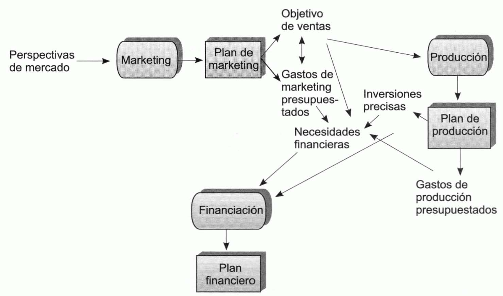
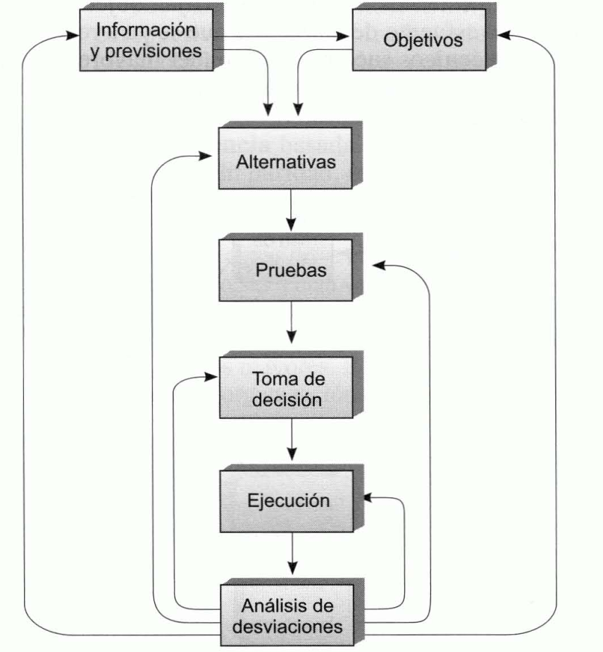
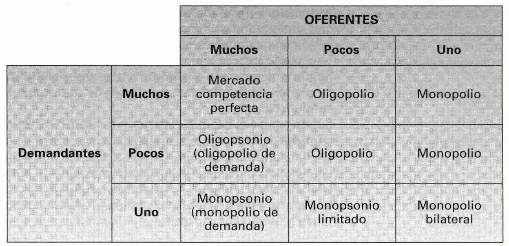
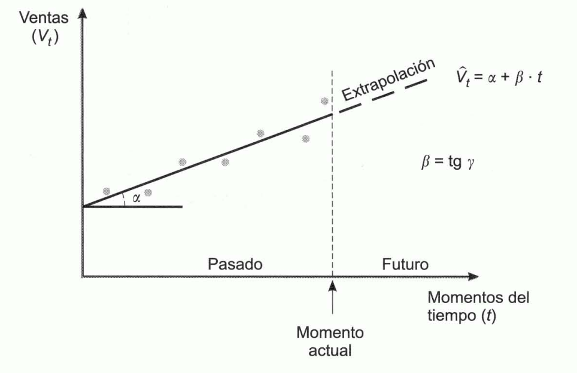
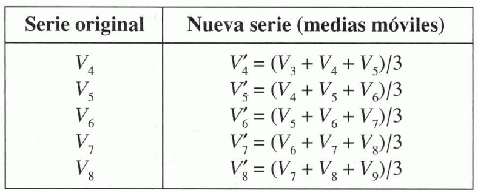
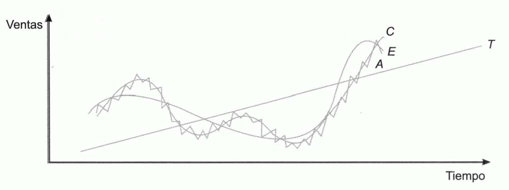
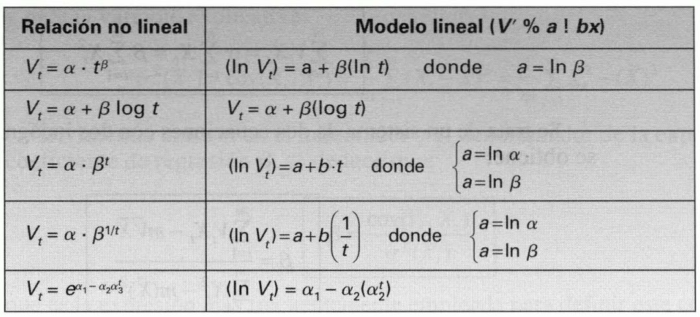

Tema 12: Elementos de marketing: el mercado, la demanda y el presupuesto mercadotécnico
=======================================================================================

## Introducción

***Marketing.*** Conjunto de actividades que dirigen el flujo de bienes
y servicios del productor al consumidor.

La empresa crea utilidades de forma, tiempo, lugar y propiedad:

- **Utilidad de forma.** Es creada por la función de producción, convirtiendo las materias primas y otros factores de producción en productos terminados.
- **Utilidad de tiempo.** Se crea poniendo el producto a disposición del consumidor cuando éste desea adquirirlo. Precisa investigar lo que el consumidor deseará en fechas futuras.
- **Utilidad de propiedad.** Se crea disponiendo la transferencia del dominio del vendedor al comprador.

***Actividades de marketing.*** Pueden considerarse como parte del proceso de producción porque el producto no se encuentra totalmente terminado hasta que se le han incorporado las cuatro formas de utilidad.

## La empresa orientada al cliente

***Orientación a la producción.*** Consiste en elaborar productos de calidad a bajo coste. Su venta era un problema menor dado dado la amplia variedad de deseos y necesidades insatisfechas que tenían los consumidores.Este enfoque se extendió desde el principio de la Revolución Industrial hasta las primeras décadas de este siglo.

***Orientación a las ventas.*** Lo prioritario es realizar el esfuerzo preciso para vender el producto. Bajo esta idea, la gestión de la fuerza de ventas adquirió una gran importancia.

***Orientación a los consumidores.*** Lo prioritario es determinar lo que desean los consumidores para luego producirlo y ofrecérselo con un beneficio. Bajo este enfoque es preciso inferir la acción empresarial y los propios productos del análisis de las necesidades y de los deseos de los consumidores.

***Orientación a la competencia.*** Basada en la consecución de ventajas sobre los competidores. Esta orientación considera a los consumidores como un premio conseguido a costa de los competidores. Complementa a la orientación al consumidor.

***Orientación al cliente.*** El cliente es el centro de la organización. La dirección de la empresa dirige de otro modo pues el impacto de la competencia ha desestabilizado los canales de poder puramente tecnocráticos, y la autoridad de la dirección depende de su aptitud para llevar a toda la organización a pensar en el cliente y en el competidor de modo creativo y responsable.

***Orientación social.*** La empresa se dirige a procurar la satisfacción y el bienestar a largo plazo de los clientes y de la sociedad, en general, para satisfacer los propios objetivos y responsabilidades de la organización. Esta perspectiva se basa en la idea de que los consumidores y la sociedad auspiciarán a aquellas organizaciones que muestren interés por su satisfacción y bienestar.

## El marketing como función empresarial: el marketing-mix

***Marketing.*** Función empresarial interrelacionada con las otras dos grandes funciones de producción y finanzas.

1. En base a estudios de mercado se fijan objetivos de venta que dependerán del esfuerzo de marketing que se va a realizar.
1. De las ventas esperadas dependerán los gastos de fabricación y las necesidades de inversiones.
1. La diferencia entre el volumen de negocio previsto y los gastos de producción, marketing y financiación determina el beneficio y el volumen de autofinanciación previsto.
1. El resto de necesidades financieras para acometer inversiones habrá de obtenerse con otras fuentes de financiación. En el plan financiero se establecen las inversiones que se van a realizar y los medios con los que van a ser financiadas.

*Figura 12.1 Relación del marketing con las funciones de producción y finanzas*

Las **decisiones mercadotécnicas**, a día de hoy, son problemas complejos que requieren el empleo de un método científico basado en instrumentos objetivos de investigación y medida cuyos campos de aplicación son:

1. Obtención de información y elaboración de previsiones para decidir, utilizándose técnicas de análisis estadístico y económico, sondeos, estudios de motivación, paneles, etc.
2.  Prueba previa de decisiones alternativas mediante técnicas de verificación parcial y total.
3. La toma de decisiones.
4. El control posterior a la ejecución de las decisiones, para determinar las desviaciones existentes en su cumplimiento y en la consecución de los objetivos propuestos. Este análisis puede generar la necesidad de:

    - Ampliar información
    - Modificar las decisiones o su ejecución
    - Realizar pruebas nuevas

surgiendo así el sistema de retroalimentación que es característico de las decisiones empresariales.

*Figura 12.2 Diagrama de flujo en la toma de decisiones mercadotécnicas*

La **información de partida** en marketing en de dos tipos:

- Necesidades insatisfechas del mercado.
- Limitaciones financieras, técnicas y comerciales de la empresa.

Por confrontación de ambos se deduce el **segmento del mercado** al que la empresa se dirigirá y el producto con el que lo hará.

***Política de distribución.*** Está determinada por las:

1. Necesidades y características del mercado tomado como objetivo
1. Limitaciones de la empresa y de la red de distribución
1. Atributos del producto

***Política de promoción y publicidad.*** Condicionada por:

1. Necesidades y características del mercado
1. Limitaciones comerciales y publicitarias de la empresa
1. Características del producto
1. Tipo de distribución elegido

***Política de precios.*** Determinada por las necesidades del mercado y sus características, así como las del producto y las de los tipos de distribución y promoción seleccionados, conjuntamente con las limitaciones financieras de la empresa.

***Marketing-mix o mezcla comercial.*** Combinación de las políticas anteriores. Una vez que se ha seleccionado un segmento del mercado, el principal problema que se presenta es determinar la mezcla comercial óptima; aquella combinación que optimice la consecución del mercado teniendo en cuenta:

- Las limitaciones del propio mercado
- La escasez de recursos financieros técnicos y comerciales de la empresa

Bajo este concepto existen los siguientes principios:

- **Principio de restricción en la toma de decisiones.** Las decisiones están restringidas por costes como la imagen de la empresa, su previa especialización o sus medios tecnológicos, que cambian lentamente, por lo que constituyen limitaciones a corto plazo; aunque a largo plazo sean variables.
- **Principio de interdependencia.** Las cuatro decisiones son interdependientes entre sí; todas dependen de todas.
- **Principio de secuencia.** Las decisiones deberán tomarse secuencialmente; la prioritaria es la selección de un mercado-objetivo al que dirigir las acciones mercadotécnicas.
- **Principio de retroacción.** El principio de interdependencia determina que la toma de unas decisiones obligue frecuentemente a la revisión de otras anteriores.
- **Principio de control.** Del análisis de las desviaciones entre los planes y los datos reales posteriores, se puede deducir la necesidad de iniciar de nuevo todo el proceso o de revisar alguna decisión.

El marketing comporta la toma de decisiones cuantitativas y cualitativas que se toman en diferentes dimensiones temporales y espaciales.

## Clases de mercados

La clasificación de mercados más generalizada en Economía es la que los distingue según el **número de oferentes y demandantes** que intervienen:

*Figura 12.4 Clasificación del mercado según el número de oferentes y demandantes que intervienen*

Otras clasificaciones que tienen interés en marketing son:

- Según el **grado de elaboración del producto**:
    - Mercados de productos primarios.
    - Mercados de productos semielaborados.
    - Mercados de bienes manufacturados.
    - Mercados de servicios.
- Desde una **perspectiva temporal**:
    - Mercado pasado.
    - Mercado presente.
    - Mercado futuro.
- Según las **posibilidades de expansión empresarial**:
    - Mercado actual: formado por los actuales consumidores.
    - Mercado potencial: integrado por los consumidores actuales y los que pueden llegar a serlo con una política mercadotécnica adecuada.
    - Mercado tendencial o mercado hacia el que se tiende en el futuro.
- Según quienes sean los **adquirientes del producto**:
    - Mercados de mayoristas.
    - Mercados de minoristas.
    - Mercados de consumidores.
- Según sean **las características y los motivos de compra de los consumidores finales**:
    - Mercados de consumo: los consumidores son individuos o familias que compran para satisfacer sus necesidades consumiendo o usando el bien o servicio. Se subdividen en:
        - Mercados de consumo inmediato.
        - Mercados de consumo duradero. Los bienes de consumo duradero son aquellos que se adquieren para ser utilizados durante largos periodos de tiempo en los que se van consumiendo mediante depreciación u obsolescencia.

            Dado que su adquisición tiene implicaciones a largo plazo, suele estar más planificada que la compra de bienes de consumo inmediato, cuyo importe por regla general es, además, comparativamente pequeño.

        - Mercados de servicios.
    - Mercados industriales: los adquirientes compran por encargo de organizaciones que precisan los productos para desarrollar su actividad y alcanzar sus fines.

Esta última clasificación es la de mayor interés en el marketing pues se basa en el uso final al que se va a destinar el producto.

## La función de demanda a corto plazo y sus elasticidades

***Variables estructurales a largo plazo.*** Constituidas por el producto y la distribución. Cualquier modificación requiere periodos de tiempo generalmente amplios, por lo que, una vez implantados un producto y un sistema de distribución, no suelen alterarse durante un largo plazo.

***Variables a corto plazo.*** Formadas por el precio, la venta personal, y algunas variables promocionales, como la publicidad y la promoción de ventas.

A largo plazo la demanda depende de todas las variables mercadotécnicas, pero a corto plazo el producto y la distribución se consideran constantes, pues no se pueden alterar con rapidez, y las variables con las que se puede incidir en la demanda son:

- Precio, $p$.
- Venta personal, $F$.
- Variables promocionales, $A$.

Para tomar decisiones a corto plazo interesará conocer la función que relaciona la cantidad demandada, $q$, con esas variables mercadotécnicas:

$$q = q\left( p,F,A \right)$$

***Coeficientes de elasticidad:*** ratios que miden, por cociente, el tan por uno de modificación de la demanda sobre el tan por uno de variación de la variable que provoca aquella modificación.

- Elasticidad de la demanda respecto a la fuerza de ventas:

    $$l_{F} = \frac{\mathrm{\Delta}q}{\mathrm{\Delta}F} \cdot \frac{F}{q}$$

- Elasticidad de la demanda respecto a la promoción:

    $$l_{A} = \frac{\mathrm{\Delta}q}{\mathrm{\Delta}A} \cdot \frac{A}{q}$$

- Elasticidad de la demanda respecto al precio:

    $$l_{P} = - \frac{\mathrm{\Delta}q}{\mathrm{\Delta}p} \cdot \frac{p}{q}$$

Si se toman variaciones infinitesimales se obtiene:

\begin{align*}
l_{F} &= \frac{\partial q}{\partial F} \cdot \frac{F}{q} \\
l_{A} &= \frac{\partial q}{\partial A} \cdot \frac{A}{q} \\
l_{P} &= - \frac{\partial q}{\partial p} \cdot \frac{p}{q}
\end{align*}

La elasticidad correspondiente a una variable queda medida, así, por el producto de la derivada parcial de la demanda respecto a la variable y el cociente entre el valor de dicha variable y el nivel de la demanda.

Las funciones de demanda exponenciales del tipo:

$$q = k \cdot p^{b_{1}} \cdot A^{b_{2}} \cdot F^{b_{3}}$$

Tienen elasticidades constantes cualesquiera que sean los valores de las variables:

\begin{align*}
l_{P} &= - b_{1} \\
l_{A} &= b_{2} \\
l_{F} &= b_{3}
\end{align*}

## La optimización del presupuesto mercadotécnico y su control

### La optimización del presupuesto mercadotécnico a corto plazo

Se supone que la empresa se encuentra en un mercado de **competencia monopolística** en el que los consumidores perciben que su producto difiere de cualquier otro y satisface deseos y necesidades que ningún otro satisface, al menos del mismo modo. Supongamos, además, que se conoce la función de demanda a corto plazo:

$$q = q\left( p,\ F,\ A \right)$$

Los niveles óptimos de $p,\ F$ y $A$ dependerán de cuál sea el objetivo que se persiga. Si se trata de **maximizar la demanda**, tales niveles habrán de cumplir la condición necesaria de que sean nulas las derivadas parciales de $q$ respecto a $p$, a $F$ y a $A$. Si se trata de **maximizar el ingreso**, $I$, habrá de formularse la función:

\begin{align*}
I &= p \cdot q \\
&= p \cdot q\left( p,F,A \right)
\end{align*}

En el óptimo se habrá de cumplir la condición necesaria de que sean nulas las derivadas parciales de $I$ respecto a $p$, a $F$ y a $A$. De forma semejante, cuando se trata de maximizar el beneficio, $B$, se ha de formular la función:

$$B = p \cdot q - c_{v} \cdot q - C_{F} - A - F$$

Donde $c_{v}$ es el coste variable unitario y $C_{F}$ son los costes fijos de producción y distribución. En este caso, las condiciones necesarias del máximo serán:

\begin{align*}
\frac{\partial B}{\partial p} &= \left( p - c_{v} \right) \cdot \frac{\partial q}{\partial p} + q = 0 \\
\frac{\partial B}{\partial F} &= \left( p - c_{v} \right) \cdot \frac{\partial q}{\partial F} - 1 = 0 \\
\frac{\partial B}{\partial A} &= \left( p - c_{v} \right) \cdot \frac{\partial q}{\partial A} - 1 = 0
\end{align*}

Multiplicando los dos términos de estas tres relaciones por $\frac{p}{q},\frac{F}{q}$ y $\frac{A}{q}$ se obtiene:

$$\left( p - c_{v} \right) \cdot \frac{\partial q}{\partial p} \cdot \frac{p}{q} + p = 0 \rightarrow \left( p - c_{v} \right) \cdot \left( - l_{P} \right) + p = 0$$

$$\left( p - c_{v} \right) \cdot \frac{\partial q}{\partial F} \cdot \frac{F}{q} - \frac{F}{q} = 0 \rightarrow \left( p - c_{v} \right) \cdot l_{F} - \frac{F}{q} = 0$$

$$\left( p - c_{v} \right) \cdot \frac{\partial q}{\partial A} \cdot \frac{A}{q} - \frac{A}{q} = 0 \rightarrow \left( p - c_{v} \right) \cdot l_{A} - \frac{A}{q} = 0$$

Precio óptimo:

\begin{align*}
p &= \frac{l_{P}}{l_{P} - 1} \cdot c_{v} \\
l_{P} &= \frac{P}{p - c_{v}}
\end{align*}

Nivel óptimo de gasto en fuerza de ventas:

\begin{align*}
F &= \left( p - c_{v} \right) \cdot q \cdot l_{F} = \frac{p}{l_{P}} \cdot q \cdot l_{F} = \frac{l_{F}}{l_{P}} \cdot p \cdot q \\
l_{F} &= l_{P} = \frac{F}{p \cdot q}
\end{align*}

Nivel óptimo del gasto en promoción:

\begin{align*}
A &= \left( p - c_{v} \right) \cdot q \cdot l_{A} = \frac{p}{l_{P}} \cdot q \cdot l_{A} = \frac{l_{A}}{l_{P}} \cdot p \cdot q \\
l_{A} &= l_{P} = \frac{A}{p \cdot q}
\end{align*}

En el punto óptimo:

$$\frac{l_{F}}{F} = \frac{l_{A}}{A} = \frac{l_{P}}{p \cdot q}$$

Muchas empresas establecen su presupuestos anuales de promoción y venta personal como una proporción fija de su volumen de ventas anual en unidades monetarias. En tal caso, las proporciones óptimos para cada una de las variables son:

$$\frac{A}{p \cdot q} = \frac{l_{A}}{l_{P}}\text{\ y\ }\frac{F}{p \cdot q} = \frac{l_{F}}{l_{P}}$$

Y la proporción óptima para el conjunto de ambas será:

$$\frac{A + F}{p \cdot q} = \frac{l_{A} + l_{F}}{l_{P}}$$

Donde el precio, la cantidad demandada y los valores de las elasticidades se entienden referidos a sus niveles óptimos.

Otras empresas establecen un total de $M$ unidades monetarias para sus gastos anuales en promoción y fuerza de ventas. Si el objetivo continúa siendo el de maximizar el beneficio, se trata de hacer máximo:

$$B = p \cdot q - c_{v} \cdot q - C_{F} - A - F$$

Con la restricción:

$$M = A + F$$

Las condiciones necesarias de óptimo (obtenidas tras derivar respecto a $\lambda$ la función lagrangiana resultante) son:

\begin{align*}
\left( p - c_{v} \right) \cdot \frac{\partial q}{\partial p} \cdot \frac{p}{q} + p = 0 \\
\frac{\partial q}{\partial A} = \frac{\partial q}{\partial F}
\end{align*}

La primera condición conduce a la siguiente expresión:

$$\frac{\partial q_{A}}{\partial E_{A}} - \lambda = 0$$

La segunda condición señala que, en equilibrio, la respuesta marginal de la demanda ha de ser la misma ante ambas variables. Si la repuesta fuera mayor para cada una de las variables, interesaría detraer recursos para ella a costa de la variable a la que le correspondiera la menor respuesta, hasta que se produjera la igualdad.

De forma semejante se optimiza la distribución del presupuesto entre dos o más territorios o segmentos. Se supone, por ejemplo, que la empresa vende su producto en dos territorios, $A$ y $B$, y que se conocen las funciones de demanda en cada uno de ellos, que depende de sus presupuestos de marketing ($E_{A}$ y $E_{B}$) y que son las siguientes:

\begin{align*}
q_{A} = q_{A}\left( E_{A} \right) \\
q_{B} = q_{B}\left( E_{B} \right)
\end{align*}

Se supone, además, que el objetivo de la empresa es maximizar la demanda total, $q$:

\begin{align*}
q &= q_{A} + q_{B} \\
&= q_{A}\left( E_{A} \right) + q_{B}\left( E_{B} \right)
\end{align*}

Y que su presupuesto mercadotécnico total es de $E$ u.m.:

$$E = E_{A} + E_{B}$$

Las condiciones necesarias de óptimo (obtenidas tras derivar respecto a $\lambda$ la función lagrangiana resultante) son:

\begin{align*}
\frac{\partial q_{A}}{\partial E_{A}} - \lambda &= 0
\frac{\partial q_{B}}{\partial E_{B}} - \lambda &= 0
\end{align*}

De las dos primeras restricciones se deduce que:

$$\frac{\partial q_{A}}{\partial E_{A}} = \frac{\partial q_{B}}{\partial E_{B}}$$

Cuando la respuesta marginal de las ventas en el territorio $A$ es mayor que en el territorio $B$, es decir, cuando una u.m. gastada en el sector $A$ tiene mayor incidencia en las ventas que si se gasta en el sector $B$, deben trasladarse fondos presupuestarios de $B$ a $A$ hasta que se produzca la igualdad. El equilibrio y la maximización de las ventas se alcanza cuando la respuesta marginal de la demanda al esfuerzo mercadotécnico es idéntica en ambos territorios.

### El control del presupuesto mercadotécnico

Denotando con el subíndice $r$ a las cantidades reales y con el $s$ a las cantidades presupuestadas, la desviación entre el beneficio neto de costes fijos ($\text{BN}$) real y el previsto será:

$$D_{T} = BN_{r} - BN_{s}$$

El beneficio bruto de costes fijos ($\text{BB}$) es el resultado alcanzado antes de deducir estos costes, es decir:

$$BN = BB - C_{F}$$

Por el hecho de ser fijos, dichos costes pueden ser previstos con gran precisión, y no han de existir diferencias sustanciales entre su valor real y el presupuestado, de modo que:

$$BN_{r} - BN_{s} = BB_{r} - BB_{s}$$

Es decir, dado que apenas han de existir diferencias entre los costes fijos reales y los presupuestados, las únicas diferencias entre el beneficio neto real y el estándar han de provenir de diferencias habidas en el beneficio bruto. Tales diferencias pueden producirse porque el número de unidades vendidas fue diferente que el previsto, o porque el margen de beneficio conseguido con cada unidad se ha desviado respecto al estándar.

Denominando $m$ al margen de beneficio bruto unitario:

$$m = p - c_{v}$$

Y llamando $q$ a la cantidad vendida, el beneficio bruto será:

$$BB = q \cdot m$$

La desviación entre el beneficio real y el previsto será:

$$D_{T} = BB_{r} - BB_{s} = q_{r} \cdot m_{r} - q_{s} \cdot m_{s}$$

Y esta desviación se puede desglosar como sigue:

$$D_{T} = \left( q_{r} \cdot m_{r} - q_{r} \cdot m_{s} \right) + \left( q_{r} \cdot m_{s} - q_{s} \cdot m_{s} \right)$$

Donde el primer sumando es la **desviación en márgenes**:

$$D_{M} = q_{r} \cdot m_{r} - q_{r} \cdot m_{s} = q_{r} \cdot \left( m_{r} - m_{s} \right)$$

Y el segundo es la **desviación en cantidades**:

$$D_{Q} = q_{r} \cdot m_{s} - q_{s} \cdot m_{s} = m_{s} \cdot \left( q_{r} - q_{s} \right)$$

La desviación en márgenes puede descomponerse del siguiente modo:

$$D_{M} = q_{r} \cdot \left( m_{r} - m_{s} \right) = q_{r} \cdot \left\lbrack \left( p_{r} - c_{\text{vr}} \right) - \left( p_{s} - c_{\text{vs}} \right) \right\rbrack = q_{r} \cdot \left( p_{r} - p_{s} \right) + q_{r} \cdot \left( c_{\text{vr}} - c_{\text{vs}} \right)$$

Donde:

-   Desviación en precios:
    $D_{P} = q_{r} \cdot \left( p_{r} - p_{s} \right)$

-   Desviación en costes variables:
    $D_{C} = q_{r} \cdot \left( c_{\text{vr}} - c_{\text{vs}} \right)$

Denominando $Q$ a las ventas totales del conjunto de empresas que
compiten en el mercado y $t$ a la proporción de estas correspondiente al
producto en cuestión (cuota de ventas de este producto):

$$q = t \cdot Q$$

La desviación en cantidades puede descomponerse de la siguiente forma:

\begin{align*}
D_{Q} &= m_{s} \cdot \left( q_{r} - q_{s} \right)  \\
&= m_{s}\left\lbrack \left( t_{r} \cdot Q_{r} - t_{s} \cdot Q_{r} \right) + \left( t_{s} \cdot Q_{r} - t_{s} \cdot Q_{s} \right) \right\rbrack  \\
&= m_{s} \cdot Q_{r} \cdot \left( t_{r} - t_{s} \right) + m_{s} \cdot t_{s} \cdot \left( Q_{r} - Q_{s} \right)
\end{align*}

Donde:

- Desviación en cuotas: $D_{K} = m_{s} \cdot Q_{r} \cdot \left( t_{r} - t_{s} \right)$
- Desviación en el tamaño global del mercado: $D_{G} = m_{s} \cdot t_{s} \cdot \left( Q_{r} - Q_{s} \right)$

## Estimación y previsión de la demanda

Para prever las ventas es precisa la utilización de técnicas y modelos de previsión. Dado, además, que la empresa puede influir en la evolución de las ventas utilizando las distintas políticas mercadotécnicas, en general, no es suficiente con prever la **evolución espontánea** del mercado, sino que es preciso determinar la **reacción o respuesta** de este a sus acciones.

Los modelos de previsión pueden ser clasificados con arreglo a distintos criterios:

- Según el **horizonte de la previsión**:
    - **A corto plazo**. Los principales factores son coyunturales.
    - **A medio plazo**. Tienen carácter más estructural.
    - **A largo plazo**. Apenas existen constantes; el entorno es una variable sometida a cambios sociales, políticos y tecnológicos.
- Según los **datos** que utilizan:
    - **Modelos basados en opiniones e intenciones de consumidores, vendedores o expertos**. Adecuados para previsiones a corto plazo de la evolución espontánea del mercado.
    - **Modelos de extrapolación de datos históricos**. Adecuados para previsiones a corto plazo de la evolución espontánea del mercado.
    - **Modelos explicativos que tienen en cuenta otras variables además del tiempo**. Se aplican a corto, medio y largo plazo, tanto para prever la evolución espontánea del mercado como sus reacciones a las decisiones de la empresa.

### Modelos de extrapolación

***Modelos de extrapolación.*** Basados en la observación de tendencias regulares en el pasado y en la hipótesis de que se mantendrán en el futuro. Cuando las ventas varían de forma aproximadamente lineal en el tiempo, puede ser útil la **regresión lineal** simple de las ventas $V_{t}$, sobre el tiempo, con arreglo a la ecuación de regresión:

$$V_{t} = \alpha + \beta \cdot t + \varepsilon_{t}$$

Donde $\alpha$ y $\beta$ son los coeficientes de regresión y $\varepsilon$ es una variable residual de media nula. Las ventas estimadas para el periodo $t$ serían:

$$V_{t} = \alpha + \beta \cdot t$$

*Figura 12.4 Ejemplo de extrapolación gráfica con una regresión lineal*

La ecuación de regresión depende de la forma en que las ventas evolucionan con el tiempo.

Para eliminar las variaciones esporádicas o accidentales de las ventas se utiliza el **método de las medias móviles**, consistente en sustituir el valor del periodo correspondiente, $V_{t}$, por la media aritmética de este valor y otros que le son próximos. Por ejemplo:

*Figura 12.5 Ejemplo de transformación*

En algunos casos, en la evolución de las ventas es posible distinguir hasta cuatro componentes:

- **Tendencia,** $\mathbf{T}$**, o dirección predominante** de la serie observada en un periodo suficientemente amplio.
- **Las variaciones estacionales y periódicas,** $\mathbf{E}$**,**que resultan evidentes en aquellos productos cuyas ventas se ven influidas por las estaciones del año, pero que también se pueden encontrar en otros sometidos a variaciones de periodo inferior al año.
- **Variaciones cíclicas,** $\mathbf{C}$**.** Es frecuente que la coyuntura económica y las ventas de los productos cuya demanda depende de la misma, evolucionen a través de oscilaciones denominadas variaciones cíclicas.
- **Variaciones accidentales,** $\mathbf{A}$**.** Pequeños movimiento derivados de circunstancias momentáneas y esporádicas.

*Figura 12.6 Evolución de las ventas*

Para predecir las ventas sería preciso determinar:

1. Las cuatro componentes.
2. La forma en que se combinan para ofrecer como resultado un determinado valor de las ventas.
    - Hipótesis aditiva: las ventas resultan explicas por la acumulación de los cuatro factores, $V = T + E + C + A$.
    - Hipótesis multiplicativa: $V = T \cdot E \cdot C \cdot A$.

### Modelos explicativos

***Análisis de regresión.*** Se busca determinar la relación cuantitativa existente entre una variable explicada (ventas) y cierto número de variables explicativas (nivel de precios, esfuerzo publicitario, etc.) del siguiente modo:

$$V_{t} = \alpha + \beta_{1} \cdot X_{1t} + \beta_{2} \cdot X_{2t} + \ldots + \beta_{n} \cdot X_{\text{nt}} + \varepsilon_{t}$$

Donde:

1. $X_{1t},X_{2t},\ldots,X_{\text{nt}}$ - variables explicativas
1. $\alpha$ - constante que mide el valor esperado para las ventas cuando tales variables toman un valor nulo
1. $\beta_{1},\beta_{2},\ldots,\beta_{n}$ - constantes que miden la influencia que las respectivas variables explicativas tienen en las ventas
1. $\varepsilon_{t}$ - variable que recoge las denominadas perturbaciones aleatorias o residuos

Se estima que estos residuos tienen escasa relevancia y que se compensan entre sí, por lo que el valor medio de $\varepsilon_{t}$ es nulo. Más rigurosamente, se supone que estas variables aleatorias residuales:

- Siguen una distribución normal con esperanza matemática nula y desviación típica constante cualquiera que sea el valor de las variables explicativas.
- No están correlacionadas con sus valores pasados ni con ninguna de las variables explicativas, que son también variables aleatorias.

Si la relación es lineal, se habla de **regresión lineal**. Existen otros tipos de funciones que pueden ser transformadas en lineales tomando logaritmos.

*Figura 12.7 Funciones que pueden ser transformadas en lineales tomando logaritmos*

Cuando existe una sola variable explicativa, el método se denomina análisis de regresión simple. La ecuación será, en este caso:

$$V_{t} = \alpha + \beta \cdot X_{t} + \varepsilon_{t}$$

Para estimar los parámetros $\alpha$ y $\beta$ puede seguirse el criterio de seleccionar aquellos para los que la suma de los residuos sea mínima. Pero los valores de tales residuos, o desviaciones verticales respecto de la recta, habrían de tomarse en valor absoluto o bien tomar aquellos valores de $\alpha$ y $\beta$ para los que se minimiza la suma de los cuadrados de tales residuos, lo que se denomina **método de los mínimos cuadrados**. Tal método consistirá, entonces, en minimizar:

$$H = \sum_{t = 1}^{m}\varepsilon_{t}^{2} = \sum_{t = 1}^{m}\left( V_{t} - \alpha - \beta \cdot X_{t} \right)^{2}$$

Donde $m$ es el número de periodos en que se han observado $V_{t}$ y $X_{t}$. La condición necesaria de mínimo exige que las derivadas parciales de $H$ con relación a $\alpha$ y $\beta$ se anulen. De esta condición se obtiene el **sistema de ecuaciones normales**:

$$\sum_{t = 1}^{m}V_{t} = m \cdot \alpha + \beta \cdot \sum_{t = 1}^{m}X_{t}$$

$$\sum_{t = 1}^{m}{V_{t} \cdot X_{t}} = \alpha \cdot \sum_{t = 1}^{m}X_{t} = \beta \cdot \sum_{t = 1}^{m}X_{t}^{2}$$

Se trata de un sistema de dos ecuaciones con dos incógnitas, del que se obtiene:

$$\beta = \frac{\sum_{t = 1}^{m}{V_{t} \cdot X_{t}} - m \cdot \overline{V} \cdot \overline{X}}{\sum_{t = 1}^{m}X_{t}^{2} - m \cdot \left( \overline{X} \right)^{2}}$$

$$\alpha = \overline{V} - \beta \cdot \overline{X}$$

Donde $\overline{V}$ y $\overline{X}$ son las medias aritméticas de las variables:

$$\overline{V} = \frac{\sum_{t = 1}^{m}V_{t}}{m}$$

$$\overline{X} = \frac{\sum_{t = 1}^{m}X_{t}}{m}$$

La media de los productos de las desviaciones de ambas variables, respecto a sus medias, se denomina covarianza. Es decir:

$$\text{con}\left( V_{t},\ X_{t} \right) = \frac{1}{m} \cdot \sum_{t = 1}^{m}{\left( V_{t} - \overline{V} \right) - (X_{t} - \overline{X})} = \frac{1}{m} \cdot \sum_{t = 1}^{m}{\left( V_{t} \cdot X_{t} \right) - (\overline{V} \cdot \overline{X})}$$

La covarianza entre una variable y ella misma es la varianza:

$$\sigma^{2}\left( V_{t} \right) = \frac{1}{m} \cdot \sum_{t = 1}^{m}{V_{t}^{2} - \left( \overline{V} \right)^{2}}$$

$$\sigma^{2}\left( X_{t} \right) = \frac{1}{m} \cdot \sum_{t = 1}^{m}{X_{t}^{2} - \left( \overline{X} \right)^{2}}$$

Dividiendo entre $m$ en el numerador y el denominador de la expresión del coeficiente de regresión $\beta$, se deduce que:

$$\beta = \frac{cov(V_{t},X_{t})}{\sigma^{2}(X_{t})}$$

La varianza mide la variabilidad de los datos en torno a su media. Es la media de las desviaciones, respecto a la media, elevadas al cuadrado. Una parte de esta variabilidad, o dispersión, proviene de la variabilidad de la variable explicativa. Es la denomina **variabilidad explicada** o **variabilidad factorial**. El resto es la proveniente de la **variabilidad de los residuos** (no explicada) y es la que se pretende minimizar. Al tanto por uno que, de la variabilidad total de la variable explicada ($V_{t}$) medida por la varianza, representa la parte factorial (es decir, el total menos la variabilidad de los residuos) se le denomina **coeficiente de determinación simple**:

$$r = \frac{\sigma^{2}\left( V_{t} \right) - \sigma^{2}(\varepsilon_{t})}{\sigma^{2}\left( V_{t} \right)}$$

El valor de $r$ no puede ser inferior a cero ni superior a la unidad. Con este coeficiente se pude estimar la bondad del ajuste de los puntos de la recta, pues éste es tanto mejor cuanto menor sea $\sigma^{2}\left( \varepsilon_{t} \right)$ y cuanto más próximo a la unidad se encuentre $r$.

Otro coeficiente que puede dar idea de la bondad del ajuste es la raíz cuadrada del coeficiente de determinación, que se denomina **coeficiente de correlación simple**:

$$\rho = \sqrt{r} = \frac{\beta \cdot \sigma(X_{t})}{\sigma\left( V_{t} \right)} = \frac{\text{cov}\left( V_{t},\ X_{t} \right)}{\sigma\left( X_{t} \right) \cdot \sigma(V_{t})}$$

Su valor puede oscilar entre $- 1$ y $1$:

- Si $\rho = - 1$ se dice que la correlación entre las variables $X_{t}$ y $V_{t}$ es perfecta y negativa.
- Si $\rho = 1$ se dice que la correlación es perfecta y positiva.
- Si $\rho = 0$ se dice que no existe correlación, o que las variables no están correlacionadas.

Las **variables explicativas** pueden ser de dos tipos:

- **Variables exógenas.** Independientes de la voluntad de la empresa, como la renta de los consumidores, el tamaño de la población, los precios de los productos de la competencia, etc. Los modelos que solo incorporan estas variables se utilizan para prever la evolución espontánea del mercado.
- **Variables de acción.** Dependen de la voluntad empresarial, como el importe del presupuesto publicitario, los precios de sus productos, etc. Los modelos que incluyen estas variables se emplean para prever las reacciones del mercado ante las distintas acciones alternativas de la empresa.

Las relaciones existentes entre las ventas y las variables explicativas se estiman en base a datos pasados. Para realizar previsiones se precisa que tales relaciones se mantengan en el futuro y, además, generalmente, si las variables son exógenas, se requiere prever los futuros valores de éstas. En algunos casos, sin embargo, la relación entre las ventas y las relaciones explicativas no es contemporánea, sino que éstas preceden a la evolución de aquéllas en el sentido de que las ventas de un periodo dependen de los valores tomados por las variables explicativas en el periodo anterior o en otros periodos. Entonces, una vez estimada la relación y conocidos los últimos valores de las variables explicativas, se podrían estimar los futuros valores de las ventas.

La previsión de cuotas de mercado y las cadenas de Markov
---------------------------------------------------------

***Cuota de mercado.*** Proporción que, del mercado total disponible ha obtenido una empresa, una marca, una línea de productos, o un ítem, en general. La variación de la cuota permite dilucidar si las variaciones de las ventas son debidas a variaciones controlables por la empresa o a condiciones generales comunes a toda la industria en cuestión.

Es frecuente, además, la fijación de cuotas de mercado como objetivos en relación a los cuales se efectúa posteriormente el control, lo que, además, se puede efectuar tanto para el conjunto de la empresa como para sus distintos productos y marcas y bien en relación al conjunto del mercado o por sus distintos segmentos.

***Cadenas de Markov:*** modelo de extrapolación de cuotas. Hay diferentes modelos:

- **Modelo de primer orden.** Se considera que solo el último estado afecta al siguiente.
- **Modelo se segundo orden.** La probabilidad de comprar un ítem determinado dependerá de los últimos comprados.
- **Modelos de orden superior.** Se definen de forma semejante al modelo de segundo orden.

***Vector de estado de un periodo.*** Vector formado por las cuotas de mercado conseguidas por los distintos ítems en ese periodo.

Si en un mercado compiten $N$ marcas y en el periodo pasado (periodo $0$) sus cuotas de mercado respectivas, en tanto por uno, fueron $p_{1}\left( 0 \right),\ p_{2}\left( 0 \right),\ldots,p_{N}(0)$, el vector de estado correspondiente a ese periodo sería:

$$P\left( 0 \right) = \left\lbrack p_{1}\left( 0 \right)\text{\ \ }p_{2}\left( 0 \right)\ \ldots\ p_{N}(0) \right\rbrack$$

Se denomina $p_{\text{ij}}$ a la proporción que, en relación a todos los consumidores que adquirieron el ítem $i$ en un periodo, representan los que han decido adquirir el ítem $j$ en el periodo siguiente. Es la probabilidad de cambio del estado $i$ al $j$.

Conocidas las cuotas de un periodo, las del periodo siguiente, se prevén del siguiente modo:

$$q_{1}\left( 1 \right) = p_{1}\left( 0 \right) \cdot p_{11} + p_{2}\left( 0 \right) \cdot p_{21} + \ldots + p_{N}\left( 0 \right) \cdot p_{N1}$$

$$q_{2}\left( 1 \right) = p_{1}\left( 0 \right) \cdot p_{12} + p_{2}\left( 0 \right) \cdot p_{22} + \ldots + p_{N}\left( 0 \right) \cdot p_{N2}$$

$$q_{N}\left( 1 \right) = p_{1}\left( 0 \right) \cdot p_{1N} + p_{2}\left( 0 \right) \cdot p_{2N} + \ldots + p_{N}\left( 0 \right) \cdot p_{\text{NN}}$$

Esos elementos integran el vector de estado previsto, que será el siguiente:

$$Q\left( 1 \right) = \left\lbrack q_{1}\left( 1 \right)\ q_{2}\left( 1 \right)\ldots q_{N}(1) \right\rbrack$$

Las anteriores expresiones pueden sintetizarse, en notación matricial, del siguiente modo:

$$Q\left( 1 \right) = P\left( 0 \right) \cdot M$$

Donde $M$ es la **matriz de transición o matriz de cambios de estado**:

$$M = \begin{bmatrix}
\begin{matrix}
p_{11} \\
p_{21} \\
\begin{matrix}
\ldots \\
p_{N1} \\
\end{matrix} \\
\end{matrix} & \begin{matrix}
p_{12} \\
p_{22} \\
\begin{matrix}
\ldots \\
p_{N2} \\
\end{matrix} \\
\end{matrix} & \begin{matrix}
\begin{matrix}
\ldots \\
\ldots \\
\begin{matrix}
 \vdots \\
\ldots \\
\end{matrix} \\
\end{matrix} & \begin{matrix}
p_{1N} \\
p_{2N} \\
\begin{matrix}
\ldots \\
p_{\text{NN}} \\
\end{matrix} \\
\end{matrix} \\
\end{matrix} \\
\end{bmatrix}$$

- Los elementos de los vectores de estado no pueden ser inferiores a cero ni superiores a uno y han de totalizar la unidad.
- Los elementos de la matriz de transición tampoco pueden ser inferiores a cero ni superiores a uno, y los de cada fila han de totalizar la unidad.

Si se supone que la matriz es **estacionaria**, es decir, que se mantiene constante en el tiempo, para predecir el vector de estado de la siguiente semana cabría hacer:

$$Q\left( 2 \right) = Q\left( 1 \right) \cdot M = P\left( 0 \right) \cdot M \cdot M = P\left( 0 \right) \cdot M^{2}$$

Y, en general:

$$Q\left( n \right) = Q\left( n - 1 \right) \cdot M = P\left( 0 \right) \cdot M^{n}$$

La potencia de la matriz $M$ es otra matriz. Si tal potencia tiene límite cuando $n$ tiende a infinito, se dice que la cadena de Markov es **asintóticamente ergódica**.

$$L = \lim_{n \rightarrow \infty}{Q(n - 1) \cdot M} = \left\lbrack \lambda_{1}\ \lambda_{2}\ldots\lambda_{N} \right\rbrack$$

De las expresiones anteriores se deduce que:

$$L = L \cdot M \rightarrow \left\lbrack \lambda_{1}\ \lambda_{2}\ldots\lambda_{N} \right\rbrack = \left\lbrack \lambda_{1}\ \lambda_{2}\ldots\lambda_{N} \right\rbrack \cdot \begin{bmatrix}
\begin{matrix}
p_{11} \\
p_{21} \\
\begin{matrix}
\ldots \\
p_{N1} \\
\end{matrix} \\
\end{matrix} & \begin{matrix}
p_{12} \\
p_{22} \\
\begin{matrix}
\ldots \\
p_{N2} \\
\end{matrix} \\
\end{matrix} & \begin{matrix}
\begin{matrix}
\ldots \\
\ldots \\
\begin{matrix}
 \vdots \\
\ldots \\
\end{matrix} \\
\end{matrix} & \begin{matrix}
p_{1N} \\
p_{2N} \\
\begin{matrix}
\ldots \\
p_{\text{NN}} \\
\end{matrix} \\
\end{matrix} \\
\end{matrix} \\
\end{bmatrix}$$

Lo cual permite obtener un sistema de ecuaciones del que deducir los valores de los elementos de $L$:

\begin{align*}
\lambda_{1} &= \lambda_{1} \cdot p_{11} + \lambda_{1} \cdot p_{21} + \ldots + \lambda_{N} \cdot p_{N1} \\
\lambda_{2} &= \lambda_{1} \cdot p_{12} + \lambda_{2} \cdot p_{22} + \ldots + \lambda_{N} \cdot p_{N2} \\
\lambda_{N} &= \lambda_{1} \cdot p_{1N} + \lambda_{1} \cdot p_{2N} + \ldots + \lambda_{N} \cdot p_{\text{NN}}
\end{align*}

Además:

$$\lambda_{1} + \lambda_{2} + \ldots + \lambda_{N} = 1$$

Los valores obtenidos de $\lambda_{1},\lambda_{2},\ldots,\lambda_{N}$ son las cuotas hacia las que se tiende si no se modifica la matriz de transición por cualquier causa, como pueda ser la relativa a los esfuerzos mercadotécnicos de las empresas concurrentes.
