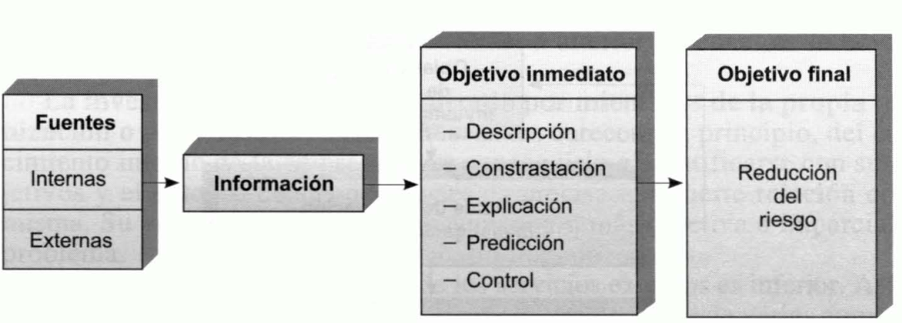
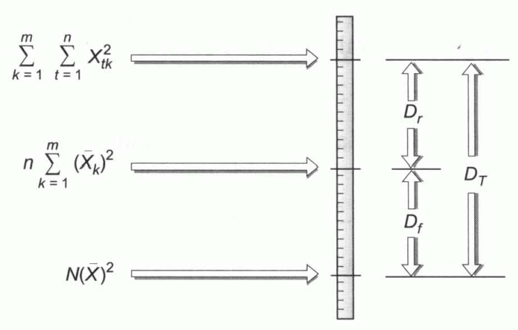

Tema 13: Investigación de mercados, segmentación y experimentación comercial
============================================================================

La investigación comercial
--------------------------

***Investigación comercial o investigación de mercados.*** Consecución y análisis de la información precisa para la toma de decisiones y su control. La investigación también tiene un coste que, a mayor información, menor riesgo y mayor coste de recogida y análisis.

***Riesgo de error.*** Es tanto mayor cuanto menor es la información en que la decisión se basa. El objetivo último de la investigación comercial es la reducción del riesgo.

***Fuentes de información.*** Pueden ser internas o externas:

- **Fuentes internas.** Se refieren a todos aquellos datos localizados en la propia empresa. Comprende estadísticas sobre volúmenes periódicos de ventas y su distribución, sobre costes y resultados de políticas alternativas de promoción y distribución, datos relativos a la evolución de las ventas ante distintas políticas de precios, etc.
- **Fuentes externas.** Las primeras que han de consultarse son las estadísticas e informes elaborados por organismos públicos y privados que son de libre disposición. Estos datos tienen la ventaja de su bajo coste y la rapidez de su disposición. Sin embargo, en ocasiones, tienen escasa fiabilidad y un excesivo retraso en su elaboración.

Cuando los datos precisos no se encuentran en la empresa y la actualización de tales informes y estadísticas es escasa o no existe, es preciso recogerlos de la propia fuente primaria y posteriormente elaborarlos para que resulten adecuados a las necesidades del decisor. La principal fuente de datos primarios externos es el **mercado**.

Las características de la investigación comercial dependerán en buena medida del objetivo que se persiga y éste puede ser:

- Una descripción del objeto investigado.
- La contrastación de una o varias hipótesis de decisión.
- La explicación y determinación de la relación existente entre variables como las ventas y el precio o la publicidad.
- La predicción de futuros valores de las diversas variables.
- El control de la ejecución de las decisiones y de sus resultados.

Las diferentes investigaciones comerciales pueden tener distintos procesos de desarrollo. Pero el proceso generalmente aplicable es el siguiente:

- Determinar el objetivo concreto de la investigación.
- Estudiar y realizar un balance de la situación general de la empresa y su entorno.
- Investigación informal somera.
- Revisión del objetivo o dar el paso a la planificación de la investigación.

*Figura 13.1 Proceso de desarrollo de una investigación comercial*

La **planificación de la investigación** requiere:

1. Revisión de las fuentes de información disponibles.
2. Selección de las fuentes.
3. Si no existentes fuentes, no son fiables o no se encuentran actualizadas, será preciso determinar los métodos a seguir para obtener los datos. Los más utilizados son las encuestas, las observaciones directas y los procedimientos experimentales.

    Un método experimental de gran importancia es la **prueba de mercado**, consistente en crear un mercado de control, en el que todos los factores permanecen constantes, y uno o varios mercados de prueba, en los que se cambia un factor para determinar el efecto que tiene esta variación por comparación con la evolución del mercado de control.

4. Preparación de impresos para registrar los datos y prueba previa de los mismos mediante, por ejemplo, su utilización con una pequeña muestra de personas semejantes a las que serán encuestadas.
5. Selección de la muestra. Que tenga las mismas características que la población y en la misma proporción aproximadamente. Las principales decisiones son las de determinación del tamaño de la muestra y las de elección del procedimiento para seleccionarla.
6. Recogida de datos primarios. Requiere seleccionar, adiestrar y dirigir a los entrevistadores.

Los impresos de recogida de datos deben diseñarse de manera que la posterior ordenación de los datos resulte lo más sencilla posible. Una vez acumulados y ordenados, es posible pasar a su análisis e interpretación, en la que se basará la **elaboración de informes** para la dirección. Es frecuente que la dirección reclame del investigador ulteriores aclaraciones, informes complementarios, etc., por lo que la investigación no se entiende concluida con la elaboración y presentación de los informes, sino que a ésta le siguen **prestaciones ulteriores**.

La investigación puede ser realizada por miembros de la propia organización o por consultores externos. Éstos carecen, en principio, del conocimiento interno de la empresa. Para conseguirlo e identificarse con sus objetivos y el entorno de sus decisiones es precisa una fuerte relación con la misma. Su ventaja es que parten de una visión más objetiva e imparcial del problema.

El coste de los servicios externos, en ocasiones, es inferior. Por ejemplo:

- **Encuestas colectivas.** Se realizan por cuenta de varias empresas, lo que reduce su coste.
- **Paneles.** Son encuestas periódicas en las que se requieren a las mismas personas (muestra permanente) que respondan a un mismo cuestionario a intervalos regulares. Permiten seguir la evolución de comportamientos y opiniones, pero sus elevados costes las hacen inviables. Por ello, son realizadas por empresas especializadas por cuenta de numerosos clientes, entre los que se reparte el gasto.

***Tamaño óptimo de la muestra.** A medida que incrementa, aumenta el coste de la investigación y el tiempo que requiere. Por otra parte, a partir de cierto tamaño, se precisan grandes incrementos de esta para conseguir pequeños aumentos de la fiabilidad estadística. Los métodos de selección de muestran se clasifican en:

- Métodos no probabilísticos.
    - **Muestreo por cuotas.** A los entrevistadores se les asigna un número de personas a encuestar, divididas en cuotas establecidas en base a cualquier criterio de segmentación y son los propios entrevistadores quienes seleccionan subjetivamente las personas que entrevistarán.
- Métodos probabilísticos:
    - **Muestreo aleatorio simple.** Los elementos son seleccionados asignándoseles números y utilizándose cualquier procedimiento de generación de números aleatorios.
    - **Muestreo aleatorio sistemático.** Los elementos de la población son también numerados para elegir la muestra, seleccionando el primer elemento al azar y los restantes tomando intervalos de una dimensión igual al resultado de dividir el tamaño de la población entre el de la muestra. Cuando el muestreo aleatorio sistemático tiene una base territorial, se le denomina **muestreo aleatorio por itinerarios**.
    - **Muestreo aleatorio estratificado.** Procedimiento probabilístico consistente en dividir la población en grupos, o estratos, de acuerdo con el criterio de segmentación que interese en cada caso, de cada uno de los cuales se extrae una muestra mediante alguno de los métodos anteriormente seleccionados. Cuando el muestreo estratificado tiene una base territorial, se le denomina **muestreo por conglomerados o áreas**.
    - **Muestreo polietápico.** Los estratos se dividen en nuevos estratos que pueden ser objeto de una nueva subdivisión y así sucesivamente.

En el muestreo aleatorio estratificado, si existen $m$ estratos, cada uno de los cuales tiene una población $N_{1},\ N_{2},\ \ldots,\ N_{m}$, el reparto de la muestra total (de tamaño $n$) puede realizase proporcionalmente a la población de cada estrato:

$$n_{i} = \frac{n}{N} \cdot N_{i}$$

Donde $n_{1},\ n_{2},\ldots,\ n_{m}$ es el número de elementos que integran las muestras de los estratos $1,2,\ldots,m$ respectivamente y $N_{1} + N_{2} + \ldots + N_{m}$ es el número de elementos de la población total.

A este procedimiento se le denomina reparto o **afijación proporcional**. En otros casos puede interesar tomar muestras del mismo tamaño en todos los estratos, es decir, realizar una **afijación por igual**:

$$n_{1} = n_{2} = \ldots = n_{m} = \frac{n}{N}$$

En los estratos cuyos elementos son muy heterogéneos puede interesar tomar una muestra mayor que en aquellos en los que existe homogeneidad en relación a la variable relevante en el estudio. En la denominada **afijación óptima**, el reparto es proporcional al tamaño de la población de cada estrato y a la desviación típica de la variable en el estrato.

$$n_{i} = N_{i} \cdot S_{i} \cdot \frac{n}{N_{1} \cdot S_{1} + N_{2} \cdot S_{2} + \ldots + N_{m} \cdot S_{m}}$$

Donde $S_{i}$ es la desviación típica de la variable en el estrato $i$.

En algunos procedimientos de afijación se tienen en cuenta los costes de recogida de información en los distintos estratos. Así, en la **afijación óptima con costes variables** el tamaño de la muestra de cada estrato, $i$, es directamente proporcional al tamaño de su población, $N_{i}$, e inversamente proporcional a la raíz cuadrada del coste de obtención de información de un elemento del estrato, $C_{i}$:

$$n_{i} = \frac{N_{i} \cdot S_{i}}{\sqrt{C_{i}}} \cdot \frac{n}{\frac{N_{1} \cdot S_{1}}{\sqrt{C_{1}}} + \frac{N_{2} \cdot S_{2}}{\sqrt{C_{2}}} + \ldots + \frac{N_{m} \cdot S_{m}}{\sqrt{C_{m}}}}$$

En general, la afijación puede realizarse en proporción al valor que cualquier característica o variable toma en los diferentes estratos. Así, pues, en general, siendo $x_{i}$ el valor que toma la variable en el estrato $i$:

$$n_{i} = x_{i} \cdot \frac{n}{x_{1} + x_{2} + \ldots + x_{m}}$$

## La segmentación de mercados

***Segmentación de mercados.*** Proceso de división de los mercados en grupos de características similares. Desde un punto de vista operativo, trata de explicar el comportamiento de cierta variable en los consumidores en base a una serie de criterios de segmentación que actúan como variables explicativas.

Una posible estrategia para acceder a los consumidores es tratar de satisfacer a la mayoría del mercado potencial mediante acciones de marketing dirigidas a la media. Esta estrategia puede ser adecuada cuando la competencia es escasa o nula. Si ya existen en el mercado varias empresas dirigidas en ese sentido, puede ser más rentable tratar de acceder a segmentos que, aunque en principio son minorías, tienen necesidades, deseos o motivaciones que no son cubiertos por otras empresas.

Los criterios más comunes para la segmentación son los siguientes:

1. **Segmentación demográfica:**
    1. Edad.
    1. Sexo.
    1. Raza.
    1. Estado civil.
    1. Peso.
    1. Estatura.
1. **Segmentación geográfica:** se diferencia consumidores por regiones o lugares de residencia en base a:
    1. Clima.
    1. Dimensión de la localidad.
    1. Carácter rural o urbano.
1. **Segmentación sociológica:**
    1. Clases sociales.
    1. Nivel de renta de las familias.
    1. Profesión.
    1. Educación.
    1. Nivel cultural.
    1. Religión.
1. **Segmentación psicográfica:** basada en la identificación de los individuos con cierta personalidad, estilo de vida o valores.
1. **Segmentación basada en la posesión de otros productos.**

El criterio idóneo en cada caso depende en gran medida del tipo de producto de que se trate.

## Métodos de segmentación de mercados

***Métodos de segmentación de mercados:*** se trata de agrupar a la población en dos grupos o categorías dicotómicas: la de las personas que consumen el producto en cuestión y la de las que no lo consumen. Determina la capacidad discriminante de los diferentes criterios de segmentación y de las distintas agrupaciones dicotómicas que se pueden realizar con cada uno de ellos.

Para segmentar el mercado ha de procederse siguiendo las dos fases siguientes:

1.  Determinar cuál es la mejor agrupación bajo cada uno de los diversos criterios existentes.
2.  Se comparan las mejores agrupaciones que se pueden realizar con los diversos criterios, para elegir el mejor de ellos.

Los principales métodos de segmentación son los siguientes:

- **Método de Belson.** El más sencillo. Considera que la mejor agrupación bajo cada criterio es la consistente en integrar en una categoría dicotómica a aquellos grupos en los que el porcentaje de consumidores es superior a la media y en otra aquellos en los que es inferior a la media. La capacidad discriminante se mide por la diferencia, en términos absolutos, entre el número de consumidores efectivos en cada grupo, $E_{i}$, y el que le correspondería si se mantuviera el porcentaje medio de consumidores, $T_{i}$.

Es decir, considera que tiene mayor capacidad discriminante aquel criterio para el cual sea máxima la diferencia:

$$|E_{i} - T_{i}|$$

Al mismo resultado se llega si se toma como medida:

$$\left( E_{i} - T_{i} \right)^{2}$$

- **Método de la** $\mathbf{\chi}^{\mathbf{2}}$**.** Tanto para seleccionar la mejor agrupación bajo cada criterio como para determinar el criterio que tiene mayor capacidad discriminante se utiliza el coeficiente:

$$\frac{\left( E_{i} - T_{i} \right)^{2}}{T_{i}}$$

Para cada posible agrupación se calcula este importe en cada una de las dos categorías y posteriormente se suman. La mejor agrupación es aquella a la que le corresponde el total, $S$, más elevado.

Además, es posible determinar si la diferencia entre la distribución efectiva y la teórica es significativa o no, pues, cuando los efectivos de cada categoría son lo suficientemente grandes, puede estimarse que $S$ sigue una distribución $\chi^{2}$ con un grado de libertad.

- **Método del análisis de la varianza:** se trata maximizar el importe:

$$D_{1 - 2} = \frac{N_{1} \cdot N_{2}}{N} \cdot \left( \overline{y_{1}} - \overline{y_{2}} \right)$$

Donde

- $N_{i}$ es el tamaño de la muestra de la categoría \(i\).
- $N$ el tamaño total de la muestra.
- $y_{i}$ la proporción media de consumidores de la categoría dicotómica \(i\).

Los dos últimos métodos tienen mayor capacidad discriminante que el de Belson, pues proporcionan segmentos más homogéneos en sí y más heterogéneos entre sí.

## La experimentación comercial

***Experimentación.*** Consiste en analizar de manera empírica el efecto que tiene una variable que controla la empresa, sobre otra que no se puede controlar directamente y que depende de la primera.

***Análisis de la varianza.*** Técnica más utilizada en experimentación comercial. Permite determinar la existencia de efectos de ciertos factores (variables explicativas o controladas) sobre una variable explicativa o no controlada en un entorno sometido a múltiples influencias o especialmente no relacionado con los factores estudiados.

***Dispersión total o variabilidad total.*** Dispersión existente en cada uno de los datos analizados.

***Dispersión factorial o variabilidad factorial.*** Mide la variabilidad de los grupos respecto a la media general. Su tamaño será tanto mayor cuanto mayor sea la incidencia del factor o variable controlada sobre la variable explicada.

***Dispersión residual.*** Es la que se produce en los diversos periodos en los establecimientos respecto a las ventas medias de cada uno de ellos.

El procedimiento para calcular las tres dispersiones se basa en la siguiente figura:

*Figura 13.3 Método para calcular las dispersiones*

1. El límite superior es el resultado de elevar al cuadrado los datos y, posteriormente, sumar esos cuadrados.
1. El nivel intermedio se obtiene sumando los cuadrados de las medias de los establecimientos y multiplicando el total por el número de periodos.
1. El límite inferior es igual al resultado de elevar al cuadrado la media general y multiplicar ese cuadrado por el número de datos.
1. La dispersión residual es la diferencia existente entre el límite superior y el nivel intermedio.
1. La dispersión factorial es la distancia entre el nivel intermedio y el límite inferior.
1. La dispersión total es la distancia entre el límite superior y el inferior.

Si la variabilidad factorial fuera significativamente superior que la residual, se podría concluir que existe un efecto diferencial debido a la variable explicativa o variable controlada en el experimento. Para determinar si esa diferencia es significativa, se calcula el estadístico $F$ y con las tablas estadísticas apropiadas se verifica si el cociente entre la dispersión factorial y la dispersión residual es significativamente superior a la unidad.

El estadístico $F$ se define como:

$$F = \frac{S_{f}^{2}}{S_{r}^{2}}$$

Donde $S_{f}^{2}$ es la cuasivarianza factorial:

$$S_{f}^{2} = \frac{D_{f}}{m - 1}$$

Y $S_{r}^{2}$ es la cuasivarianza residual:

$$S_{r}^{2} = \frac{D_{r}}{N - m}$$

Donde $N$ es el número de datos y $m$ el de establecimientos.

Los denominadores de estos dos últimos cocientes son los denominados **grados de libertad** de cada uno de ellos.
