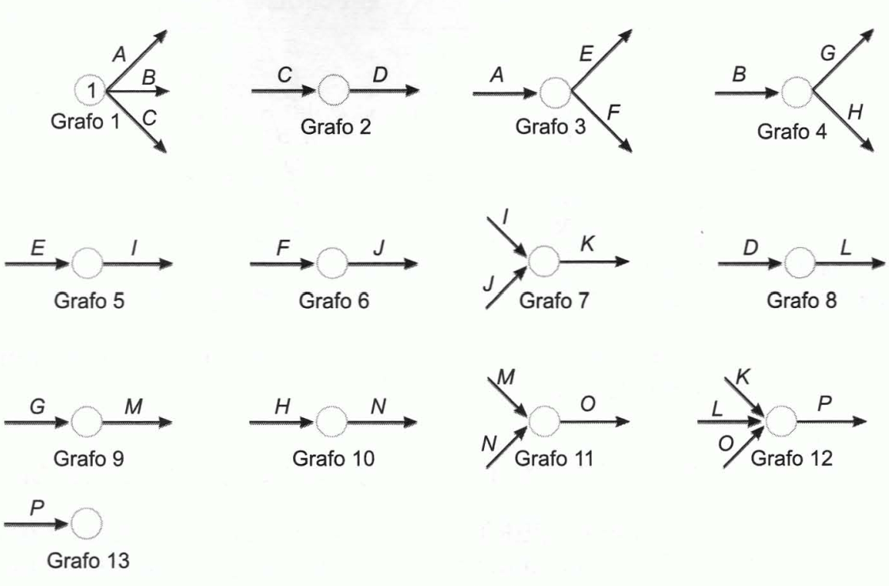

Tema 5: Técnicas instrumentales de planificación, programación y control
========================================================================

Los árboles de decisión
-----------------------

***Decisiones secuenciales:*** decisiones que se encuentran sometidas a
un proceso dinámico y adaptativo en un período de tiempo más o menos
amplio en el que las decisiones se concatenan, de modo que cada una
condiciona a las que le siguen y viene condicionada por las que le
anteceden y por los estados de la naturaleza que se hayan presentado.

***Árbol de decisión:*** sistema de representación del proceso
decisional en el que se reflejan las posibles alternativas por las que
se puede optar y los resultados que corresponden a cada alternativa
según cual sea el estado de la naturaleza que se presente. Está
constituido por nudos y ramas:

-   **Nudos o vértices:** representan situaciones en las cuales debe
    tomarse una u otra decisión (**nudos decisionales**), o el decisor
    se enfrenta a distintos estados de la naturaleza o suceso aleatorios
    (**nudos aleatorios**). Los nudos decisionales se representan con
    cuadrados y los aleatorios con círculos.

-   **Ramas o aristas:** las que parten de los nudos decisionales
    representan alternativas de decisión, mientras que las que parten de
    nudos aleatorios representan posibles estados de la naturaleza.

Cuando se conocen las probabilidades de los diversos estados, éstas se
representan sobre las ramas. Al final de cada camino se reseña el
resultado que correspondería a esa sucesión de decisiones y sucesos.

Cada nudo tiene un **valor asociado**:

-   Nudo aleatorio: esperanza matemática de los valores situados al
    final de las ramas que parten de él.

-   Nudo decisional: es el mejor de los valores en los que tienen
    destino las ramas que parten de él.

El valor esperado de la información perfecta
--------------------------------------------

***Información perfecta:*** aquella en la que la probabilidad de que sea
correcta es el cien por cien.

***Valor esperado de la información (VEI):*** es la esperanza matemática
del valor de la información.

***Valor esperado neto de la información (VENI):*** valor esperado de la
información menos su coste.

***Valor esperado de la información perfecta (VEIP):*** es el límite
máximo que podrá pagarse por la información perfecta y por cualquier
otra.

La programación lineal
----------------------

***Problema de programación lineal:*** consiste en una función objetivo
lineal, que se ha de maximizar o minimizar, y un conjunto de
restricciones de carácter lineal. Se trata de determinar los valores de
las variables que optimizan la función cumpliéndose las restricciones.

Maximizar (o minimizar):

$$Z = c_{1} \cdot X_{1} + c_{2} \cdot X_{2} + \ldots + c_{n} \cdot X_{n}$$

Sometida a las restricciones:

$$a_{11} \cdot X_{1} + a_{12} \cdot X_{2} + \ldots + a_{1n} \cdot X_{n} \leq b_{1}$$

$$a_{21} \cdot X_{1} + a_{22} \cdot X_{2} + \ldots + a_{2n} \cdot X_{n} \leq b_{2}$$

$$\ldots$$

$$a_{m1} \cdot X_{1} + a_{m2} \cdot X_{2} + \ldots + a_{\text{mn}} \cdot X_{n} \leq b_{m}$$

Y, siempre, la condición de no negatividad de las variables:

$$X_{1},X_{2},\ldots,X_{n} \geq 0$$

***Resolución gráfica de un problema de programación lineal:***

1.  Representar las ecuaciones que se obtienen al establecer las
    restricciones como si fueran igualdades y sólo en el primer
    cuadrante, pues las variables no pueden ser negativas.

2.  Representar la función objetivo tomando un valor arbitrario
    cualquiera para $Z$.

3.  Trazar paralelas a esta última recta tan alejadas como sea posible
    del origen de coordenadas, hasta determinar la más lejana que tenga
    algún punto perteneciente a la **región de las soluciones
    posibles**. Si el problema fuera de minimización, se irían trazando
    paralelas lo más próximas posible al origen de coordenadas.

4.  Determinar el punto de esa paralela que se encuentra en el área de
    soluciones posibles. Las coordenadas de ese punto son la solución
    óptima. Si hubiera varios puntos, el problema tendría varias
    soluciones: tantas como puntos.

Método PERT. Introducción
-------------------------

***Método PERT (Program Evaluation and Review Technique):*** es un
instrumento al servicio de la toma de decisiones que permite la
planificación, ejecución y control de proyectos que requieren la
coordinación de un gran número de actividades entre las que existen
relaciones de precedencia y que se han de realizar en un tiempo limitado
y con unos medios también limitados.

***Método CPM (Critical Path Method):*** es un método similar al PERT.
Posteriormente se introdujo la relación que existe entre el coste de
cada actividad y su duración (J.E.Kelley).

***Método Roy:*** método dual del PERT.

***Diferencias de notación entre el PERT y CPM:***

  PERT           CPM
  -------------- -------------------------------
  Suceso         Nudo
  Actividad      Trabajo
  Holguras       Flotante
  Tiempo early   Tiempo más bajo de iniciación
  Tiempo last    Tiempo más alto de iniciación

Tabla . Diferencias de notación entre el método PERT y el CPM

La **diferencia** **formal** entre ambos métodos radica en que el método
PERT se suele trabajar con tres estimaciones de tiempo, en tanto que en
el CPM se trabaja con una sola estimación.

La diferencia básica entre el Método Roy y las otras dos técnicas es que
en éstas las actividades se representan con flechas y los nudos señalan
la interrelación existente entre esas actividades, en tanto que en el
Método Roy las actividades se representan por nudos y son las flechas
las que indican el orden temporal de la realización de las actividades.
La representación del Método Roy tiene algunas ventajas pues resulta más
congruente con la Teoría de Grafos, que define el **grafo** como
conjunto de elementos ligados con relaciones orientadas (flechas), y su
comprensión es más intuitiva.

El PERT es un instrumento de **programación temporal** que requiere:

1.  Relacionar el conjunto de actividades que se ha de realizar.

2.  Estimar el tiempo que requiere cada una de ellas.

3.  Determinar el orden en el que han de realizarse las actividades, es
    decir, determinar las precedencias existentes entre ellas.

Este método obliga a identificar las actividades que integran el
proyecto, resaltando las dependencias y condicionamientos existentes
entre ellas, así como sus duraciones.

Las principales aportaciones del PERT, que lo han convertido en un
instrumento popular son:

1.  La producción de planes realistas, detallados y de fácil difusión,
    que incrementan las probabilidades de alcanzar los objetivos del
    proyecto.

2.  La predicción de las duraciones y de la certidumbre de las mismas.

3.  El centrar la atención en las partes del proyecto que son
    susceptibles de impedir o demorar su realización.

4.  Informar de la incompleta utilización de los recursos.

5.  La sencilla simulación de alternativas.

6.  La obtención de informes completos y frecuentes del estado del
    proyecto.

Uno de los **objetivos** del PERT es anticipar la duración mínima del
proyecto. Otro es determinar qué actividades son críticas, es decir,
cuáles han de ser objeto de un mayor control, por ser actividades que,
si se retrasan, provocan un retraso en la ejecución total del proyecto
sobre el mínimo preciso.

El método PERT en certeza
-------------------------

***Tabla de precedencias:*** es el paso previo en la aplicación del
método PERT. En ella se recogen las relaciones de precedencia existentes
entre las actividades.

***Grafo PERT:*** está formado por nudos y flechas. Los nudos
representan estados o situaciones. Las flechas representan las
actividades del proyecto. El primer nudo representa el estado de
comienzo del proyecto y el último la situación en la que se ha
finalizado el proyecto.

Cada flecha ha de tener un nudo de origen y otro de destino:

-   **Nudo de origen:** representa la situación en la cual se han
    finalizado las actividades precedentes y, por tanto, puede comenzar
    la actividad en cuestión.

-   **Nudo de destino:** representan la situación en la cual se ha
    finalizado la actividad en cuestión y, por tanto, pueden comenzar
    las que le siguen en el orden secuencial según la tabla de
    precedencias.

***Tipos elementales de prelaciones o precedencias:***

-   **Prelaciones lineales:** son las que se presentan cuando, para
    poder iniciar una determinada actividad, es necesario que haya
    finalizado previamente una única actividad.

-   **Prelaciones de convergencia:** para poder iniciar una cierta
    actividad es necesario que hayan finalizado previamente dos o más
    actividades.

-   **Prelaciones de divergencia:** para que puedan iniciarse dos o más
    actividades es necesario que se haya terminado anteriormente una
    única actividad.

-   **Relaciones que dan lugar a convergencia y divergencia:** son
    aquellas que se producen cuando, para que se puedan iniciar un
    conjunto de dos o más actividades, es preciso que se haya finalizado
    previamente más de una actividad.

{width="4.379146981627296in"
height="2.8882075678040247in"}

Figura . Ejemplo de grafos parciales

Las relaciones de precedencia permiten construir los grafos parciales
que, componiéndolos y numerando los nodos, se emplean para obtener el
grafo PERT. Deben respetarse los siguientes principios:

1.  **Principio de designación sucesiva**. Prohíbe numerar un nudo si se
    encuentra sin numerar alguno de los nudos de los que parten flechas
    que finalizan en él.

2.  **Principio de unicidad del estado inicial y del estado final.**
    Prohíbe la existencia de más de un nodo de comienzo ni más de un
    nodo final, pues solo puede existir una situación de inicio del
    proyecto y una situación de finalización del mismo.

3.  **Principio de designación unívoca.** Prohíbe la existencia de dos
    flechas que partan del mismo nudo y que tenga, también, el mismo
    nudo de destino.

{width="4.223455818022747in"
height="3.8625601487314087in"}

Figura . Ejemplo de PERT

***Actividad ficticia:*** enlace lógico que permite reflejar formalmente
las prelaciones existentes entre las diferentes actividades que forman
el proyecto. Se utilizan para resolver problemas en la representación,
por ejemplo:

-   Existen simultáneamente prelaciones lineales de convergencia o
    divergencia.

{width="1.9062642169728783in"
height="2.1666819772528436in"}
{width="2.742043963254593in"
height="2.132701224846894in"}

Figura . Representación incorrecta (izquierda) y correcta empleando
actividades ficticias (derecha). Se supone que las actividades A y B
preceden a la C y la actividad A precede a la D

-   Actividades paralelas.

{width="3.469194006999125in"
height="0.9954429133858268in"}
{width="2.8909962817147856in"
height="1.5414238845144357in"}

Figura . Representación incorrecta (izquierda) pues se violan los
principios de unicidad del estado final y de designación unívoca y
representación correcta mediante actividades ficticias (derecha)

-   Las actividades ficticias se utilizan siempre que exista más de una
    actividad que no preceda a ninguna otra. La flecha que va
    directamente de un nudo a otro, sin conectarse con una actividad
    ficticia a través de un nudo intermedio, ha de ser la que
    corresponda a la actividad con una duración más prolongada.

{width="3.544709098862642in"
height="2.3696675415573054in"}

Figura . Ejemplo del uso de actividades ficticias cuando más de una
actividad no precede a ninguna otra

***Camino:*** conjunto de actividades sucesivas.

***Tiempo early:*** número mínimo de unidades de tiempo necesarias para
alcanzar la situación representada por ese nudo. Es la duración del
camino más largo que conduce, desde el nudo inicial, a ese nudo. Se
calcula, en el grafo, procediendo desde el nudo inicial hacia el final.

***Tiempo last:*** momento más tardía en el que es admisible llegar a la
situación descrita por este nudo de modo que no se retrase la ejecución
del proyecto sobre el mínimo imprescindible. Se calculan, en el grafo,
procediendo desde el nudo final hacia el inicial. El tiempo *last* del
último nudo ha de ser igual a su tiempo *early* pues ese nudo significa
que se ha terminado el proyecto y no se admite que éste se finalice en
un tiempo inferior al mínimo imprescindible. El tiempo *last* de un nudo
es la diferencia entre el tiempo *last* del último nudo y la duración
del camino más largo que conduce, en sentido inverso, del último nudo al
nudo en cuestión.

***Oscilación de un nudo:*** diferencia entre su tiempo *last* y su
tiempo *early*.

***Camino crítico:*** está formado por las actividades en las que no
debe producirse ninguna demora si se desea que el trabajo se termine en
el mínimo tiempo posible. Es el camino que tiene mayor duración entre
los que unen el primer y el último nudo. Las oscilaciones de los nudos
que se encuentran en el camino crítico valen cero.

***Actividades críticas:*** actividades que forman parte del camino
crítico. Son las actividades cuyas ejecuciones habrán de ser objeto de
mayor grado de control para evitar que se retrasen.

***Holgura:*** margen de tiempo con el que cuentan las actividades que
no son críticas.

{width="4.696681977252843in"
height="1.38503280839895in"}

Figura . Representación de nodos y sus características: $\mathbf{i}$
nudo de origen, $\mathbf{j}$ nudo de destino, $\mathbf{E}$ tiempo
*early*, $\mathbf{L}$ tiempo *last* y $\mathbf{d}_{\mathbf{\text{ij}}}$
duración de la actividad

-   **Holgura total:** margen de tiempo sobrante suponiendo que a la
    situación representada por el nudo de origen se llega lo más pronto
    posible y que a la del destino se llega lo más tarde admisible.

$$H_{T} = L_{j} - E_{i} - d_{\text{ij}}$$

-   **Holgura libre:** margen de tiempo sobrante suponiendo que el nudo
    de origen se alcanza lo más pronto posible y que al de destino se
    llega también lo más pronto posible. También se puede calcular
    restando la oscilación del nudo de destino a la holgura total.

$$H_{L} = E_{j} - E_{i} - d_{\text{ij}} = H_{T} - O_{j}$$

-   **Holgura independiente:** es el margen que sobra suponiendo que al
    nudo de origen se llega lo más tarde que es admisible y que al de
    destino se llega lo más pronto posible. Otra forma de calcularla es
    restar la oscilación del nudo de origen a la holgura libre.

$$H_{I} = E_{j} - L_{i} - d_{\text{ij}} = H_{L} - O_{i}$$

Las oscilaciones de los nudos han de ser siempre cantidades no negativas
por lo que la holgura total ha de ser mayor o igual que la libre y ésta
mayor o igual que la independiente.

Los gráficos de Gantt
---------------------

***Gráficos de control:*** técnicas más elementales de programación
temporal de actividades.

***Gráfico de Gantt:*** instrumento de control consistente en
representar en el eje de abscisas el tiempo o las fechas de realización
del proyecto y en el de ordenadas las actividades que lo integran. Cada
barra tiene una longitud directamente proporcional a s curación y
comienza en el momento de la iniciación de la tarea que representa,
finalizando en el de su terminación. Permiten controlar visualmente la
ejecución de los trabajos.

{width="4.40842738407699in"
height="3.261770559930009in"}

Figura . Gráfico de Gantt

El método PERT en incertidumbre
-------------------------------

***Método PERT en incertidumbre o en riesgo:*** aplicación del método
PERT cuando no se puede prever las duraciones de las actividades pero se
suponen conocidas sus distribuciones de probabilidad.

La duración de cada actividad es una variable aleatoria que se ajusta a
cierta distribución de probabilidad (distribución beta), cuya esperanza
matemática es:

$$E\left( d \right) = \frac{t_{o} + 4t_{m} + t_{p}}{6}$$

Y cuya varianza vale:

$$\sigma^{2} = \frac{\left( t_{p} - t_{o} \right)^{2}}{36}$$

Donde:

-   $d$: duración de la actividad.

-   $t_{o}$: duración optimista.

-   $t_{m}$: duración normal o más probable.

-   $t_{p}$: duración pesimista.

Una vez estimadas las duraciones esperadas de las actividades, se sitúan
sobre las flechas correspondientes, y se procede de la misma forma que
en ambiente de certeza, pero, en este caso la duración del camino
crítico será la **duración esperada** del proyecto, es decir, la
esperanza matemática del tiempo de ejecución.

Si las duraciones de las actividades son independientes entre sí, la
varianza de la duración del proyecto será igual a la suma de las
varianzas de las duraciones de las tareas. Cuando es aplicable el
teorema central del límite, la duración del proyecto seguirá una
distribución normal.

El PERT-coste
-------------

***PERT-coste:*** extensión del PERT-tiempo en la que se consideran
explícitamente los costes.

***Costes directos:*** son aquellos que se pueden imputar claramente a
las actividades que los genera. Aumentan a medida que se reducen las
duraciones de las tareas.

***Costes indirectos:*** no están vinculados a la producción, sino al
tiempo, por lo que se imputan a la generalidad del proyecto y no a las
actividades en concreto. Aumentan cuanto mayor sea la duración del
proyecto.

***Coeficiente de costes:*** representa el importe en el que se modifica
el coste directo de una actividad al modificar su duración una unidad de
tiempo.

$$\frac{c_{e} - c_{n}}{t_{n} - t_{e}}$$

Donde:

-   $c_{n}$: coste directo correspondiente a la duración normal de la
    tarea.

-   $c_{e}$: coste directo correspondiente a la duración extrema de la
    tarea.

-   $t_{n}$: duración normal.

-   $t_{e}$: duración extrema.

Para reducir el tiempo de realización del proyecto sobre el inicialmente
previsto, de la forma más económica posible, se deberá acelerar primero
aquella actividad crítica que tenga un menor coeficiente de costes.
Posteriormente, se acelera la que tenga el siguiente coeficiente, y así
sucesivamente, hasta que todas las actividades críticas se encuentren en
su duración extrema.

La **duración óptima del proyecto** será aquella que tenga el mínimo
coste total, es decir, aquella para la que sea mínima la suma de los
costes directos e indirectos.

