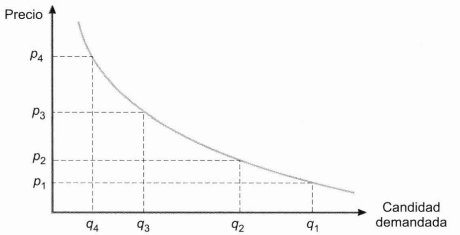

Tema 14: Las variables del marketing
====================================

El producto. Concepto, la diferenciación y el posicionamiento de marcas
-----------------------------------------------------------------------

***Producto.*** existen diferentes concepciones para este término:

- **Producto tangible.** Bien o servicio con cierta entidad física.

- **Producto ampliado.** Cuando alguien adquiere un producto también compra un conjunto de servicios que acompañan a tal ente físico.

- **Producto genérico.** El consumidor realmente compra la esperanza de obtener un beneficio; satisfacer una necesidad o un deseo. Esta concepción es la que debe imperar desde el punto de vista del marketing.

***Producto diferenciado.*** Aquel que se distingue del resto según la percepción del consumidor.

***Diferenciación de productos.*** Consiste en crear nuevos productos con los que, por ejemplo, acceder a nuevos segmentos del mercado, modificando los existentes de manera que cambie la percepción que el consumidor tiene de los mismos y las necesidades que éste puede considerar satisfechas.

***Posición de la marca.*** situación que ocupa en relación a las demás
marcas según los atributos que los consumidores perciben en ellas. Para
determinar la posición de cada marca se puede solicitar a los
consumidores que las clasifiquen según el grado en que consideren que
cada una de ellas posee los atributos de posicionamiento que previamente
se han definido como determinantes.

El estudio de las posiciones de las marcas puede ayudar a definir el
segmento del mercado al que dirigirse. Para ello, se determinan las
posiciones consideradas como ideales por los consumidores de cada
segmento y aquellas en las que sitúan a las diferentes marcas, sean de
la empresa o de la competencia. De este tipo de estudio puede inferirse
también la conveniencia de crear nuevos productos o modificar o
diferenciar los actuales.

Las principales dificultades para la introducción de un nuevo producto
en un mercado derivan de la diferenciación realizada de los productos ya
existentes, gracias a la cual, en muchos casos, los deseos de los
distintos segmentos se encuentran ya cubiertos.

El ciclo de vida del producto
-----------------------------

El **ciclo de vida** de un producto está formado por las siguientes
etapas.

1.  **Introducción o lanzamiento.** Cuando el producto es nuevo en el
    mercado tiene la ventaja de que existen pocos competidores, y el
    inconveniente de que la mayoría de los consumidores no han probado
    el producto y, en consecuencia, saben poco de él, por lo que el
    crecimiento de las ventas es lento.

Se requiere un esfuerzo importante de promoción, la distribución suele
ser reducida y los costes de producción elevados al no poderse
aprovechar las ventajas de la producción en gran escala.

2.  **Crecimiento.** A medida que el producto va siendo más conocido, si
    satisface al mercado, las ventas comienzan a crecer sustancialmente,
    lo que atrae a la competencia. La empresa comienza a diferencia el
    producto para introducirse en nuevos segmentos, lo que requerirá una
    diferenciación en las políticas de marketing-mix.

La distribución se amplía a nuevos canales y los gastos en promoción y
publicidad siguen siendo elevados, pero más reducidos que en la etapa
anterior.

Al aumentar la producción, los costes unitarios se reducen y es posible
reducir un poco los precios.

El crecimiento de los beneficios depende de la estrategia de la empresa:
puede elegir entre políticas que abarcan desde la fuerte promoción y el
bajo precio a la escasa promoción con precios más elevados.

La celeridad con que se producen estas dos primeras etapas depende, en
buena medida, de la rapidez de la aceptación del producto por los
consumidores. La distribución de las personas en categorías de
predisposición a la prueba es aproximadamente normal.

{width="4.861942257217848in"
height="2.3655074365704287in"}

Figura . Estrategias en la promoción

3.  **Madurez.** Llega en el momento en que se reduce el crecimiento de
    las ventas y éstas se estabilizan. También los costes y, como
    consecuencia, los beneficios tienden a estabilizarse. La demanda y
    los beneficios generados depende del crecimiento de la población y
    de la coyuntura económica más que de las acciones de la empresa.

Dado que el producto ya es conocido, la mayoría de los consumidores
tienden a un comportamiento repetitivo, y solo las empresas competidoras
más fuertes habrán conseguido mantenerse en el mercado.

Para prolongar esta fase, ha de procurarse el acceso a nuevos segmentos
del mercado, diferenciando el producto y buscándole nuevos usos,
aumentando, con ello, el número de consumidores.

Para hacer frente a la competencia en cada segmento, la empresa puede
desarrollar estrategias de marcas múltiples que compitan entre sí y con
las de las empresas competidoras.

4.  **Declive.** Las ventas comienzan a descender, con mayor o menor
    celeridad, debido a los cambiantes deseos de los consumidores, a la
    introducción de nuevos productos sustitutivos, o ambas razones.

Al reducirse la producción, el coste unitario se incrementa y el
beneficio por unidad vendida se reduce. A menos que los consumidores
restantes tengan una asidua lealtad que permita incrementar el precio,
las pérdidas obligarán a una retirada del producto o a una sustancial
modificación del mismo. Si esta es posible, no se debe esperar a ese
momento para realizarla, sino que se debe efectuar antes de que las
ventas comiencen a declinar.

Tampoco para la retirada del producto se debe esperar a incurrir en
pérdidas sino que debe realizarse en el momento en que se haya
desarrollado un nuevo producto más rentable en el que emplearlos.

{width="5.552123797025372in"
height="2.885437445319335in"}

Figura . Ciclo de vida de un producto

La creación de nuevos productos
-------------------------------

La creación de un nuevo producto supone la realización de una inversión
que puede ser analizada como tal. La rentabilidad esperada ha de ser
mayor que el coste de su financiación y, entre los nuevos productos
alternativos que cumplan tal condición, ha de darse preferencia, en
principio, a aquellos que tengan mayores rentabilidades internas o
valores actuales netos.

En ocasiones, sin embargo, pueden interesar productos cuya rentabilidad
no es muy alta pero que, al incorporarse a la cartera de productos,
reducen el nivel de riesgo soportado por la misma.

***Estrategia de desarrollo:*** el nuevo producto se dirige al mismo
mercado en el que viene actuando la empresa.

***Estrategia de diversificación de productos y mercados:*** el nuevo
producto se dirige a nuevos mercados. Diversificando entre productos que
reaccionan de forma distinta a las diversas circunstancias económicas es
posible reducir el riesgo de la actividad empresarial y procurar una
evolución estable.

***Línea:*** conjunto de productos agrupados por ciertas características
que pueden ser de tipo técnico o comercial. Su **profundidad** es el
número de productos o referencias que la integran.

***Grama de productos:*** está formada por el conjunto de líneas y su
**amplitud** es el número de líneas que la forman.

***Longitud:*** número total de productos o ítems de la empresa.

La **planificación y desarrollo del producto** consta de las siguientes
etapas:

1.  **Búsqueda de ideas.** Pueden provenir del interior de la empresa o
    del exterior. En ocasiones se crean grupos de creatividad para la
    generación de ideas. En el método del *brainstorming* un número de
    personas comprendido entre cinco y diez se reúnen para decir unas
    cuantas ideas les vengan a la mente, evitando la crítica a las
    restantes y tratando de asociar sus ideas y las de los demás para,
    posteriormente, realizar una evaluación de todas ellas.

2.  **Selección de ideas.** Hay ideas que pueden ser rechazadas por ser
    irrealizables o carentes de valor. Las restantes han de ser
    sometidas a un somero análisis para determinar si pueden ser
    realizadas con los medios de la empresa y para estudiar su
    viabilidad en el mercado. Este análisis general suele ser realizado
    por un grupo de representantes de las distintas funciones de la
    empresa. Las ideas que superan este análisis han de ser evaluadas
    para su posterior selección.

3.  **Análisis de viabilidad.** Las ideas han de pasar por un proceso de
    selección y evaluación económica, tanto más exacto a medida que se
    va afirmando el proyecto. Para obtener información sobre cómo
    percibirán los consumidores el producto se realiza el denominado
    **test de concepto**, que consiste en encuestar a varios grupos de
    personas a las que previamente se les informa sobre el producto
    todavía no desarrollado. De este modo se investigan las necesidades
    que el consumidor entiende que el producto satisface, la situación
    en que lo posiciona en relación a otros productos, el precio que
    pagaría por él, etc. Se puede llegar a estimar el porcentaje de
    personas que podrían aceptar el producto y, si tal porcentaje se
    estima suficiente, puede continuarse con el proyecto.

4.  **Desarrollo del producto.** Los conceptos que son aceptados por el
    consumidor y que, además, son susceptibles de elaboración con los
    medios de la empresa, y realizables con criterios
    económico-financieros, se materializan en prototipos que son
    sometidos a nuevos análisis técnicos, comerciales y financieros. Se
    especifican y seleccionan los métodos de producción, los costes de
    fabricación, el color del producto, etc.

5.  **Prueba del producto.** Los prototipos alternativos resultantes son
    sometidos al juicio de los consumidores, a algunos de los cuales se
    les realizan tests de percepción, de aceptación y de utilización.

Para analizar el comportamiento del consumidor en el acto de compra
real, se puede poner a la venta, con características diferenciadas en
diversos establecimientos semejantes, lo que puede ayudar a seleccionar
los atributos que el consumidor prefiere.

En ocasiones se ensayan prototipos y alternativas mercadotécnicas en
diversos mercados-prueba o mercados-testigo. El resultado de estas
pruebas puede conducir a una reformulación técnica y comercial del
producto y a nuevas pruebas.

6.  **Comercialización.** Si los resultados de las pruebas son
    favorables, el producto es comercializado y comienza la fase de
    introducción de su ciclo de vida.

Para la planificación y control del desarrollo del producto son útiles
las **técnicas PERT**. Para la selección de ideas y de decisiones
alternativas tienen utilidad los **árboles de decisión.** En la
evaluación del producto son útiles el **análisis del punto muerto**, el
**valor actual neto** y el **tipo de rendimiento interno**.

La identificación del producto. Marcas, envases y etiquetas
-----------------------------------------------------------

***Marca:*** identifica y permite el reconocimiento de un producto por
una palabra, un nombre, un símbolo, un diseño o una combinación de tales
signos.

***Nombre de marca:*** parte de la marca que puede pronunciarse.

***Distintivo de marca:*** parte de la marca que puede recordarse, pero
no pronunciarse (símbolo, diseño, color, etc.).

***Marca registrada:*** parte de la marca (nombre, símbolo, diseño,
etc.) legalmente protegida para poder ser usada con exclusividad.

Marcar los productos tiene ventajas para la empresa y para los
consumidores:

- A la empresa le permite identificar sus productos, protegerse contra
    las imitaciones, referir sus acciones mercadotécnicas a unos signos
    que el consumidor puede identificar, obtener **lealtad a la marca**
    de los consumidores satisfechos, diferenciar y modificar sus
    productos.

- El marcado de los productos simplifica las decisiones de compra de
    los consumidores. Si estos quedan satisfechos con una compra, pueden
    adoptar un comportamiento repetitivo.

***Marca familia:*** marca común a varios productos de la misma empresa.

***Marca individual:*** mara utilizada por un solo producto.

El marcar individualmente un producto nuevo permite desvincular la
reputación de otros productos a la aceptación de aquel.

Sin embargo, si se tiene gran confianza en el producto de reciente
creación y los anteriores cuentan con un gran prestigio, las ventajas de
ponerle la misma marca son evidentes. A esta estrategia se le denomina
**extensión de la marca** y con ella se trata de extender el prestigio
de los anteriores productos a los nuevos o modificados. Permite, además,
realizar promoción y publicidad comunes.

***Marcas nacionales o de fabricante:*** son puestas por la empresa
fabricante y generalmente su promoción se realiza a nivel nacional o
internacional.

***Marcas de distribuidor:*** marca impuesta por el distribuidor. En
ocasiones el fabricante ha de elaborar el producto ajustándose a los
requisitos impuestos por el distribuidor e identificarle con la marca de
este último.

Son cualidades deseables en una marca:

- Que sea fácil de recordar, identificar y pronunciar, por lo que
    generalmente es preferible que el nombre sea corto.

- Que sugiera algo sobre los atributos del producto y sobre los
    beneficios que el consumidor obtendrá de él.

Para seleccionar la marca se realizan pruebas de asociación, sobre la
imagen que sugiere cada una de las alternativas, de facilidad de
pronunciación, de memorización y de preferencia entre ellas.

***Envase:*** desde el punto de vista mercadotécnico es una parte del
producto. Tiene gran importancia pues la mayor parte de las decisiones
se toman en el lugar de adquisición y con los distintos productos
alternativos a la vista. El envase debe atraer la atención y, al igual
que la marca, ha de sugerir algo sobre los atributos del producto y
sobre los beneficios que el consumidor obtendrá de él. Debe inspirar
confianza y producir una impresión favorable, apoyando y confirmando el
prestigio que la empresa trata de asociar a la marca.

La **creación del envase**, pasa por una serie de fases semejantes a las
de la creación del producto mismo.

Si la empresa desea diferenciar sus productos puede diseñar **envases
distintos** para cada uno de ellos. En otras ocasiones pude interesar
que el consumidor asocie entre sí diversos productos de una línea, lo
que se facilita dotándoles de **envases idénticos o semejantes**.

Los **objetivos del envase** son contener, proteger, promocionar y
diferenciar el producto.

Etiqueta: elemento identificador del producto. Se diferencia entre:

- **Etiqueta de la marca:** puede ser un instrumento importante de
    promoción e identificación del producto, especialmente, cuando no se
    utiliza envase. En tal caso, la etiqueta cumple algunas de las
    funciones de éste y puede determinar preferencias muy acusadas entre
    los consumidores.

- **Etiqueta informativa:** proporciona datos sobre el fabricante o
    vendedor y las características y forma de uso o consumo del
    producto. En algunos productos su contenido se encuentra regulado.

La decisión de determinación de precios y sus limitaciones
----------------------------------------------------------

La decisión de fijación de los precios de los productos, parte de cierta
información que actúan como limitación de la decisión. Ésta está formada
por datos provenientes de la empresa y por otros referentes a su
entorno:

- **Datos internos:** costes empresariales, interrelaciones entre la
    política de precios y las restantes políticas de marketing-mix.

- **Datos externos:** limitaciones legales, comportamiento previsible
    de la demanda y de los consumidores ante las variaciones de los
    precios y la actuación de la competencia.

### Costes y precios

Para que la empresa obtenga beneficios y sobreviva a largo plazo, el
conjunto de sus productos ha de generar los ingresos suficientes para
cubrir sus costes. Ello implica que, por regla general:

- El precio de venta ha de ser superior al coste total unitario
    (**precio técnico**).

- El margen bruto unitario ha de ser positivo, es decir, el precio ha
    de ser superior al coste variable unitario (**precio mínimo**).

En ocasiones, la empresa tiene un exceso de capacidad y puede crear
nuevos productos sin incrementar por ello sus cargas de estructura. En
tal caso, podría ser suficiente que el precio unitario del nuevo
producto cubriera los costes variables unitario que le son imputables.

Muchas empresas fija sus precios aplicando cierto tanto de rentabilidad
sobre coste variable. Si dicho tanto o margen proporcional es del $s$
por uno, el precio de venta será:

$$p = c_{v} + c_{v} \cdot s = c_{v} \cdot (1 + s)$$

Para no incurrir en pérdidas, el valor de $s$ ha de ser tal que permita
recuperar los costes fijos, es decir:

$$\left( p - c_{v} \right) \cdot q \geq C_{F}$$

$$p - c_{v} = c_{v} \cdot s \rightarrow c_{v} \cdot s \cdot q \geq C_{F} \rightarrow s \geq \frac{C_{F}}{c_{v} \cdot q}$$

### Limitaciones legales y gubernamentales

Existen diversas normas de rango legal y administrativo, como las de
defensa de la competencia, las de intervención de precios o las de
imposición indirecta, que limitan o influyen en los precios finales de
venta al consumidor.

### La demanda y el comportamiento al consumidor ante las variaciones de precio

***Curva de demanda:*** curva que relaciona la cantidad demandada con el
precio del producto. Puede ser diferente para la clase de producto y
para cada marca.

{width="3.8190857392825897in"
height="1.9547156605424323in"}

Figura . Curva de demanda

***Bienes Giffen:*** el volumen de compras se reduce al disminuir el
precio. Suelen ser artículos que satisfacen necesidades primarias. Los
consumidores pueden no ser muy aficionados a ellos, pero, dado su nivel
de renta, se ven obligados a su consumo. Cuando su precio desciende, el
consumidor descubre que su renta real ha aumentado y los adquiere en
menor cuantía, comprando otros bienes con el remanente de su renta.

La estimación de la curva de demanda puede basarse en:

- La subjetividad del empresario.

- Datos históricos.

- Datos conseguidos mediante sondeos realizados a consumidores.

- Experimentación analizando la respuesta de los consumidores para
    diferentes niveles de precios en diversos establecimientos o
    mercados.

La curva de demanda de un mismo producto puede tener formas diferentes
en cada uno de los segmentos del mercado a que se dirige, en función de
las características de los consumidores que los integran, de lo que
puede derivarse la conveniencia de diferenciar tal producto en base a su
precio.

La elasticidad de la demanda respecto al precio responde a la siguiente
expresión:

$$e = - \frac{\frac{\mathrm{\Delta}q}{q}}{\frac{\mathrm{\Delta}p}{p}} = - \frac{\mathrm{\Delta}q}{\mathrm{\Delta}p} \cdot \frac{p}{q}$$

La elasticidad de la curva puede ser diferente en cada uno de sus puntos
y, por tanto, toda medida de elasticidad debe referirse a un punto en
concreto.

Las oscilaciones de precios y cantidades abarcan tramos por lo que para
calcularla se suele tomar como precios y cantidades de partida las
medias aritméticas de los extremos:

$$\mathrm{\Delta}p = p_{2} - p_{1}$$

$$\mathrm{\Delta}q = q_{2} - q_{1}$$

$$p = \frac{p_{2} + p_{1}}{2}$$

$$q = \frac{q_{2} + q_{1}}{2}$$

$$e = \frac{p_{2} + p_{1}}{q_{2} + q_{1}} \cdot \frac{q_{2} - q_{1}}{p_{2} - p_{1}}$$

Cuando se conoce la ecuación de la curva de demanda es posible
determinar su elasticidad en un punto de la misma:

$$e = - \frac{\text{dq}}{\text{dp}} \cdot \frac{p}{q}$$

En las zonas de la curva en las que la elasticidad es superior a la
unidad, se dice que la demanda es **elástica**. Reduciendo el precio se
produciría un incremento en la cantidad demandada en proporción superior
al descenso del precio, por lo que los ingresos se incrementarían.

Si la elasticidad es inferior a uno, la demanda es **inelástica**, una
reducción del precio originaría un aumento de la demanda de menor
proporción, con lo que los ingresos se reducirían. Convendría aumentar
el precio.

Se dice que la **elasticidad es normal** cuando es igual a uno, en cuyo
caso las modificaciones de precios producen variaciones
proporcionalmente iguales en la demanda. Es la elasticidad para la cual
el ingreso es máximo.

El precio es una variable que el consumidor tiene en cuenta en las
decisiones de compra de bienes de adquisición frecuente y en los que,
siendo de adquisición esporádica, tienen un alto coste en relación a la
renta personal, concediéndole menos importancia en la compra de bienes
de adquisición distanciada en el tiempo y cuyo importe no es elevado.

Ciertos productos se encuentran sometidos a la percepción que tiene el
consumidor de la **relación calidad-precio**:

- **Precios mínimos:** los consumidores los asocian a una baja calidad
    y no los adquieren.

- **Precios máximos:** por encima de los cuales no se compran por ser
    considerados excesivamente caros.

- **Precio óptimo:** el producto es aceptado por el mayor número de
    consumidores.

### Competencia y precios

La previsible reacción de las otras empresas que concurren en el mercado
es un factor de gran importancia en la decisión de fijación de precios.
Las empresas tratan de evitar una **guerra de precios** que afecte a los
resultados económicos de todas ellas. Para competir suelen centrarse en
otras variables como la promoción.

En un mercado en el que compiten muchas marcas, aquella cuyo precio se
eleve perderá muchas ventas.

En una situación de competencia perfecta, la demanda de cada marca sería
infinitamente elástica.

Objetivos en la política de precios
-----------------------------------

Los objetivos perseguidos en la fijación de precios hacen referencia a:

- El beneficio o la rentabilidad. La rentabilidad es un objetivo
    preferible al beneficio.

- Las ventas o la cuota de mercado.

    - Para maximizar las ventas se fija un mínimo aceptable de
        beneficio y se trata de maximizar el volumen de ventas.

    - Con el aumento de la cuota de mercado se trata de desplazar a la
        competencia, incrementando la participación de la empresa en el
        mercado.

- El mantenimiento de cierta situación en relación a la competencia.

- Consideraciones éticas y sociales.

- Cuestiones vinculadas a la imagen de la empresa y de sus productos.

***Seguimiento al líder:*** se produce cuando, para evitar la guerra de
precios, diversas empresas seguidoras adoptan como indicador el precio
fijado por la empresa líder, modificando sus precios en el momento en el
que ésta lo hace y en la misma proporción. La competencia se centra en
cuestiones al margen de la política de precios.

En algunos casos, como los precios de muchos servicios públicos,
predominan consideraciones de índole ética y social y los precios se
fijan con relación a las posibilidades de pago de los consumidores.

La estrategia de precios de la empresa puede ser una parte integrante de
la **estrategia de imagen**.

Algunas estrategias de precios
------------------------------

Entre las estrategias de precios que pueden seguirse, se utilizan con
frecuencia:

- **Precios promocionales:** pueden utilizarse para introducir un
    producto nuevo al mercado, revitalizar un producto antiguo o
    introducirlo en un nuevo segmento.

- **Líneas de precios:** se fija un cierto número limitado de precios
    con objeto de simplificar la decisión del consumidor y crear una
    imagen concreta fácilmente perceptible.

- **Precios psicológicos:** los precios se fijan atendiendo a la
    reacción psicológica del consumidor.

- **Precios flexibles:** varían de mercado a mercado e incluso de
    consumidor a consumidor. Es una estrategia frecuente en mercados
    industriales grandes, en los que los clientes que cuentan con cierta
    antigüedad, o cuyos volúmenes de compras son elevados, reciben de
    los fabricantes e intermediarios mejores precios que los demás.

- **Descuentos:** se aplican sobre los precios reseñados en catálogos
    (**precios de lista**). Pueden ser por pronto pago, por volumen de
    compras, de temporada o funcionales. Estos últimos son los que se
    aplica a intermediarios que realizan algunas funciones como la
    clasificación de los productos, su envasado, etc.

- **Referencia geográfica de precios:** el precio final percibido por
    el proveedor y el abonado por el cliente resultan afectados por las
    cláusulas de referencia geográfica de los precios. En la cláusula
    FOB (*Free On Board*) el vendedor dejará la mercancía a bordo del
    medio de transporte, siendo de cuenta del comprador el gasto de
    transporte desde ese momento, así como el riesgo de que la mercancía
    resulte dañada con posterioridad.

Diferenciación y discriminación de precios
------------------------------------------

***Diferenciación y discriminación de precios:*** prácticas consistentes
en aplicar diferentes precios a distintos clientes o marcas, o en
diversos lugares o momentos del tiempo.

El beneficio de una empresa que vende su producto en $N$ mercados con
precios diferenciados será:

$$B = \left( p_{1} \cdot q_{1} + p_{2} \cdot q_{2} + \ldots + p_{N} \cdot q_{N} \right) - C_{T}$$

Derivando el beneficio respecto a cada uno de los $q_{i}$, e igualando a
cero el resultado, se obtienen las condiciones de máximo beneficio:

$$\frac{\partial B}{\partial q_{i}} = p_{i} + q_{i} \cdot \frac{\partial p_{i}}{\partial q_{i}} - c^{'} = 0$$

Donde $c'$ es el denominado coste marginal, o modificación que
experimenta el coste al modificarse en una unidad física la cantidad de
producto producida y vendida:

$$c^{'} = \frac{\partial C_{T}}{\partial Q} = \frac{\partial C_{T}}{\partial q_{i}} \cdot \frac{\partial q_{i}}{\partial Q} = \frac{\partial C_{T}}{\partial q_{i}}$$

$$Q = q_{1} + q_{2} + \ldots + q_{N}$$

De la expresión del ingreso total del mercado $i$

$$I_{i} = p_{i} \cdot q_{i}$$

Se deduce la del ingreso marginal de ese mercado:

$$I_{i}^{'} = \frac{dI_{i}}{dq_{i}} = p_{i} + q_{i} \cdot \frac{dp_{i}}{dq_{i}}$$

Para que el beneficio sea máximo, los ingresos marginales de los
diferentes mercados han de ser iguales entre sí e iguales, además, el
coste marginal:

$$I_{1}^{'} = I_{2}^{'} = \ldots = I_{N}^{'} = c'$$

Recordando la ecuación de la elasticidad-precio de la demanda:

$$I_{i}^{'} = p_{i} \cdot \left( 1 - \frac{1}{e_{i}} \right)$$

Por consiguiente, para obtener el máximo beneficio ha de cumplirse:

$$p_{1} \cdot \left( 1 - \frac{1}{e_{1}} \right) = p_{2} \cdot \left( 1 - \frac{1}{e_{2}} \right) = \ldots = p_{N} \cdot \left( 1 - \frac{1}{e_{N}} \right) = c^{'}$$

Para que el importe $I_{i}'$ sea idéntico en todos los mercados, se
habrá de fijar un precio más elevado en aquellos cuya elasticidad sea
más pequeña.

La publicidad
-------------

***Publicidad:*** forma de comunicación en masa que tiene como objetivo
transmitir información, crear una actitud o inducir a una acción
beneficiosa para quien la realiza. Se distingue:

- **Publicidad difusa:** pretende solamente dar a conocer algo.

- **Publicidad persuasiva o combativa:** trata de incidir en el
    reparto del mercado entre distintos productos.

- **Publicidad mixta:** combina objetivos de difusión y de persuasión.
    Es lo habitual.

Las principales cuestiones que se plantean en materia de publicidad son:

1.  Presupuesto publicitario.

2.  Determinación del mensaje publicitario.

3.  Selección de medios y soportes publicitarios.

4.  Medición y control de los efectos de la publicidad.

### El presupuesto publicitario

La mayoría de las empresas determinan sus presupuestos publicitarios
atendiendo a alguna de las siguientes **reglas generales:**

- Gastar el montante que resta del beneficio una vez atendida la
    rentabilidad normal del capital.

- Gastar un porcentaje fijo de las ventas en unidades monetarias.

- Asignar un presupuesto variable en función de los gastos que realice
    la competencia, no gastando menos que la media, ni mucho más, lo que
    podría dar lugar a una guerra publicitaria.

- Presupuestar tras analizar los objetivos y los costes para
    alcanzarlos.

Los dos primeros procedimientos conducen a la realización de mayores
esfuerzos publicitarios cuando menos necesarios son (ventas y beneficios
elevados). En lugar de amortiguar las oscilaciones económicas
coyunturales, las acentúan.

El tercer procedimiento no siempre se justifica pues, en ciertos
momentos, pueden requerirse esfuerzos publicitarios muy superiores a la
media del sector.

El mejor procedimiento es el último. Se trata de determinar el volumen
de gastos que optimiza el objetivo. El problema es que generalmente no
se conoce la relación funcional existente entre las ventas y el esfuerzo
publicitario y sin cierto grado de conocimiento de la relación no es
posible llegar a una optimización de la decisión ni de forma aproximada.

En la determinación de la función que relaciona ventas y gastos
publicitarios, la principal dificultad se encuentra en aislar el efecto
de éstos sobre aquéllas, pues el volumen de ventas depende también de
otras variables de control de la empresa y de circunstancias que la
empresa no puede controlar. Otra dificultad es que suele existir cierto
retraso en el efecto de la publicidad sobre las ventas.

Generalmente se considera que la curva correspondiente a la función
adopta una forma semejante a la siguiente figura, es decir, inicialmente
las ventas se incrementan más que proporcionalmente con los aumentos de
los presupuestos de publicidad, hasta cierto nivel a partir del cual lo
hacen menos que proporcionalmente. Existe un nivel de ventas mínimo que
no requiere publicidad y otro máximo que se alcanza a medida que el
mercado se va saturando.

{width="3.5916437007874014in"
height="1.7647255030621172in"}

Figura . Relación entre las ventas y el presupuesto publicitario

### El mensaje publicitario. El anuncio

Son requisitos del **texto publicitario**:

- Que señale algún atributo del producto que sea deseable.

- Que lo señale con carácter exclusivo.

- Que resulte creíble.

Además, debe evitarse la evocación de los aspectos no deseables en el
producto.

El anuncio será diferente si se requiere una acción directa de fuerte
impacto o una acción diluida a largo plazo, pero siempre debe:

- Atraer la atención y mantener el interés durante el tiempo
    suficiente para estimular la atracción por el producto.

- Poner de manifiesto la acción que ha de emprender el consumidor, ya
    sea un cambio inmediato o lento, o un mantenimiento de su
    comportamiento.

El anuncio está formado por un texto y una ilustración dispuesta
físicamente según cierta composición.

Generalmente, antes del lanzamiento del mensaje se requieren:

- Estudios de opiniones de individuos o grupos de consumidores.

- Pruebas de memorización.

- Análisis de efectividad.

### Selección de medios y soportes publicitarios

***Soporte:*** todo elemento que puede ser utilizado para transmitir el
mensaje publicitario al consumidor.

***Medio:*** todos los soportes afines o de la misma categoría.

***Audiencia de un soporte:*** es el número de personas de la
población-objetivo a las que les llega el mensaje. Es una de las
magnitudes de mayor importancia en la selección de medios y soportes.

El proceso de selección comienza con la enumeración de los medios y
soportes disponibles. La elección entre ellos depende de los siguientes
factores:

1.  Objetivos del mensaje.

2.  Difusión del medio y el soporte entre el segmento de población al
    que se desea dirigir la comunicación.

3.  Características del producto.

4.  Características de la población-objetivo.

5.  Posibilidades de anunciar el producto en momentos concretos del
    tiempo, como los cercanos a la decisión de compra.

6.  Precio de los medios y soportes.

7.  Servicios complementarios que ofrecen.

***Audiencia neta:*** número de personas de la población objetivo
expuestas al menos a uno de los soportes.

Suponiendo que una empresa inserta un anuncio en los soportes
$S_{1},\ S_{2}$ y $S_{3}$, para dirigirse a una población de $N$
personas. Denominando:

- $n_{i}$ a la audiencia del soporte $i$.

- $n_{\text{ij}}$ al número de personas expuestas a los soportes $i$ y
    $j$ simultáneamente.

- $n_{123}$ al número de personas expuestas a los tres soportes de
    manera simultánea.

La audiencia neta será:

$$n = n_{1} + n_{2} + n_{3} - n_{12} - n_{13} - n_{23} + n_{123}$$

***Penetración de un soporte:*** tanto por uno que, del número de
personas a las que se dirige el mensaje, representa el número de las que
resultan expuestas al mismo.

La penetración del soporte $i$ es el cociente:

$$P_{i} = \frac{n_{i}}{N}$$

Las penetraciones conjuntas de los soportes son:

$$P_{12} = \frac{n_{12}}{N}$$

$$P_{13} = \frac{n_{13}}{N}$$

$$P_{23} = \frac{n_{23}}{N}$$

$$P_{123} = \frac{n_{123}}{N}$$

La penetración neta será:

$$P = \frac{n}{N} = \frac{n_{1} + n_{2} + n_{3} - n_{12} - n_{13} - n_{23} + n_{123}}{N} = P_{1} + P_{2} + P_{3} - P_{12} - P_{13} - P_{23} + P_{123}$$

Entre las distintas alternativas existentes de combinación de soportes
conviene elegir aquella para la que la audiencia neta y la penetración
neta sean más elevadas.

### La medida y el control de la eficacia de la publicidad

El control de la publicidad requiere una medida de los resultados de
cada campaña.

En los controles a corto plazo suele ser frecuente medir el grado de
cumplimiento de los objetivos específicos de la comunicación, es decir,
de su incidencia en los consumidores. Para ello, se realizan tests sobre
muestras de personas que han estado expuestas al soporte del mensaje:

- **Test de recuerdo o memorización:** se pide a los consumidores una
    descripción del anuncio.

- **Test de reconocimiento:** se les preguntan si han visto el anuncio
    en un determinado medio, o con qué marca asocian un producto, etc.

Otros tests tratan de determinar la modificación de las actitudes de los
consumidores analizando sus preferencias antes y después de recibir el
mensaje publicitario.

En los controles a largo plazo se utilizan:

- **Modelos econométricos:** se separan los efectos de la publicidad
    de los demás factores y se incorporan los efectos temporales.

- **Experimentación:** por ejemplo, la de la **ciudad testigo**,
    consistente en elegir dos ciudades tan semejantes entre sí como sea
    posible en cuanto a los factores que pueden incidir en la evolución
    de sus ventas, y lanzar una campaña publicitaria en solo una de
    ellas (**ciudad experimento**), comparándose luego las ventas de
    esta con las de la ciudad en la que no se realiza ninguna publicidad
    (**ciudad testigo**).

La promoción de ventas y las relaciones públicas
------------------------------------------------

***Promoción de ventas:*** está formada por todas aquellas actividades
mercadotécnicas distintas de la venta personal y de la publicidad, que
estimulan las compras de los clientes y la eficacia de los vendedores,
tales como exposiciones, ferias, demostraciones, material para tiendas y
otros esfuerzos de ventas no repetitivos que se encuentran fuera de la
rutina habitual.

Las principales diferencias entre la promoción de ventas y la publicidad
son:

- La publicidad se realiza por medios controlados por terceros, en
    tanto que los instrumentos utilizados en la promoción de ventas son
    controlados por la propia empresa.

- Las decisiones de promoción de ventas son esporádicas y menos
    rutinarias que las de publicidad.

- La importancia de la promoción de ventas suele ser mayor en las
    empresas pequeñas que en las grandes.

En muchos casos, la promoción de ventas actúa como puente entre la
publicidad y la venta personal completando y coordinando los esfuerzos
realizados en estos dos campos.

La promoción puede tener como objetivo al que dirigirse:

- Consumidor final.

- Distribuidores.

- Prescriptores, son personas cuya opinión e influencia determina o
    condiciona en buena parte la selección del consumidor.

***Promoción dirigida al consumidor final:*** puede tratar de informarle
o de estimularle:

- Instrumentos de información: entrega de manuales y folletos
    administrativos, realización de demostraciones y disposición de
    servicios de resolución gratuita de consultas sin compromiso.

- Instrumentos de estímulo al consumidor: distribución de muestras
    gratuitas y la realización de concursos y ofertas de premios.

***Promoción en el lugar de compra:*** tiene especial importancia en los
productos cuya adquisición se hace por impulso.

***Promoción dirigida a los distribuidores:*** puede ser, también, de
información y prestación de servicios, o de estímulo e incentivación
inmediata:

- Instrumentos de información: asistencia en la formación de sus
    vendedores, asesoría contable y en la organización y control de sus
    almacenes, en la disposición de sus expositores, etc.

- Instrumentos de estímulo: descuentos por volumen de compras,
    concursos de ventas entre distribuidores, ofertas especiales, etc.

Los vendedores, agentes y representantes de la empresa tienen un papel
importante en la promoción ayudando a los consumidores y distribuidores
con su asesoramiento y actuando como agentes de comunicación de la
empresa. También pueden ser objeto de instrumentos de promoción con los
que se trata de informarles, estimularles y aumentar su eficacia
mediante competiciones de ventas, primas por volumen de ventas,
distinciones honoríficas, etc.

La actividad de los agentes y representantes de la empresa con los
prescriptores es una de las labores promocionales más importantes
realizadas con este colectivo.

***Merchandising:*** comprende el conjunto de decisiones y actividades
relativas a la exposición de los productos en el lugar de venta, el
espacio dedicado a cada uno de ellos, su presentación y, en general, la
disposición de los artículos en la tienda o almacén de venta. Los
principales servicios en los que se basa son:

- Aquello que se ve se vende; lo que se coge se compra. Los mejores
    lugares son los de paso obligado y los de paso repetido. Las mejores
    zonas de los estantes son las que se encuentran a la altura de los
    ojos y al alcance de las manos.

- El volumen de ventas es tanto mayor cuanto más elevado sea el
    volumen expuesto, pues estimula la compra en mayores cantidades.

- La imagen de un producto depende de la de los que le rodean.

- Para facilitar la decisión de compra, los productos han de situarse
    en grupos de categorías homogéneas. Los artículos que son
    complementarios entre sí deben colocarse juntos.

- La situación de los artículos junto a otros de compra repetida o que
    son objeto de fuerte promoción incentiva su compra, pues el lugar en
    que se sitúan estos últimos se transforma en zona de paso casi
    obligado.

En el *merchandising*, la disposición de los productos en la tienda se
completa con la señalización exterior, los rótulos de la fachada y los
escaparates. En el interior, el ambiente creado con la iluminación, el
mobiliario, los colores y la música influyen en la actitud del
consumidor y en su comportamiento de compra.

***Relaciones públicas:*** comprenden todas las actividades y decisiones
destinadas a mejorar y mantener las relaciones de la organización
empresarial con conjuntos de personas tales como sus empleados, los
consumidores, los accionistas, los medios de comunicación, las
autoridades locales o los sindicatos.

Las principales diferencias entre la publicidad y las relaciones
públicas son:

- Las comunicaciones de las relaciones públicas se dirigen a mayor
    variedad de receptores.

- Las actividades de relaciones públicas se basan en un esfuerzo
    continuado de mantenimiento de una política estable, a largo plazo,
    par la consolidación de una opinión pública favorable y para la
    obtención de la confianza de los grupos a los que se dirige.

- Aunque las actividades de las relaciones públicas tienen un coste,
    no se suele pagar por los mensajes que genera. Se trata más bien de
    crear noticias favorables a la empresa que los medios de difusión
    recogen como tales acontecimientos y no como anuncios pagados.

- El mensaje es más sutil y no tan evidente o directo como el de la
    publicidad.

- La comunicación de las noticias no es tan repetitiva como suele
    serlo en la publicidad.

- El mensaje es más creíble en las relaciones públicas que en la
    publicidad.

El conjunto de medios existentes para mantener unas buenas relaciones
públicas es inagotable. Se trata de un obrar bien y hacerlo saber que
requiere:

- Determinar lo que los grupos sociales desean y los intereses puestos
    en juego.

- Orientar las decisiones y la acción a la satisfacción de tales
    deseos e intereses.

- Exponer y demostrar lo que se ha realizado en tal sentido.

***Pseudoacontecimiento:*** hecho elaborado dispuesto para su difusión
por los medios de comunicación.

Los pseudoacontecimientos tiene, sobre los hechos no elaborados, las
siguientes ventajas:

- Pueden ser planificados y preparados minuciosamente.

- Son más independientes del momento y del lugar en que se producen.

- Pueden ser ampliados antes, por la previsión de su futuro
    acaecimiento, y después, por los comentario sobre lo ocurrido.

- Se pueden disponer los instrumentos y autores más adecuados al
    efecto deseado.

No se debe confundir un pseudoacontecimiento con una falsificación.

La apreciación de su efectividad se suele realizar de forma intuitiva,
si bien en algunas ocasiones se pueden obtener indicios de su valor,
como en la realización de sondeos de opinión o en la respuesta obtenida
al solicitar mayor capital a los accionistas, un esfuerzo temporal a los
empleados o una información a los poderes públicos.

La venta personal
-----------------

***Venta personal:*** venta realizada mediante contacto personal entre
el vendedor, agente o representante de la empresa y el comprador. Es,
por consiguiente, una forma de distribución, pero también un instrumento
de promoción de gran importancia.

El vendedor debe conocer bien el producto para informar a los posibles
compradores. Además, puede comunicar en sentido inverso, informando a la
empresa sobre la evolución del mercado, las necesidades, gustos y deseos
de los clientes, las acciones de la competencia y de los intermediarios,
etc.

### Publicidad y venta personal

Los principales efectos de la publicidad en relación a las tarea de la
fuerza de ventas son las siguientes:

- Refuerza los argumentos del vendedor.

- Realiza la tarea previa de venta, pues el cliente que ha recibido
    mensajes publicitarios necesita menos información que el que no
    tiene noticia previa alguna.

- Permite el acceso a grupos de convivencia y referencia y
    prescriptores que pueden condicionar la decisión del cliente
    potencial y a los que el vendedor no tiene acceso para comunicarse.

- Permite que el proceso de comunicación continúe entre visita y
    visita del vendedor, facilitando la venta.

- Proporciona argumentos y estimula a los vendedores.

### Retribución de la fuerza de ventas

El esfuerzo comercial realizado en esta variable se mide por el
presupuesto asignado a la misma y este depende de la retribución de los
vendedores, de sus gastos de dietas y del número de vendedores o tamaño
de la fuerza de ventas.

***Sistema de sueldo fijo:*** cada vendedor percibe una remuneración que
es independiente del número de unidades vendidas y que suele depender de
su antigüedad y experiencia.

- Al no ser estimulante, precisa un control riguroso de la fuerza de
    ventas.

- Puede ser adecuado cuando es difícil precisar si realmente las
    diferencias en las ventas de los diversos vendedores se deben a su
    esfuerzo y capacidad o a otras circunstancias.

***Sistema de comisiones:*** cada vendedor percibe periódicamente un
montante igual a cierta proporción de una cantidad que puede ser su
volumen de ventas en el periodo, o el importe en el que estas excedan
cierta cuantía, o el margen bruto correspondiente a aquél o a éste.

- La proporción del sistema de comisiones puede ser idéntica para
    todos los productos o diferente.

- Es un sistema que estimula las ventas a coto plazo, aunque a largo
    plazo puede tener efectos negativos pues el personal de venta puede
    descuidar otras funciones que le son propias.

- Tiene la ventaja de la sencillez tanto en el cálculo de la
    retribución de los vendedores como en la determinación del
    presupuesto.

- La irregularidad de los salarios de los vendedores en cada periodo y
    la falta de atención a otros aspectos pueden provocar conflictos y
    redundar en una falta de identificación del vendedor con la firma.

***Sistemas mixtos:*** la remuneración comprende un sueldo fijo
suficiente para que los vendedores tengan cierta estabilidad en sus
rentas, y un incentivo que puede ser una comisión establecida sobre
ciertas magnitudes o una prima determinada subjetivamente o como
proporción sobre otras magnitudes como el número de clientes obtenidos o
el número de personas visitadas en el periodo.

La principal desventaja de un sistema mixto es la dificultad de calcular
las remuneraciones y elaborar los presupuestos.

La decisión más relevante es establecer la relación media entre el
sueldo fijo y el incentivo, pues de ello depende la proximidad a las
ventajas e inconvenientes de los otros dos sistemas. Se estima que el
sueldo fijo representa el $75\%$ de la remuneración total y el $25\%$ al
incentivo.

***Sistema OPR:*** procedimiento de fijación de primas efectivas que
permite retribuir el esfuerzo realizado por cada vendedor, teniendo en
cuenta que el potencial de ventas no es el mismo en todos los
territorios, y que, además, proporciona información a la empresa sobre
su mercado potencial. Los datos primarios de este sistema son:

- Objetivo de volumen de ventas que tiene el vendedor, $O$.

- Previsión de ventas que éste realiza, $P$.

- Resultado alcanzado por el mismo, $R$.

Una vez determinado el importe sobre el que se calcula la prima, el
porcentaje efectivo que se le abone depende de la relación entre la
previsión y la realización del vendedor del siguiente modo:

$$OPR = 120 \cdot \frac{P}{O}\ \ si\ P = R$$

$$OPR = 60 \cdot \frac{P + R}{O}\ si\ P < R$$

$$OPR = 60 \cdot \frac{3R - P}{O}\ si\ P > R$$

Este sistema incentiva tanto las ventas como la certeza en las
previsiones, estimulando así al vendedor para obtener la información
precisa para la previsión empresarial de las ventas y, por tanto, para
la mejora de la planificación.

### Asignación de la fuerza de ventas

***Asignación por productos:*** conviene utilizarla cuando la empresa
opera con líneas muy diferenciadas o cuando los productos tienen cierta
complejidad técnica y requiere una elevada preparación por parte de los
vendedores.

Ventajas:

- Permite especializar técnicamente a los vendedores.

- El buen conocimiento del producto mejora la imagen de la empresa.

- El cliente recibe mejor información sobre el producto.

Inconvenientes:

- Elevados gastos de desplazamiento.

- Posible competencia entre vendedores de la propia empresa para
    vender a clientes cuyas necesidades pueden ser satisfechas con
    distintos productos de la misma.

- Puede llegarse a que los vendedores hallan recorrido las mismas
    rutas para visitar a los mismo clientes ofreciéndoles distintos
    productos de la misma empresa.

***Asignación territorial:*** es conveniente cuando la empresa opera en
un territorio muy amplio. Los territorios se establecen con arreglo a
tres criterios:

- Que los vendedores de cada territorio tengan semejante carga de
    trabajo y potencial de ventas.

- Que las zonas que forman cada uno de los territorios sean contiguas
    entre sí.

- Que los clientes se encuentren distribuidos regularmente en el
    territorio, minimizándose los tiempos y costes de viaje.

Con este último criterio se preferirían distribuciones circulares antes
que rectangulares, siendo frecuentes las realizadas en forma de cuña.

El grado de compactibilidad se puede medir con el denominado **momento
de inercia**:

$$I_{j} = \sum_{i = 1}^{N_{j}}{V_{i} \cdot D_{\text{ih}}^{2}}$$

Donde:

- $I_{j}$ es el momento de inercia del territorio $j$.

- $V_{i}$ es el montante de ventas al cliente $i$.

- $N_{j}$ es el número de clientes del territorio $j$.

- $D_{\text{ih}}$ es la distancia del cliente $i$ al origen o base de
    venta $h$.

La compactibilidad de un territorio es tanto mayor cuanto menor sea su
momento de inercia.

Ventajas:

- Clara determinación de las responsabilidades de cada vendedor.

- Sencillo control de las actividades y resultados de cada vendedor.

- Bajos gastos de desplazamiento.

- Favorece el establecimiento de relaciones personales de la
    localidad.

Inconvenientes:

- Cuando los productos y/o clientes se encuentra muy diferenciados,
    puede requerirse reasignar, dentro de cada territorio, con otros
    criterios.

- Las diferencias de densidad demográfica entre los territorios pueden
    obligar a viajar más a los vendedores de las zonas menos pobladas.

***Asignación por clientes:*** es conveniente cuando la empresa vende a
clientes de características muy diferenciadas y que requieren un trato
muy distinto.

Ventajas:

- Facilita la comunicación empresa-cliente al establecerse relaciones
    personales.

- Permite un mejor conocimiento de las necesidades, gustos y deseos de
    los diversos tipos de clientes.

Inconvenientes:

- La pérdida de un vendedor puede suponer pérdida de clientes.

- Elevados gastos de desplazamiento.

- Posibles conflictos entre los vendedores, especialmente cuando
    existen clientes difícilmente clasificables.

 La distribución
---------------

***Distribución:*** incluye todas aquellas decisiones y actividades que
se orientan al proceso por el que se dirige el producto hasta el
consumidor final. La selección adecuada del canal de distribución es
importante por:

- La venta no se encuentra realmente completa hasta que el producto es
    adquirido por el consumidor final, al que hay que hacérselo llegar.

- Los distribuidores continúan las actividades de marketing de la
    empresa, siendo responsables, en muchas ocasiones, del servicio al
    cliente y de actividades posteriores a la venta que pueden afectar a
    la imagen del producto y a la empresa fabricante.

- La mayor parte de los distribuidores trabajan con productos y marcas
    que compiten entre sí, y el apoyo de los distribuidores en unos u
    otros puede ser un factor de gran incidencia en sus respectivos
    volúmenes de ventas.

- La mayor parte de los productos se suelen encontrar en la fase de
    madurez de su ciclo de vida y es en esta etapa en la que el apoyo de
    los distribuidores tiene mayor importancia.

***Canal de distribución:*** formado por un conjunto de intermediarios
que participan en ese proceso:

- **Mayoristas:** compran a fabricantes o a otros mayoristas y venden
    a otros intermediarios. Venden al por mayor.

- **Minoristas o detallistas:** compran a fabricantes o a otros
    mayoristas y venden a los consumidores. Venden al por menor o al
    detalle.

- **Semimayoristas:** son intermediarios que venden tanto a otros
    intermediaros como a consumidores finales.

Según sea el número de intermediarios o distribuidores existente, así
será el número de etapas que siga el producto en el canal.

La venta directa del fabricante al consumidor y los canales de una etapa
son propios de algunos productos industriales. En los productos de
consumo el número de etapas suele ser mayor, especialmente en los
agrícolas.

Funciones de los intermediarios
-------------------------------

***Mayoristas de servicio completo:*** transportan el producto, lo
almacenan, lo dividen en lotes o porciones ajustados a las necesidades y
deseos de los minoritas y consumidores finales, financian a los
detallistas permitiéndoles el aplazamiento del pago, prestan servicios
posteriores a la venta y colaboran en la promoción del producto.

***Mayoristas de contado o de función limitada:*** actúan casi como
depositarios o almacenistas del producto.

Entre los minoristas la variedad existente es todavía mayor.

Los intermediarios y los canales de distribución realizan las siguientes
funciones:

- **Reducción del número de intercambios.** En general, si hay $F$
    fabricantes y $D$ detallistas, el número de transacciones será
    $F \cdot D$. Al incluir un mayorista, el número de intercambios se
    reduce a $F + D$.

- **Economicidad.** Al reducirse el número de intercambios, se
    economiza tiempo y costes de transporte y desplazamientos. Sin
    embargo, cada intermediario tiene también unos costes y precisa un
    margen de beneficios para su supervivencia. La optimización del
    canal es un problema de cálculo económico en el que hay que tener en
    cuenta ambas cuestiones.

- **Creación de utilidad** disponiendo los bienes en el lugar, momento
    y cantidad que el consumidor precisa.

- **Normalización del producto.** Muchos distribuidores compran
    productos con características heterogéneas y los agrupan por clases
    o calidades, a los que asignan precios diferentes, normalizando con
    ello el producto y facilitando la decisión de compra.

- **Especialización de la función de distribución.** Su
    especialización permite una reducción de costes.

- **Comunicación y promoción.** Los intermediarios proporcionan
    información al fabricante y promocionan sus productos. En general,
    la información será tanto mejor cuanto más corto sea el canal.

- **Financiación.** Cuando paga al contado, el distribuidor financia
    al fabricante o al intermediario anterior, el cual no precisa que el
    producto llegue al consumidor final para recuperar sus costes y
    obtener un margen. Los intermediaros, en ocasiones, financian al
    siguiente distribuidor y al consumidor, en el caso de los
    detallistas, permitiéndole el pago aplazado de sus compras.

### La selección de los canales de distribución. Innovación y conflictos

La selección puede basarse en tres criterios:

1.  Las posibilidades de control del canal.

2.  Criterios económicos de eficacia y eficiencia económica.

3.  Un criterio más amplio, que aparte de una relación de las funciones
    que se desea que desarrolle el canal, las jerarquiza por orden de
    importancia, evalúa la capacidad de desempeño de tales funciones por
    los canales existentes y los que se pudieran crear, y selecciona en
    base al grado de adecuación entre objetivos deseados y medios
    disponibles.

Existen, además, ciertas limitaciones que condicionan la selección:

- Las características de los consumidores, del mercado y del producto.

- Las posibles limitaciones legales.

- Las disponibilidades financieras que pueden impedir la creación de
    una red propia y obligar a la utilización de los canales exteriores.

- Las características de los canales existentes y su grado de
    adecuación a los objetivos de la empresa.

La innovación en materia de distribución puede consistir en:

- La utilización de nuevos canales.

- La reorganización del canal habitual.

- La nueva utilización de canales ya existentes.

En algunos casos tales innovaciones pueden provocar conflictos de
canales:

- Conflictos entre el fabricante y el canal de distribución por
    cuestiones tales como los precios.

- Conflictos que derivan de la utilización simultánea de varios
    canales.

La causa de los conflictos se encuentra en la estructura del poder en el
canal y en al forma de su ejercicio. Este poder es un factor que
contribuye a explicar la organización del propio canal.

***Poder coercitivo:*** se basa en las posibles penalizaciones que un
miembro del canal puede imponer a otro.

***Poder no coercitivo:*** se basa en los premios y asistencias
prestadas. Este poder se subdivide en:

- **Poder de compensación económica**, que se basa en la oferta de
    beneficios o recompensas económicas.

- **Poder de reconocimiento**, que se deriva de una capacidad de
    liderazgo y de un prestigio asumido por otros miembros del canal.

- **Poder de experiencia**, que se basa en la disponibilidad de
    experiencia y de conocimientos que otros miembros no tienen.

- **Poder legítimo**, que es el que se basa en las normas existentes,
    así como en los acuerdos y contratos establecidos entre los miembros
    del canal.

Los conflictos aumentan con el uso del poder coercitivo y se reducen con
su sustitución por el poder no coercitivo.

Para prevenir los conflictos y la adopción de posiciones de fuerza por
parte de los distribuidores es conveniente:

- Evitar la utilización de un solo distribuidor y que uno de ellos
    represente una parte excesivamente importante del volumen de ventas
    total de la empresa.

- No apoyarse en exceso en la acción de venta de los distribuidores y
    utilizar también otras políticas como la de publicidad para
    incentivar las ventas.

- Diferenciar los productos, utilizando distintas marcas en los
    distintos canales.

En la negociación con los distribuidores la posición de la empresa es
tanto más fuerte cuanto mejor sea la posición de sus productos en
relación a los de la competencia.
